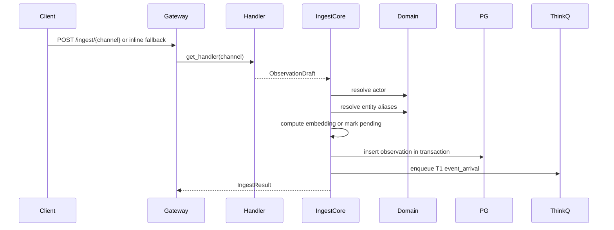
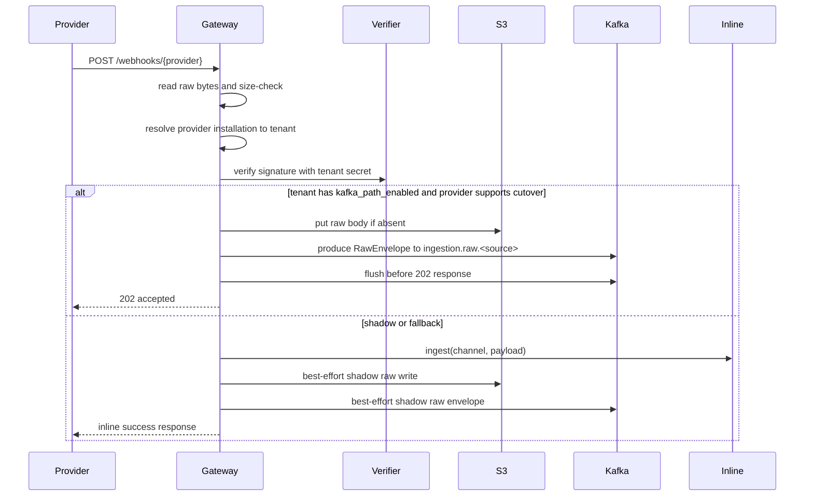
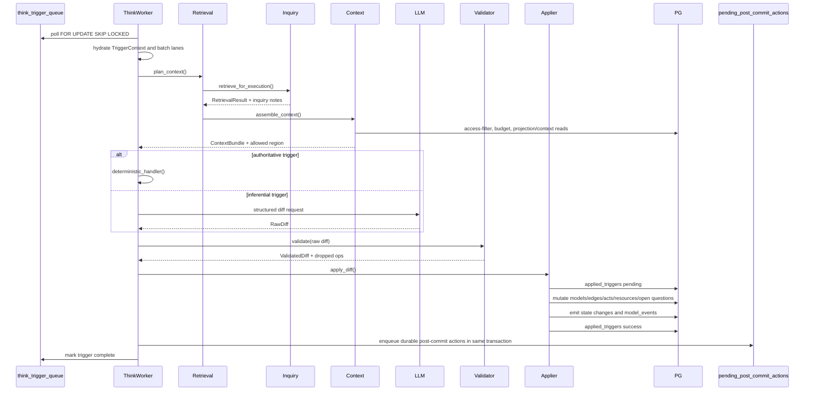
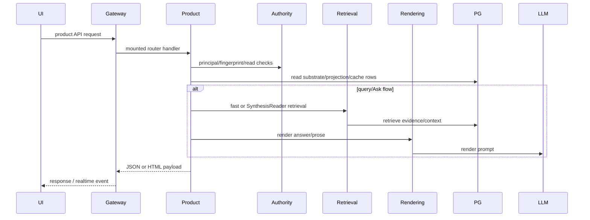

# Fyralis Core Current System Deep Dive

Last reviewed from this checkout on 2026-06-29.

This document is an end-to-end map of how Fyralis Core works today. It is
grounded in the current repository layout, runtime manifests, migrations,
gateway route mounting, ingestion workers, reasoning code, product surfaces,
access-control primitives, and extension seams.

Fyralis Core is a backend-only organizational intelligence runtime. It captures
company signals, turns them into tenant-scoped observations, reasons over those
observations into a durable operating memory graph, and serves product/read
surfaces over that graph. The demo/UI overlay is intentionally outside core and
plugs in through extension entry points; core must not import overlay code.

## 1. System Mental Model

The shortest accurate description is:

```text
external source event or user request
  -> gateway, webhook, live worker, or onboarding worker
  -> inline ingestion or raw S3/Kafka ingestion
  -> normalized ObservationDraft
  -> observations row
  -> think trigger or read-side response
  -> retrieval, adaptive inquiry, context assembly
  -> deterministic or LLM-backed structured diff
  -> validation and transactional apply
  -> models, edges, acts, resources, events, projections
  -> post-commit workers and product APIs
  -> CEO home, Ask, query, Today, recommendations, forecasts, history,
     model trace, decision deltas, resolution threads, realtime streams
```

Postgres is the central boundary. It is the system of record, vector store,
durable queue substrate, idempotency ledger, audit log, integration-state store,
projection store, product cache, and worker handoff point.

The second key boundary is the structured reasoning diff. LLMs and deterministic
handlers do not mutate the database directly. They propose schema-shaped changes;
validators narrow the proposal; appliers and repositories write the actual
state.

## 2. Detailed System Diagram

```mermaid
flowchart TB
  subgraph External["External Inputs"]
    UI["UI / demo overlay\nHTTP, WS, extension routes"]
    Webhooks["Signed webhooks\nSlack, GitHub, Discord, Jira,\nfinance, people, design, alerts"]
    Pollers["Live/poll workers\nGmail, Calendar, Drive,\nDiscord, Telegram, Signal"]
    OAuth["OAuth/install/onboarding\nsource setup and backfill"]
    ExtIn["Extension edge ingest\n/ext/v1/ingest"]
  end

  subgraph App["services/app"]
    Gateway["FastAPI gateway\nmain.py + route_mounts.py"]
    Middleware["request context\nauth\nrate limit\npublic webhook prefixes"]
    WebhookRouter["/webhooks/{provider}\nverification + tenant resolution"]
    Realtime["realtime dispatch\nCEO stream"]
    Routes["product/domain/integration routes\nhealth, metrics, auth, ingest"]
  end

  subgraph Ingest["services/ingest"]
    Inline["inline ingest()\nhandler -> ObservationDraft"]
    RawTier["raw tier\nS3/MinIO raw body\nRawEnvelope"]
    KafkaRaw["Kafka raw topics\ningestion.raw.<source>"]
    Normalizer["normalizer worker\nDB-free raw -> normalized"]
    KafkaNorm["Kafka normalized topics\ningestion.normalized.<source>"]
    Writer["observation writer\nNormalizedEnvelope -> ingest_from_draft"]
    Summarize["summarization workers\nlarge documents"]
    EmbedRetry["embedding worker + backlog\nretry pending embeddings"]
    DLQ["DLQ writer\ningestion failures"]
    Flags["tenant flags + circuit breaker\nkafka_path_enabled"]
    Enrichers["draft enrichers\ncompany_os.draft_enrichers"]
  end

  subgraph Domain["services/domain"]
    Actors["actors + sessions\nidentity mappings"]
    Aliases["entity_aliases\nentity_review_queue"]
    Observations["observations\npartitioned evidence + vectors"]
    Models["models\nbeliefs, recommendations,\nhypotheses, predictions"]
    Edges["model_edges + relation tables\nrelationship memory"]
    Acts["goals, commitments,\ndecisions, act graph"]
    Resources["resources, transactions,\ndeployments, customer commitments"]
    Events["model_events\nneutral change stream"]
    Projections["projection_snapshots\nconstraints, resources,\nemployee profiles, extensions"]
    Triggers["think_trigger_queue\nmodel_reeval_queue"]
    PostCommitQ["pending_post_commit_actions"]
  end

  subgraph Platform["services/platform"]
    Access["can_read\nroles, tenant, entity rules"]
    Authority["read authority\nlabels, provenance, grants,\nfingerprints"]
    Inquiry["execution inquiry\nhypotheses, questions,\nevidence reservoir, sufficiency"]
    Extensions["extension governance\ngrants, readonly reader,\negress, marketplace"]
    Runtime["process manifest"]
  end

  subgraph Reasoning["services/reasoning"]
    ThinkWorker["think_worker\nqueue polling + batching"]
    Retrieval["retrieval pathways\nA structural, B semantic,\nC temporal, D pattern,\nG model graph, L terms,\nprojection context"]
    Context["context planner + assembler\naccess filter, budgets, MMR,\nallowed region"]
    Reason["reasoning frame\nLLM or deterministic diff"]
    Validate["validator\nschema, region, confidence,\nentity existence, partial drops"]
    Apply["applier\nclaim, lifecycle, relation,\nedge, question, act, resource ops"]
    PostCommit["post_commit_worker\nrealtime, projections,\nedge discovery, open questions"]
    Sage["SAGE / topology / relationships\nreader utility + optimization"]
  end

  subgraph Product["services/product + app routers"]
    ProductCore["product query + repository layer\nread models, commands, cached snapshots"]
    CEO["CEO home\n/view/ceo/home + stream"]
    Ask["Ask Fyralis\n/v1/ask + /view/ceo/ask"]
    Today["Today / artifacts\n/v1/today"]
    Recs["recommendations\n/v1/recommendations"]
    Forecasts["forecasts\n/v1/forecasts"]
    History["history\n/v1/history"]
    Trace["model trace\n/v1/model/*"]
    Deltas["decision deltas\n/v1/decision_deltas"]
    Threads["resolution threads\n/v1/resolution_threads"]
    Rendering["rendering service\n/rendering/*"]
  end

  subgraph Workers["services/workers and scripts/run_*.py"]
    EntityResolver["entity resolver"]
    Anomaly["anomaly processor"]
    Housekeeper["housekeeper\nmaintenance registry"]
    Topology["topology sweeper\nedge drift\nprecipitation"]
    Calibration["calibration/deadline workers"]
    ExtWorkers["extension_workers\ncompany_os.workers"]
    WorkerMetrics["worker metrics endpoints"]
  end

  subgraph Infra["Infrastructure"]
    PG[(Postgres + pgvector)]
    Kafka[(Kafka)]
    S3[(S3/MinIO)]
    Redis[(Redis)]
    Ollama["Ollama embeddings"]
    LLM["External/Codex LLM providers"]
    Prom["Prometheus/Grafana/exporters"]
  end

  UI --> Gateway
  Webhooks --> WebhookRouter
  Pollers --> RawTier
  OAuth --> Gateway
  ExtIn --> Extensions

  Gateway --> Middleware
  Middleware --> Routes
  Routes --> ProductCore
  ProductCore --> CEO
  ProductCore --> Ask
  ProductCore --> Today
  ProductCore --> Recs
  ProductCore --> Forecasts
  ProductCore --> History
  ProductCore --> Trace
  ProductCore --> Deltas
  ProductCore --> Threads
  ProductCore --> Rendering
  WebhookRouter --> Inline
  WebhookRouter --> RawTier

  RawTier --> S3
  RawTier --> KafkaRaw
  KafkaRaw --> Normalizer
  Normalizer --> S3
  Normalizer --> KafkaNorm
  KafkaNorm --> Writer
  Writer --> Inline
  Inline --> Enrichers
  Inline --> Actors
  Inline --> Aliases
  Inline --> Ollama
  Inline --> Observations
  Inline --> Triggers
  Inline --> Summarize
  Inline --> EmbedRetry
  Normalizer --> DLQ
  Writer --> DLQ
  Flags --> WebhookRouter
  Flags --> Writer

  Observations --> PG
  Models --> PG
  Edges --> PG
  Acts --> PG
  Resources --> PG
  Events --> PG
  Projections --> PG
  Triggers --> PG
  PostCommitQ --> PG

  ThinkWorker --> Triggers
  ThinkWorker --> Retrieval
  Retrieval --> Inquiry
  Retrieval --> Observations
  Retrieval --> Models
  Retrieval --> Edges
  Retrieval --> Projections
  Context --> Authority
  Context --> Access
  Retrieval --> Context
  Context --> Reason
  Reason --> LLM
  Reason --> Validate
  Validate --> Apply
  Apply --> Models
  Apply --> Edges
  Apply --> Acts
  Apply --> Resources
  Apply --> Events
  Apply --> PostCommitQ
  PostCommit --> PostCommitQ
  PostCommit --> Projections
  PostCommit --> Sage
  PostCommit --> Realtime

  ProductCore --> Authority
  ProductCore --> Access
  ProductCore --> Observations
  ProductCore --> Models
  ProductCore --> Acts
  ProductCore --> Resources
  ProductCore --> Projections
  Rendering --> LLM
  ProductCore --> Realtime

  EntityResolver --> Observations
  EntityResolver --> Aliases
  EntityResolver --> Triggers
  Anomaly --> Observations
  Anomaly --> Triggers
  Housekeeper --> PG
  Topology --> Edges
  Calibration --> Models
  ExtWorkers --> Extensions
  EntityResolver --> WorkerMetrics
  Anomaly --> WorkerMetrics
  Housekeeper --> WorkerMetrics
  Topology --> WorkerMetrics

  Gateway --> Redis
  EmbedRetry --> Kafka
  Normalizer --> Kafka
  Writer --> Kafka
  Prom --> Gateway
  Prom --> WorkerMetrics
```



## 3. Codebase Layers

The codebase is a layered Python monolith:

```text
services/app and services/product
        |
        v
services/reasoning, services/ingest, services/platform, services/workers
        |
        v
services/domain
        |
        v
lib
```

Layer responsibilities:

| Layer | Main paths | Responsibility |
| --- | --- | --- |
| Shared primitives | `lib/shared`, `lib/llm`, `lib/embeddings`, `lib/extensions`, `lib/observability` | IDs, typed rows, DB helpers, errors, LLM abstraction, embeddings, extension host API, health and metrics. |
| Domain | `services/domain/*` | Canonical substrate: actors, observations, entity aliases, models, model edges, acts, resources, model events, projections, triggers. |
| Ingest | `services/ingest/*` | Handler registry, provider integrations, raw-tier Kafka/S3 pipeline, observation writer, source workflows, summarization, embeddings, synthetic scenarios. |
| Platform | `services/platform/*` | Access control, read authority, adaptive inquiry runtime, extension governance, runtime process manifest. |
| Reasoning | `services/reasoning/*` | Think, retrieval, context planning, validation, applier, topology, relationships, Sage, calibration, dynamics, contestability. |
| Product | `services/product/*` | CEO home, Ask, query, Today, recommendations, decision deltas, forecasts, history, model trace, rendering, resolution threads. |
| App | `services/app/*` | FastAPI gateway, middleware, route mounting, webhooks, realtime. |
| Workers | `services/workers/*`, `scripts/run_*.py` | Long-running loops and bounded maintenance jobs. |

`pyproject.toml` enforces several boundaries with import-linter:

- Core cannot import demo or simulation overlays.
- `lib` cannot import `services`.
- `services.reasoning` cannot directly import app, product, or ingest.
- Domain and ingest have ratchet contracts that prevent new upward imports
  beyond explicit allowlisted debt.
- `lib.extensions` cannot import `services`, preserving the public extension
  host API boundary.

## 4. Runtime Topology

The production-style stack is defined by `docker-compose.yml` and
`services/platform/runtime/process_manifest.py`.

Infrastructure:

| Service | Role |
| --- | --- |
| Postgres + pgvector | System of record, vector search, queue tables, idempotency, integration state, product caches, projections, audit. |
| Kafka | Durable ingestion bus for raw, normalized, embedding, summarization, DLQ, and onboarding/control events. |
| S3/MinIO | Raw payload object store. Kafka carries pointers, not large bodies. |
| Redis | Rate-limit and coordination dependency for selected gateway/ingestion paths. |
| Ollama | Local embedding provider, especially `nomic-embed-text` 768-dimensional vectors. |
| LLM providers | Structured reasoning, question planning, entity resolution, and rendering via `lib.llm.provider`. |
| Observability profile | Prometheus, Grafana, Postgres exporter, Kafka exporter, Redis exporter. |

Long-running process families:

| Family | Processes | Purpose |
| --- | --- | --- |
| Ingress | `gateway` | HTTP, webhooks, OAuth callbacks, route composition, realtime startup, extension startup. |
| Onboarding/backfill | `oauth_poller`, `tenant_onboarding`, `source_onboarding`, `shard_fetch`, `reconciler`, `feels_onboarded_monitor`, `periodic_reconciler` | Install sources, fetch backfill shards, detect gaps, emit progress, reconcile steady-state drift. |
| Kafka consumers | `normalizer`, `observation_writer`, `dlq_writer`, `summarization_worker`, `summarization_batch_worker`, `embedding_worker`, `embedding_backlog`, `circuit_breaker` | Raw-to-normalized transforms, observation persistence, large-document summarization, embedding retries, DLQ, cutover safety. |
| Live source workers | Discord, Telegram, Signal, Gmail, Calendar, Drive workers | Maintain sessions, watches, history cursors, polling loops, raw publish. |
| Reasoning/product workers | `think_worker`, `post_commit_worker`, `anomaly_processor_worker`, `entity_resolver_worker`, Sage workers, `housekeeper_worker`, `relationship_ontology_proposals_worker` | Reasoning queue drain, post-commit queue drain, anomaly triggers, entity cleanup, retrieval learning, maintenance. |
| Extension workers | `extension_workers` | Discovers and supervises `company_os.workers` contributions. |

Local dogfood is smaller: gateway, Think worker, post-commit worker, and often a
topology sweeper. Production mode includes the ingestion data plane and live
source workers.

## 5. Gateway Flow

The gateway composition root is `services/app/gateway/main.py`.

Startup flow:

1. Configure structured logging.
2. Create or receive an asyncpg pool.
3. Build `GatewayDeps` with `ActorRepo`, `EntityAliasRepo`, optional embedder,
   and rate limiter.
4. Wire integration runtime state: secret store, tenant resolver, tenant flags,
   Kafka producer, S3 raw client, GitHub state.
5. Wire the ingestion data plane.
6. Start OAuth state sweeping.
7. Configure CEO view, realtime dispatch, and optional scheduler.
8. Mount the Ask router when configured.
9. Run `company_os.gateway_extensions` startup hooks.
10. Mount route families from `route_mounts.py`.
11. On shutdown, stop schedulers/dispatchers and close owned clients/pools.

Middleware flow:

1. `RequestContextMiddleware` creates request/log context.
2. `BearerAuthMiddleware` validates sessions except on public paths such as
   health checks, webhooks, and extension-contributed public prefixes.
3. `RateLimitMiddleware` enforces per-tenant/actor limits.

Mounted route families include health, readiness, metrics, session creation,
inline ingest, webhooks, OAuth/install endpoints, substrate reads, Today,
recommendations, model/map/spec pages, decision deltas, forecasts, model trace,
history, Ask, rendering, conversations, resolution threads, extension routes,
debug routes, optional finance routes, and optional Slack routes.

## 6. Ingestion Flows

There are two ingestion lanes: inline and raw-tier Kafka/S3.

### 6.1 Inline Ingest



The handler registry in `services/ingest/ingestion/handlers/__init__.py`
normalizes source-specific payloads into `ObservationDraft`:

- `source_channel`
- `content_text`
- JSON `content`
- `source_actor_ref`
- `external_id`
- `occurred_at`
- `entities_hint`
- `trust_tier`
- `kind`

`ingest_from_draft()` then:

1. Runs draft enrichers discovered through `company_os.draft_enrichers`.
2. Detects large documents and can queue summarization before normal Think.
3. Pre-assigns a UUIDv7 observation id.
4. Resolves actors through `ActorRepo`.
5. Resolves known entity aliases and records unresolved phrases.
6. Computes an embedding or leaves `embedding_pending=true`.
7. Inserts into `observations`, with dedup around `(source_channel, external_id)`.
8. Opens actor clarification requests when source actor refs are unknown.
9. Enqueues a T1 trigger unless deduped, disabled, or waiting for summary.
10. Publishes embedding/summarization retry messages when needed.

### 6.2 Webhook Raw-Tier Flow

The webhook router is `services/app/webhooks/router.py`.



Important properties:

- Signature failure is reported before tenant resolution failure to avoid a
  JSON/tenant probing oracle.
- Cutover is provider-specific and tenant-flag controlled.
- The gateway flushes Kafka before acknowledging a cutover webhook, so a 202
  means the raw event reached the broker.
- If S3/Kafka cutover fails, the gateway falls back to inline ingest. This is
  graceful degradation, not weaker verification.
- Shadow writes are best-effort and never affect the inline response.

### 6.3 Raw Envelope And Topics

Raw envelopes are Pydantic v1 wire objects with:

- `source`
- `tenant_id`
- `raw_s3_key`
- `content_hash`
- `ingested_at`
- `ingress_kind`: webhook, gateway, pubsub, backfill, or poll
- `ingress_metadata`
- `idem_hints`

Topic names are generated centrally:

```text
ingestion.raw.<source>
ingestion.normalized.<source>
ingestion.embedding.<source>
ingestion.summarization.<source>
ingestion.dlq.<source>
```

Sources currently include Slack, GitHub, Discord, Gmail, Notion, Google
Calendar, Google Drive, Jira, Mercury, QuickBooks, Grafana, Telegram, Brex,
Ramp, Gusto, Deel, Fireflies, Signal, AWS, Miro, Figma, Carta, HiBob, Ashby,
LinkedIn, and WhatsApp.

### 6.4 Normalizer Flow

The normalizer worker is intentionally DB-free.

```text
Kafka ingestion.raw.<source>
  -> fetch raw body from S3
  -> validate RawEnvelope invariants
  -> map source/ingress to handler channel
  -> run handler registry
  -> emit NormalizedEnvelope to ingestion.normalized.<source>
  -> DLQ parse/invariant/unsupported failures
```

The no-DB invariant matters: raw-to-normalized transformation can scale and
fail independently of Postgres, and it cannot accidentally create side effects.

### 6.5 Observation Writer Flow

The observation writer is the DB boundary for the Kafka lane.

```text
Kafka ingestion.normalized.<source>
  -> parse NormalizedEnvelope
  -> check tenant kafka_path_enabled flag
  -> if live flag false: shadow-log/no-op because inline path owns write
  -> if backfill or full mode: reconstruct ObservationDraft
  -> ingest_from_draft()
  -> commit Kafka offset after definitive outcome
  -> DLQ permanent failures
  -> retry transient failures
  -> durable poison counter prevents endless partition blockage
```

Backfill is exempt from the live kill-switch because it has no inline fallback.
If a backfill cursor moves after broker ack, the writer must persist the
observation even if live cutover was disabled.

### 6.6 Summarization And Embeddings

Large document observations may be persisted as pending summaries instead of
immediately entering Think. Summarization workers turn raw or retained content
into shorter evidence. Embedding workers and the DB-scanning backlog drainer
cover rows with `embedding_pending=true`, so missing inline embeddings do not
permanently remove an observation from semantic retrieval.

## 7. Domain Substrate

The domain layer owns the canonical memory store.

| Area | Tables / concepts | Purpose |
| --- | --- | --- |
| Tenants and actors | `tenants`, `actors`, `actor_identity_mappings`, `actor_sessions` | Tenant root, people/agents/system actors, bearer sessions, source identities. |
| Observations | `observations` partitions, vectors, `observations_new` notifications | Append-oriented evidence layer. |
| Entity aliases | `entity_aliases`, `entity_review_queue` | Fast source phrase to canonical entity mapping plus review queue. |
| Models | `models`, status notes, signal readings, scopes, composition, semantic terms, open questions | Durable beliefs, claims, recommendations, hypotheses, situations, predictions. |
| Relationships | `model_edges`, relation claims, relation instances, relation participants, relation projections | Typed memory graph and relation-bearing facts. |
| Acts | `goals`, `commitments`, `decisions`, `contributes_to`, `depends_on`, `constrained_by` | Executable organizational state. |
| Resources | `resources`, transactions, deployments, customer commitments | Capacity, financial, customer, infrastructure, regulatory, and other resource state. |
| Queues | `think_trigger_queue`, `model_reeval_queue`, `pending_post_commit_actions` | Durable async handoffs. |
| Events/projections | `model_events`, `projection_checkpoints`, `projection_snapshots` | Neutral change stream and rebuildable operating views. |
| Product state | CEO cache, rendering costs, conversations, recommendations, forecasts, decision deltas, Ask tables, resolution threads | Read and workflow surfaces. |
| Access/extension state | roles, labels, provenance, grants, extension grants, egress outbox, marketplace metadata | Governed reads and extension lifecycle. |

Truth flows in this order:

```text
observations
  -> models and model_edges/relation tables
  -> model_events
  -> projection_snapshots
  -> product caches and API responses
```

`models` and relationship tables are canonical. Search documents, semantic term
postings, projection snapshots, and view caches are accelerators or rebuildable
views.

## 8. Entity Resolution Flow

Inline ingest only performs exact fast-path alias lookup. Unresolved phrases are
stored in observation content. The entity resolver worker later:

1. Wakes from `observations_new` or polls pending observations.
2. Loads phrase context: source observation, recent channel observations, active
   Models, prior alias hits, and candidate aliases.
3. Calls an LLM with a structured `EntityResolution` schema.
4. High confidence with a canonical ref inserts an alias, appends the entity to
   `observations.entities_mentioned`, emits a state-change observation, and can
   enqueue T1 for material entity types.
5. Medium confidence writes `entity_review_queue`.
6. Low confidence drops/logs the phrase.

This keeps ingestion cheap while preserving a path to resolve human-language
aliases after more context is available.

## 9. Think And Reasoning Flow

Think is the mutation engine.



### 9.1 Trigger Kinds

| Kind | Source | Meaning |
| --- | --- | --- |
| T1 | Ingestion and entity resolver | New signal/event arrived. |
| T2 | Belief/model updates | Existing belief needs reevaluation or deterministic bookkeeping. |
| T3 | Anomaly processor | An anomalous region needs reasoning. |
| T4 | Background/topology/open-question/model reeval work | Maintenance, relationship candidates, Ask, open questions, model reeval. |
| T6 | Legacy topology events | Compatibility for retired accepted-memory topology events. |

The worker uses per-tenant concurrency semaphores, backpressure slowdowns, retry
classification, dead-letter handling, and batching lanes. It groups compatible
T1 signals by entity or actor where configured, while keeping the safe default
of one in-flight Think transaction per tenant.

### 9.2 Retrieval And Adaptive Inquiry

The active retrieval entry point is `services/platform/execution/inquiry.py`.
`EXECUTION_RETRIEVAL_ENGINE=legacy` rolls back to primary retrieval directly;
the default runs the adaptive inquiry runtime.

Deep Think retrieval:

1. Bootstrap baseline retrieval with `primary_retrieve()`.
2. Classify route and signal shape.
3. Generate competing hypotheses, including no-update/noise.
4. Generate or plan discriminating questions.
5. Compile retrieval actions over structural, semantic, temporal, pattern,
   lexical, model-edge, and projection contexts.
6. Execute actions and populate an evidence reservoir.
7. Evaluate answerability and sufficiency.
8. Compile a compact context packet.
9. Persist inquiry sessions, questions, evidence, omissions, reader traces, and
   outcome signals when enabled.
10. Return a normal `RetrievalResult` plus inquiry notes.

Primary retrieval pathways:

| Pathway | Meaning |
| --- | --- |
| A structural | Entity/scope/model graph overlap, acts/resources/customer traversal. |
| B semantic | Vector similarity over observations/models. |
| C temporal | Recent relevant context. |
| D pattern | Pattern/background retrieval. |
| G model graph | Typed model-edge traversal. |
| L semantic terms | Sparse/focused lexical term lookup and postings. |
| Projection context | Reads `projection_snapshots` when fresh enough. |

Trigger-specific weights merge results. Returned Models are reconsolidated by
bumping activation, retrieval count, and `last_retrieved_at` inside the caller's
transaction.

### 9.3 Context Assembly

The context planner:

1. Runs active retrieval.
2. Optionally expands second pass retrieval.
3. Builds a `ReasoningFrame`.
4. Detects dynamic signals.
5. Assembles a prompt-facing `ContextBundle`.
6. Applies access/tenant filtering.
7. Applies budgets for observations, models, acts, resources.
8. Preserves strong relevance and graph anchors before diversity pressure.
9. Computes allowed mutation region from touched entities.
10. Adds actor operating context and active-work augmentation.

The context bundle is the LLM-facing state, but also a policy boundary: the
validator rejects or narrows diffs that reach outside the allowed region.

### 9.4 Reason, Validate, Apply

Reasoning output buckets include:

- `claim_ops`: insert/update/archive Models.
- `memory_lifecycle_ops`: confirm, falsify, revise, unchanged, archive,
  supersede existing memory.
- `relation_claim_ops` and `relation_frame_ops`: first-class relation facts and
  frames.
- `edge_ops`: Model-to-Model relationship edges.
- `ontology_gap_ops`: relationship ontology gaps.
- `open_question_ops`: model open-question lifecycle.
- `formation_resolutions`: representation/formation decisions.
- `act_ops`: goals, commitments, decisions, act edges.
- `resource_ops`: resources, transactions, deployments, releases.
- `new_predictions`: prediction lifecycle materialization.

The applier order is deliberate:

1. Insert `applied_triggers` with `pending`.
2. Apply claims and map same-diff placeholders to real Model ids.
3. Apply open questions.
4. Apply memory lifecycle decisions.
5. Apply relation claims and relation frames.
6. Apply Model edges.
7. Apply ontology gaps.
8. Apply act operations.
9. Apply resource operations.
10. Enqueue T2 belief-updated work for applied belief models.
11. Mark `applied_triggers` success.
12. Emit SAGE/edge-intelligence outcome events.

Unexpected errors roll back the transaction, including `applied_triggers`.
Domain-invalid late edge/act/resource details can be classified and dropped
under the partial-accept policy.

## 10. Post-Commit Flow

Post-commit actions are queued inside the same transaction as `apply_diff()`.
This prevents the old failure mode where the database commit succeeded but a
process crash lost downstream side effects.

Action kinds:

- `publish_anomalies`
- `schedule_predictions`
- `broadcast_realtime`
- `invalidate_metrics`
- `materialize_projections`
- `discover_model_edges`
- `search_open_questions`

The post-commit worker polls with `FOR UPDATE SKIP LOCKED`, dispatches handlers,
retries with exponential backoff, and dead-letters after repeated failure.

Important handlers:

- Projection materialization consumes `model_events` and writes
  `projection_snapshots`.
- Edge discovery invokes latent topology and pair-evidence promotion, and may
  enqueue more Think work for relationship candidates.
- Open-question search can pursue unresolved memory questions.
- Realtime and invalidation hooks make product surfaces refresh.

## 11. Model Events And Projections

`model_events` are the durable neutral change stream. Rebuildable projection
workers consume them through `ProjectionRunner`.

Core projectors:

- `constraints`
- `resources`
- `employee_profiles`

Extension projectors are discovered via `company_os.projections` and are
failure-isolated. A failed projector/event does not stop other projectors, and
checkpoint ordering preserves retry safety for the failing projector.

Projection snapshots are read-side accelerators, not canonical truth. Retrieval
can use projection context when available and fresh; product surfaces can use
projection snapshots to avoid reconstructing every view from raw models.

## 12. Product And Read Flows



### 12.1 CEO Home

`services/product/greeting` composes snapshots from Models, commitments,
resources, state changes, anomalies, and recent conversations. The gateway wires
CEO home routes and the stream manager. The scheduler can refresh
`view_ceo_cache`; `/view/ceo/home` reads cached or composed state; the stream
surface emits realtime updates.

### 12.2 Query

`services/product/query` is the classify, retrieve, render path for
`/view/ceo/ask` and query-prefetch flows:

1. Validate viewer id.
2. Resolve card context if present.
3. Classify the query.
4. Pick a strategy.
5. Run retrieval in fast mode through the execution layer.
6. Assemble context with an access context.
7. Render the turn through the rendering adapter.
8. Cache prefetched responses under an authority-fingerprinted cache key.
9. Return HTML plus retrieval trace, cost, model, and latency metadata.

### 12.3 Ask Fyralis

`services/product/ask` is the newer session/evidence workflow:

1. Create an Ask session with scope and authority snapshot.
2. Add user message and retrieval run rows.
3. Use `SynthesisReader` and fallback reads to gather models, observations,
   projected evidence, and omissions.
4. Filter models/observations/evidence through `authorize_read()`.
5. Persist evidence items with provenance and inherited access labels.
6. Compose answer payload and assistant message.
7. Optionally create a proposed state change.
8. On evidence expansion, re-check live authority before returning evidence.
9. On accepted-answer writeback, re-check supporting evidence authority before
   enqueueing durable memory work.

Ask is security-sensitive because answers and persisted evidence can otherwise
launder restricted source data into a broader read surface.

### 12.4 Today

`services/product/today` builds a single Today payload from active
recommendations, supporting events, signal-strip metrics, vitals, viewer state,
map state, recent signals, and authority-filtered cards. It is mostly a
read-side translator over the substrate.

### 12.5 Recommendations

Recommendations are Models with `claim_role='recommendation'` or
`claim_role='hypothesis'`.

Read flow:

- Query active recommendation/hypothesis Models for the actor.
- Denormalize target goal/commitment/decision/resource.
- Filter archived or stale targets.
- Rank by impact, confidence, created time, and feedback multiplier.
- Filter through authority when a principal is supplied.

Write flow:

- Act on recommendation: apply structured `proposed_change`, archive the
  recommendation Model, emit a state-change observation, update feedback stats.
- Dismiss: archive recommendation and record feedback.
- Ratify hypothesis: approve/correct/other enqueue T2 for Think; dismiss
  archives directly.

### 12.6 Decision Deltas And Resolution Threads

Decision deltas are proposed changes with consequence previews. Accepting a
delta:

1. Validates status transition.
2. Applies a currently wired primary target update for supported targets.
3. Marks the delta accepted.
4. Emits a ledger-visible event.
5. Dispatches notification stubs.
6. Ensures a resolution thread for follow-through.

Resolution threads provide a product workflow around accepted deltas and
follow-up evaluation.

### 12.7 Forecasts

Forecasts read `predictions` and `prediction_signals`. The page layer derives
horizon matrix, driving patterns, leading indicators, falsifiers, intervention
levers, accuracy summaries, and deterministic briefs from the thin prediction
schema.

### 12.8 History, Model Trace, Map, Spec, Rendering

- History aggregates ledger/state-change views.
- Model trace exposes support/dependency/trace views for individual Models.
- Map/model routes expose topology and model page data.
- Spec routes expose compatibility shapes for frontend specs.
- Rendering builds prompts, calls the LLM provider, applies voice rules, retries
  once on rejection-level violations, and records render costs.

## 13. Access Control And Read Authority

There are two related layers.

Base `can_read()`:

1. Absolute tenant isolation.
2. Admin/leadership override after tenant isolation, except HR observations.
3. Observation checks: author, mentioned actor, source actor mapping, shared
   channel, manager chain.
4. Act checks: owner/contributor/manager/shared-goal/role grant.
5. Resource checks: kind-specific roles, entity grants, account owner/team.
6. Model checks: visibility subjects, scope actors/entities, first-person,
   roles.

Read authority extends this for human-facing reads:

| Concept | Purpose |
| --- | --- |
| `Principal` | Actor, tenant, role set, active grant epoch. |
| `AuthorityFingerprint` | Cache key for purpose + role/grant/scope state. |
| `object_access_labels` | Classification/domain/source labels such as financial, HR, restricted, public. |
| `object_provenance_edges` | Derived-object to source-object lineage. |
| `read_authority_grants` | Delegated object, label, or scope grants. |
| `authorize_read()` | Base `can_read`, labels, grants, and provenance recursion. |
| `AuthorizedReader` | Facade for product code migrating away from raw SQL reads. |

Derived objects such as evidence, caches, projections, and exports are allowed
only when their provenance sources are authorized or an explicit grant applies.
Labels can require roles or grants. Overrides and delegations mark decisions as
audit-worthy.

## 14. Extension Flows

Extension architecture is split intentionally:

- `lib.extensions` defines the stable host API, manifest, registry, and worker
  discovery without importing `services`.
- `services.platform.extensions` performs concrete DB-backed enforcement,
  governance, egress, and edge ingest.

Extension contribution points:

| Entry point | Flow |
| --- | --- |
| `company_os.interfaces` | Declares manifest, capabilities, host API version, feature flag, activation events. |
| `company_os.gateway_extensions` | Adds routers, public prefixes, startup hooks without core importing overlay code. |
| `company_os.draft_enrichers` | Mutates an `ObservationDraft` before persistence, raw-on-failure and grant-gated. |
| `company_os.workers` | Background workers supervised by `lib.extensions.run_workers`. |
| `company_os.projections` | Rebuildable projectors over `model_events`. |

Extension read flow:

1. Resolve active manifest and tenant grant.
2. Build a capability-scoped reader.
3. Enter tenant-scoped transaction and set `fyralis_ext_readonly`.
4. Apply channel and substrate-kind capability filters.
5. Return frozen view types, not raw DB rows.

Extension egress flow:

1. Egress projector tails observations by `(occurred_at, id)`.
2. For each active grant, redact and filter by channel capability.
3. Append to `extension_egress` outbox.
4. Optionally enqueue webhook delivery or produce `ext.egress.v1`.
5. Persist cursor so re-runs are idempotent.

Extension edge ingest:

1. `POST /ext/v1/ingest` validates grant and trust ceiling.
2. Namespaces source channel as `ext:<extension_id>:<sub>`.
3. Rejects unreachable authoritative trust tiers.
4. Persists through `ingest_from_draft()`, using the same observation,
   embedding, dedup, entity, and Think-trigger path as first-party signals.

## 15. Background Worker Flows

| Worker | Flow |
| --- | --- |
| Anomaly processor | Poll fresh observations, run detectors, compute significance, debounce/promote, enqueue T3 with region spec. |
| Entity resolver | Resolve unresolved phrases from observations, write aliases/review rows, re-enqueue T1 for material resolutions. |
| Housekeeper | Registry over deadline resolver, obligations, decay/archive, relationship maintenance, calibration, edge drift, topology, precipitation, ontology proposals, structural features. |
| SAGE topology optimizer | Claims completed inquiry sessions with outcome events, evaluates outcomes, reinforces/decays retrieval/topology utility state. |
| Topology sweeper | Refreshes latent relationship candidates over bounded active model frontiers. |
| Edge drift | Detects relationship drift and candidate changes. |
| Precipitation | Clusters accumulated weak signals into background pattern candidates. |
| Calibration updater | Updates prediction/forecast calibration summaries. |
| Deadline resolver | Resolves or escalates due commitments/obligations. |
| Relationship ontology proposals | Proposes new relationship ontology candidates from examples. |

Most worker loops are designed as bounded `run_once` units plus a thin
`run_forever`/scheduler wrapper so tests and operators can run one pass.

## 16. Observability, Idempotency, And Failure Semantics

Important persisted evidence:

- `think_runs`
- `think_run_costs`
- `think_run_artifacts`
- `view_render_costs`
- `reconciliation_events`
- `audit_events`
- `region_lock_log`
- `relationship_maintenance_log`
- `inquiry_sessions`, question runs, evidence items, outcome events
- ingestion failures, DLQ rows, poison counters, workflow state
- extension egress outbox and audit/governance rows

Idempotency:

- Observation dedup uses source channel/external id plus advisory locks.
- Raw S3 writes are content/idempotency-key shaped.
- Kafka consumers commit offsets only after definitive processing.
- `applied_triggers` prevents duplicate Think application.
- Post-commit actions dedup by tenant, trigger, and action kind while pending.
- Projection checkpoints preserve per-projector event order.

Failure boundaries:

- Webhook verification failures stop before ingestion.
- Cutover S3/Kafka failures fall back to inline ingest.
- Shadow-write failures never affect inline success.
- Normalizer failures go DLQ and do not touch Postgres.
- Writer permanent failures go DLQ; transient failures retry/redeliver.
- Think validation/apply unexpected failures roll back mutation.
- Post-commit failures retry and later dead-letter without undoing the
  committed memory update.
- Extension discovery, enrichers, workers, and projectors are failure-isolated
  so one bad extension cannot break the host process.

## 17. End-To-End Flow Index

### A. User Opens CEO Home

1. UI calls `/view/ceo/home`.
2. Gateway authenticates session and tenant.
3. CEO router reads cache or composes snapshot.
4. Snapshot reads Models, commitments, resources, state changes, anomalies,
   and conversation context.
5. Authority/read filters apply where wired.
6. Response returns structured home/card/query-grid data.
7. Stream endpoint can push updates from realtime dispatcher.

### B. User Asks A Question Through Query

1. UI posts `/view/ceo/ask`.
2. Query handler validates viewer id.
3. Classifier chooses category.
4. Strategy parses query and card context.
5. Execution retrieval runs fast mode.
6. Context assembler filters by tenant/access and budgets.
7. Rendering service produces answer HTML and records render cost.
8. Optional prefetch cache writes under authority fingerprint.
9. Response includes HTML and retrieval trace.

### C. User Uses Ask Fyralis Session

1. UI creates `/v1/ask/sessions`.
2. Store persists session, scope, mode, and authority snapshot.
3. User posts a message.
4. Orchestrator creates retrieval run.
5. SynthesisReader gathers projected evidence, models, observations, omissions.
6. Fallback queries cover empty reader results.
7. `authorize_read()` filters all evidence and source objects.
8. Store persists evidence, provenance, labels, answer, and messages.
9. Proposed state changes may be created for later validation.
10. Feedback and evidence expansion are persisted and authority-checked.

### D. Signed Webhook Arrives In Cutover Mode

1. Provider posts `/webhooks/{provider}`.
2. Gateway reads raw body, checks size, parses JSON best effort.
3. Tenant resolver maps installation to tenant.
4. Secret store loads provider secret.
5. Verifier checks signature.
6. Gateway writes raw body to S3 and produces RawEnvelope to Kafka.
7. Gateway flushes Kafka and returns 202.
8. Normalizer consumes raw topic, fetches S3 body, runs handler, emits normalized.
9. Observation writer consumes normalized, calls `ingest_from_draft()`.
10. Observation row and T1 trigger are committed.

### E. Signed Webhook Falls Back Inline

1. Same verification path as cutover.
2. Cutover disabled or S3/Kafka publish/flush fails.
3. Gateway calls `ingest()` directly.
4. Inline path inserts observation and T1 trigger.
5. Gateway may best-effort shadow-write raw payload.
6. Provider gets normal inline success response.

### F. Backfill Shard Ingestion

1. Onboarding/source workflows create source runs and shards.
2. `shard_fetch` fetches provider data and writes raw bodies to S3.
3. It publishes raw envelopes with `ingress_kind='backfill'`.
4. Normalizer and observation writer process the shard.
5. Writer persists backfill regardless of live kill-switch.
6. Reconciler/gap detectors update workflow state and progress.

### G. Think Processes A New Observation

1. Think worker leases T1 trigger.
2. TriggerContext is hydrated from queue payload and observation row.
3. Adaptive inquiry retrieves and compiles evidence.
4. Context assembler builds prompt-facing bundle and allowed region.
5. LLM or deterministic handler returns a raw diff.
6. Validator narrows diff.
7. Applier mutates Models/edges/acts/resources/open questions.
8. Model events and post-commit actions are written.
9. Trigger row is marked completed.

### H. Post-Commit Projection Updates

1. Post-commit worker leases `materialize_projections`.
2. ProjectionRunner fetches pending `model_events` for each projector.
3. Matching projector computes affected subjects.
4. Snapshot rows are upserted.
5. Checkpoints advance per projector/version.
6. Retrieval/product readers can use fresh snapshots.

### I. Recommendation Is Accepted

1. UI posts recommendation action.
2. Handler loads active recommendation Model.
3. Proposed change dispatches to goal/commitment/decision/resource services.
4. Recommendation Model is archived.
5. State-change observation and feedback stats are written.
6. Supporting model confirmations may be bumped.

### J. Decision Delta Is Accepted

1. Router starts transaction.
2. `apply_acceptance()` validates status.
3. Supported target update is applied.
4. Delta is marked accepted.
5. Ledger-visible event is emitted.
6. Resolution thread is ensured.
7. Response reports what side effects fired.

### K. Extension Reads Or Writes

Read:

1. Extension authenticates and resolves grant.
2. Host builds capability-scoped reader.
3. Reader enters tenant transaction and restricted role.
4. Query is filtered by capabilities and RLS.
5. Frozen view objects return.

Write:

1. Extension posts `/ext/v1/ingest`.
2. Host checks write grant and trust ceiling.
3. Source channel is namespaced.
4. Draft persists via `ingest_from_draft()`.
5. Think sees it as normal low-trust external evidence.

## 18. What To Keep In Mind When Changing The System

- Do not bypass `ingest_from_draft()` for observations; it is the shared
  observation, dedup, entity, embedding, and Think-trigger boundary.
- Do not let normalizer import DB code; the raw-to-normalized lane is pure by
  design.
- Do not let LLM code directly mutate domain tables; structured diff plus
  validation plus applier is the safety boundary.
- Treat product caches, Ask evidence, projections, and exports as derived data
  that must carry provenance or be filtered through live authority.
- Prefer model events and projection snapshots for rebuildable read views
  instead of adding another canonical state copy.
- Add new long-running processes to both the process manifest and deployment
  surfaces.
- Keep extension host APIs in `lib.extensions` independent from `services`.
- For schema changes, add idempotent migrations and validate drift when a DB is
  available.
