# Fyralis Core — Comprehensive Documentation

> **Organizational-intelligence runtime** (Python package `company-os`). This is a single-file, end-to-end reference: what Fyralis is, the problem it solves, its layer-by-layer technical implementation, architecture diagrams, an API/WebSocket reference, a developer-onboarding guide, an end-user & troubleshooting guide, and code-level conventions.
>
> **Provenance.** Derived from the source tree (originally on the `cannonical` branch, since merged into `main`) and **verified against code** (generated 2026-06-02). Where a claim is an inference not pinned down by code, it is labelled as such. For the canonical narrative records see [CODEBASE-ARCHITECTURE.md](CODEBASE-ARCHITECTURE.md) (module reference) and [CODEBASE-MANAGEMENT.md](CODEBASE-MANAGEMENT.md) (decision record), siblings of this page in the *Codebase reference* section.

### How this document maps to documentation types

| Documentation type | Where to look |
|---|---|
| **Design & Architecture** | [What Fyralis Is](#what-fyralis-is), [System Architecture](#system-architecture), and every per-layer section. |
| **Technical & API Reference** | [API & WebSocket Reference](#api--websocket-reference), [Database Schema & Migrations](#database-schema--migrations), and the per-layer internals. |
| **Developer Onboarding** | [Developer Onboarding](#developer-onboarding). |
| **End-User & Troubleshooting** | [End-User Operations & Troubleshooting](#end-user-operations--troubleshooting). |
| **Code-Level Documentation** | [Code-Level Documentation & Conventions](#code-level-documentation--conventions). |


## Table of Contents

- [What Fyralis Is](#what-fyralis-is)
  - [The Problem](#the-problem)
  - [The Core Data Flow](#the-core-data-flow)
  - [Tech Stack at a Glance](#tech-stack-at-a-glance)
- [System Architecture](#system-architecture)
  - [Layered Design](#layered-design)
  - [Top-Level Architecture Diagram](#top-level-architecture-diagram)
  - [Layer Dependency Diagram](#layer-dependency-diagram)
  - [Subsystem Map](#subsystem-map)
- [App Layer — Gateway & Transport](#app-layer--gateway--transport)
  - [Entrypoint & port](#entrypoint--port)
  - [Middleware chain](#middleware-chain)
  - [Webhook ingress](#webhook-ingress)
  - [OAuth flows](#oauth-flows)
  - [Realtime WS dispatch](#realtime-ws-dispatch)
  - [Request / event flow](#request--event-flow)
- [Ingest Layer — Signal Intake](#ingest-layer--signal-intake)
  - [The uniform ingest path](#the-uniform-ingest-path)
  - [Two convergent ingestion paths](#two-convergent-ingestion-paths)
  - [Supported sources](#supported-sources)
  - [Intelligence enrichment & embedding backlog](#intelligence-enrichment--embedding-backlog)
- [Domain Layer — Substrate](#domain-layer--substrate)
  - [Model — the first-class falsifiable belief](#model--the-first-class-falsifiable-belief)
  - [Act = Goal | Commitment | Decision](#act--goal--commitment--decision)
  - [Resource — assets / capacity](#resource--assets--capacity)
  - [Observation — the source of T1](#observation--the-source-of-t1)
  - [Entity alias — fast-path text→entity](#entity-alias--fast-path-textentity)
  - [Substrate relationships](#substrate-relationships)
- [Reasoning Layer — The Think Pipeline](#reasoning-layer--the-think-pipeline)
  - [The `think()` pipeline](#the-think-pipeline-split-inferential-transaction)
  - [The worker](#the-worker)
  - [Trigger taxonomy](#trigger-taxonomy)
  - [Retrieval pathways + inquiry](#retrieval-pathways--inquiry)
  - [Diff structure & reconciliation](#diff-structure--reconciliation)
  - [Topology, relationships, judgment](#topology-relationships-judgment)
  - [Contestability & calibration](#contestability--calibration)
  - [Think transaction boundary](#think-transaction-boundary-flow)
- [Product Layer — CEO Surfaces](#product-layer--ceo-surfaces)
  - [Surfaces](#surfaces)
  - [Greeting scheduler — the CEO-view pre-compute](#greeting-scheduler--the-ceo-view-pre-compute)
  - [Rendering — voice-compliant prose with retry + cost tracking](#rendering--voice-compliant-prose-with-retry--cost-tracking)
  - [Query / Ask](#query--ask)
  - [Demo — anonymous multi-tenant sandbox](#demo--anonymous-multi-tenant-sandbox)
- [Platform Layer — Access Control & Execution Routing](#platform-layer--access-control--execution-routing)
  - [Five-layer access control](#five-layer-access-control)
  - [Execution routing](#execution-routing)
  - [Adaptive inquiry engine](#adaptive-inquiry-engine)
- [Workers, Shared Libraries & Data Plane](#workers-shared-libraries--data-plane)
  - [Background Workers](#background-workers)
  - [Shared Libraries](#shared-libraries-lib)
  - [Runtime & Data Plane](#runtime--data-plane)
- [API & WebSocket Reference](#api--websocket-reference)
  - [Auth model](#auth-model)
  - [Health & metrics](#health--metrics)
  - [Auth / session](#auth--session)
  - [Ingest & substrate](#ingest--substrate-servicesappgatewaymainpy)
  - [CEO view & greeting](#ceo-view--greeting-servicesproductgreeting)
  - [Ask / query & conversations](#ask--query--conversations-servicesproductquery-conversations)
  - [Today](#today-servicesappgatewaytoday_routespy)
  - [Recommendations](#recommendations-mainpy)
  - [Decision deltas](#decision-deltas-servicesproductdecision_deltasrouterpy-prefix-v1decision_deltas-also-surfaced-under-v1specdecision_deltas-in-spec_routespy)
  - [Forecasts](#forecasts-servicesproductforecastsrouterpy-prefix-v1forecasts)
  - [History / ledger](#history--ledger)
  - [Model trace, model page & map](#model-trace-model-page--map-servicesproductmodel_tracerouterpy-gatewaymodel_page_routespy-gatewaymap_routespy)
  - [Spec surface](#spec-surface-servicesappgatewayspec_routespy)
  - [Demo (overlay-contributed)](#demo-overlay-contributed)
  - [Realtime WebSocket](#realtime-websocket-servicesapprealtimemainpy)
  - [Webhooks](#webhooks-servicesappwebhooksrouterpy-prefix-webhooks)
  - [OAuth & integration install](#oauth--integration-install-servicesingestintegrations)
  - [Slack-DM panel](#slack-dm-panel-servicesappgatewayslack_routerpy-prefix-slack-dev-gated)
  - [Finance panel](#finance-panel-servicesappgatewayfinance_routerpy-prefix-finance-dev-gated)
  - [Debug & GitHub-intel](#debug--github-intel-servicesappgatewaydebug_routerpy-prefix-debug-servicesingestgithub_intelapipy-prefix-github-intel)
  - [Mounting summary](#mounting-summary)
- [Database Schema & Migrations](#database-schema--migrations)
  - [How migrations work](#how-migrations-work)
  - [Core tables](#core-tables)
- [Developer Onboarding](#developer-onboarding)
  - [Prerequisites](#prerequisites)
  - [Quickstart](#quickstart)
  - [Running components individually](#running-components-individually)
  - [Running tests](#running-tests)
  - [Docs site](#docs-site)
- [End-User Operations & Troubleshooting](#end-user-operations--troubleshooting)
  - [Using the app](#using-the-app-end-user-view)
  - [Operating the stack](#operating-the-stack)
  - [Troubleshooting](#troubleshooting-faq-table)
- [Code-Level Documentation & Conventions](#code-level-documentation--conventions)
  - [Layering & import discipline](#layering--import-discipline)
  - [Code style](#code-style)
  - [Documentation conventions](#documentation-conventions)
  - [How to extend the system](#how-to-extend-the-system)
  - [Local checks before pushing](#local-checks-before-pushing)

---

## What Fyralis Is

Fyralis Core (Python package `company-os`, internally "Company OS") is an **organizational-intelligence runtime**. It continuously ingests a company's operational signals — Slack, GitHub, Discord, email, calendars, Google Drive, Jira, finance tools — normalizes them into tenant-scoped *observations*, and reasons over them into a live, falsifiable *model* of the organization, which it renders into CEO-facing product surfaces (greeting, today, forecasts, ask). It runs as a FastAPI gateway plus a fleet of background workers over PostgreSQL + pgvector, with Ollama for embeddings and external LLM providers for reasoning.

### The Problem

A growing company's reality is scattered across many tools, and the systems built to surface it — dashboards and documents — go stale the moment they're written and bury the signal in noise. The leader ends up reconstructing "what is actually happening" by hand from a dozen tabs.

The central bet (framing drawn from `docs/glossary.md` and `docs/index.md`; the explicit product-thesis prose is still an open `TODO(human)` in `docs/index.md`) is to model the org **not as documents or dashboards, but as a graph of falsifiable beliefs**. The first-class unit is a **Model** (`services/domain/models`, table `models`): a proposition about the organization carrying:

| Attribute | Meaning |
|-----------|---------|
| **Proposition kind** | `observation` / `belief` / `prediction` / `norm` — its epistemic stance |
| **Confidence** | credence clipped to `[0.05, 0.95]`; immutable `confidence_at_assertion` + live calibratable value |
| **Falsifier** | a condition that would contradict the claim (mandatory at confidence ≥ 0.7) |
| **Activation** | recency/importance `[0,1]`, decayed (~5-day half-life), raised by retrieval |
| **Typed edges** | `supports`, `contradicts`, `causes`, `blocks`, `predicts`, `early_warning_for`, … to other Models (`model_edges`) |

Beliefs can be **contested** by actors with standing, **reconciled** against duplicates, and **calibrated** against hit-rate — so the org-model is meant to stay current and correct rather than rot like a wiki. *(Inference, grounded in the glossary's Model/Falsifier/Contestation/Calibration definitions.)*

### The Core Data Flow

The defining "signal → memory → surface" path (from `docs/index.md`, verified against `services/`):

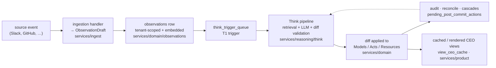

The Think worker (`scripts/run_think_worker.py`) drains `think_trigger_queue`; the post-commit worker (`scripts/run_post_commit_worker.py`) drains `pending_post_commit_actions`. See `services/reasoning/think` for the pipeline and `services/domain` for what the diff mutates.

### Tech Stack at a Glance

| Concern | Choice | Notes |
|---------|--------|-------|
| HTTP/WS gateway | **FastAPI on :8000** | `services/app/gateway/main.py`; WS `/stream`, webhooks, OAuth callbacks |
| Substrate / queues / cache | **PostgreSQL 16 + pgvector** | `pgvector/pgvector:pg16`; holds observations, models, `think_trigger_queue`, `view_ceo_cache` |
| Embeddings | **Ollama (`nomic-embed-text`)** | 768-d vectors; `lib/embeddings/ollama.py` (`EMBEDDING_DIM = 768`), `VECTOR(768)` columns |
| Reasoning / rendering LLM | **Codex** | App path uses `LLM_PROVIDER=codex`; Think main uses `CODEX_MODEL` / `CODEX_REASONING_EFFORT`, while inquiry question planning uses `INQUIRY_CODEX_QUESTION_MODEL` |
| Ingestion lanes | **Kafka (KRaft)** | per-source topic quad (raw / normalized / embedding / dlq); full-pipeline mode only |
| Raw tier | **S3 / MinIO** | bucket `fyralis-raw` (`S3_RAW_BUCKET`) |
| Rate limiter | **Redis** | backs the embedding-backlog drainer (Lua EVALSHA) |
| Frontend | **React / Vite** | lives in the **fyraliscore-demo** overlay repo (was core `ui/`); HTTP `/api` + WS `/stream`; external client, no Python coupling |
| Background workers | **Worker processes** | Think, post-commit, topology sweeper, ingestion consumers, live source pollers (`services/workers`, `services/ingest`) |

Local dev brings up Postgres + Ollama via `docker-compose.yml`; `scripts/dogfood_up.sh` launches the gateway, Think + post-commit workers, and the topology sweeper. (The UI now lives in the overlay repo and is run from there.) Setup details: `README.md`.

---

## System Architecture

Fyralis Core (package `company-os`) is a source-level monolith, not a fleet of microservices: one repository, one importable Python codebase, deployed as a FastAPI gateway plus a set of background workers. Its internal structure is organized into **layers** under `services/`, with a shared lower layer in `lib/`. The directory tree mirrors the runtime data flow — **signal → ingest → domain substrate → reasoning → product surface → app transport** — and the boundaries between layers are statically enforced rather than merely conventional.

### Layered Design

Each `services/<layer>/` is a **PEP 420 namespace package** (no `__init__.py` at the layer root, matching `services/` itself) carrying its own `README.md`. Layers are ordered so that **higher layers depend on lower ones** ("import downward, not upward"): App sits on top of Product/Ingest, Product on Reasoning, Reasoning and Ingest on the Domain substrate, and everything bottoms out on `lib/`. `services/platform` is cross-cutting (authz + execution routing), and `services/workers` holds background packages that drive the substrate.

Boundaries are enforced by **import-linter** (`lint-imports`, configured in `pyproject.toml` under `[tool.importlinter]`, run as the CI `architecture` job). Only invariants that are *empirically true today* are encoded, so a failure is always a real regression — never an aspirational rule the code already breaks. The enforced contracts:

| # | Contract (type) | What it forbids | Documented exceptions |
|---|---|---|---|
| 1 | `lib` is independent of `services` (`forbidden`) | Any `lib.*` module importing `services.*` | Three deliberate lazy/function-local imports in `lib/llm/provider.py` (reasoning `circuit_breaker`, `diff_schema`, `strict_schema`) and test-only fixtures in `lib/`. |
| 2 | Reasoning core does not *directly* import App/Product/Ingest (`forbidden`, `allow_indirect_imports = true`) | `services.reasoning.*` newly reaching up into `services.app` / `services.product` / `services.ingest` | A known **transitive** edge `reasoning → services/domain/models/repo.py → product/reasoning` exists and is tracked as debt in `CODEBASE-MANAGEMENT.md`, not enforced against. |
| 3 | Core never imports the demo / simulation overlays (`forbidden`) | Any core module importing the `fyralis_demo` / simulation overlay packages | None — core is overlay-free; the overlay plugs in only through entry-point seams (`company_os.gateway_extensions`, `company_os.event_subscribers`, `company_os.reasoning_augmentors`). |

Contract 2 is direct-only by design: it catches a reasoning module *newly* coupling upward (the common regression) without red-gating the one pre-existing upward edge in `domain/models/repo.py`. Naming collisions from the re-layering were resolved so `services/reasoning/topology` is distinct from `lib/topology`, and `services/ingest/integrations` from `lib/integrations`.

### Top-Level Architecture Diagram

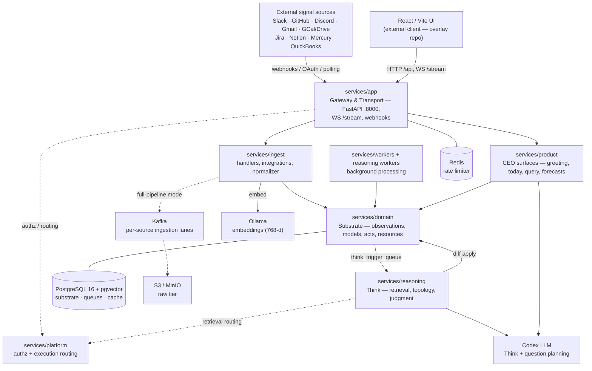

The defining path is **signal → memory → surface**: a source event is normalized by an ingestion handler into an `ObservationDraft`, persisted as a tenant-scoped, embedded `observations` row, which enqueues a `T1` row on `think_trigger_queue`; the Think pipeline retrieves context, runs LLM reasoning, validates a diff, and applies it to Models/Acts/Resources; cascades and reconciliation follow, and the result is rendered into cached CEO views. Dotted edges are mode-gated or cross-cutting (e.g. the Kafka "full-pipeline mode" is opt-in per tenant); solid edges are verified in code.

### Layer Dependency Diagram

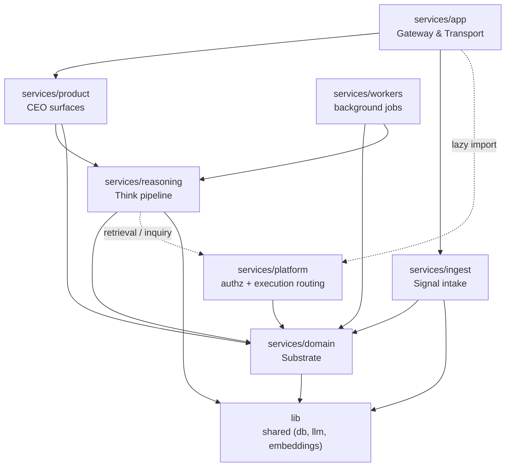

### Subsystem Map

One row per layer; packages and ownership condensed from `docs/architecture/index.md` and `CODEBASE-ARCHITECTURE.md §0` (verified against the source tree).

| Layer | Package(s) | Owns |
|---|---|---|
| **App** | `services/app` (`gateway`, `webhooks`, `realtime`) | HTTP/WS ingress, middleware auth, rate limits, webhook ingress (signature verify + tenant resolve), OAuth, realtime dispatch over `WS /stream`. |
| **Ingest** | `services/ingest` (`ingestion`, `integrations`, `synthetic`) | Per-channel handlers, third-party integrations, normalization to observations, the Kafka full-pipeline path. (GitHub/code intel enrichment was extracted to `Fyralisinc/github-intel`.) |
| **Reasoning** | `services/reasoning` (`think`, `retrieval`, `topology`, `judgment`, `relationships`, `dynamics`, `contestability`, `calibration`) | Retrieval, LLM reasoning, diff validation/apply, reconciliation, topology, judgment/scoring. |
| **Domain** | `services/domain` (`models`, `acts`, `resources`, `observations`, `actors`, `entity_aliases`, `bridge`, `falsifiers`) | The persisted, tenant-scoped substrate; system-of-record repositories (`*/repo.py`). |
| **Product** | `services/product` (`greeting`, `today`, `query`, `conversations`, `forecasts`, `recommendations`, `decision_deltas`, `history`, `model_trace`, `rendering`) | CEO-facing surfaces composed from substrate + reasoning: greeting/CEO view, today briefing, query/ask, forecasts, recommendations, rendering. (The demo tenancy subsystem moved to the **fyraliscore-demo** overlay; it mounts back via the gateway extension seam.) |
| **Platform** | `services/platform` (`access_control`, `execution`) | Five-layer `can_read` access control (`@requires_access`) and the execution-routing / adaptive-inquiry gate. |
| **Workers** | `services/workers` (`anomaly_processor`, `entity_resolver`, `calibration_updater`, `deadline_resolver`, `precipitation`, `edge_drift`, `topology_sweeper`, `topology_updater`, `neighborhood_detector`, `maintenance`) | Polling/scheduled substrate-maintenance and trigger-enqueue jobs — **mostly undeployed** (no compose service). |
| **lib** | `lib` (`shared`, `llm`, `embeddings`, `integrations`, `topology`, `nexus`) | Shared building blocks: DB/IDs/errors/types helpers, structured-output LLM provider, embeddings; **must not import `services`** (enforced). |
| **data-plane** | — (compose) | Backend-only runtime processes and data stores: PostgreSQL 16 + pgvector (substrate, durable queues, cache), Kafka (KRaft, per-source lanes), S3/MinIO (raw tier), Redis (rate limiter), Ollama (768-d embeddings). (The UI container and the nginx-proxy + acme-companion HTTPS edge moved to the overlay's `docker-compose.demo.yml`.) |

---

## App Layer — Gateway & Transport

The HTTP/WS edge. It terminates every external request, authenticates and rate-limits it, dispatches into the ingest/product/reasoning layers, ingests provider webhooks, and fans realtime state out to the UI. Lives in `services/app/` with three packages: `gateway`, `webhooks`, `realtime`. (OAuth install/callback handlers live one layer over in `services/ingest/integrations/`, mounted here by the gateway.)

### Entrypoint & port

- ASGI app: `uvicorn services.app.gateway:app` — the module-level `app` is built by `build_app()` in `services/app/gateway/main.py`. Every dependency (pool, repos, embedder, rate limiter) is injectable so tests construct the app synchronously; production wires them in the `_lifespan` handler.
- Port **8000** (Docker `gateway` service `expose: "8000"`; sandbox publishes `8000:8000`).
- `build_app()` delegates route mounting to `services/app/gateway/route_mounts.py`: core/auth/ingest, substrate, contest, dashboard, Sage internal, recommendations, Today core/artifacts, Structure, Map, decision-deltas, forecasts, model-trace, history, spec/model-page/today routes, webhooks, OAuth integrations, Jira/Mercury/QuickBooks install surfaces, GitHub-intel, and env-gated finance + Slack-DM debug panels.
- An **extension seam** (`services/app/gateway/extensions.py`, entry-point group `company_os.gateway_extensions`) lets installed overlays contribute routers, startup hooks, and public path prefixes. The demo/simulation surfaces (`/v1/demo/*`, the Pelago seed, the simulation mount) live in the **fyraliscore-demo** overlay and plug in here — present only when that overlay is installed. Core imports nothing from the overlay.
- `_lifespan` owns: creating the asyncpg pool (`db_bootstrap.create_gateway_pool`, JSON/vector codecs), constructing `GatewayDeps`, integration state wiring (`state_wiring.py`: secret store + `TenantResolver` + `TenantFlags` + GitHub client/replay cache), starting the realtime dispatcher, a 5-min `oauth_install_states` sweep task, CEO-view wiring (`ceo_view_wiring.py`), and when `KAFKA_BOOTSTRAP_SERVERS` is set the ingestion data-plane producer + S3 raw client (`state_wiring.py`).

### Middleware chain

Added last-to-first, so they run in this order on every request:

| Order | Middleware | Responsibility |
|-------|-----------|----------------|
| 1 | `RequestContextMiddleware` | Assigns a `request_id` (uuid7), binds tenant/actor to structlog, logs a request summary, sets `X-Request-Id`. |
| 2 | `BearerAuthMiddleware` | Validates `Authorization: Bearer <token>` against `actor_sessions`; populates `request.state.auth`; injects `X-Tenant-Id` from the resolved tenant for downstream routers. |
| 3 | `RateLimitMiddleware` | Per-`(tenant, actor)` token bucket; `/ingest/*` gets the higher tier. |

Auth (`services/app/gateway/auth.py`): tokens are opaque uuid7 strings; the DB stores only `SHA-256(token)`. `validate_token()` returns an `AuthContext(session_id, actor_id, tenant_id, expires_at)` or `None` for unknown/expired/revoked (no distinguishing oracle — all yield 401). Sessions are minted via `POST /auth/session` (`create_session`, dev-gated by `AUTH_BOOTSTRAP_SECRET`). A `Bearer`+`X-Tenant-Id` mismatch returns 403 `tenant_mismatch`.

Public bypass (skip Bearer + rate-limit): exact paths `/healthz`, `/metrics`, `/auth/session`, and each provider's `/integrations/<p>/callback|installed|install-error`; **core** prefixes `/view/ceo/`, `/rendering/`, `/debug/`, `/webhooks/`, `/finance/`, `/slack/`, plus `/stream`. `/integrations/<p>/install` stays Bearer-required. Overlay public prefixes (`/simulation/`, the demo picker routes under `/v1/demo/`) are **not** hardcoded in core's `_PUBLIC_PATH_PREFIXES`; they are contributed at runtime by the installed demo extension.

Rate limiting (`services/app/gateway/rate_limit.py`) is an **in-process** `asyncio`-locked token bucket (Redis was deferred), keyed `(tier, (tenant_id, actor_id))`:

| Tier | Path | Budget |
|------|------|--------|
| `SIGNAL_INGEST` | `/ingest/*` | 1000/min (cap 1000) |
| `DEFAULT` | everything else | 100/min (cap 100) |

Over-budget → 429 `{"error":"rate_limited","tier":...}`.

### Webhook ingress

`services/app/webhooks/router.py` mounts `POST /webhooks/{provider}/{subpath:path}` (public-prefixed; the per-provider signature is the only auth). Flow:

1. Capture **raw body bytes**; reject `> MAX_PAYLOAD_BYTES` (1 MB) → 413.
2. Look up the per-provider verifier in `signatures.VERIFIERS` (slack, github, discord, jira, notion, mercury, quickbooks, grafana, linear, stripe); unknown → 404.
3. Best-effort JSON parse (for tenant resolve + Slack/Notion handshakes).
4. Resolve tenant via `app.state.tenant_resolver.resolve(provider, payload, headers)` → `provider_installations` (IN-07 DB-backed, TTL `InstallationCache`); outcome captured but **rejection deferred until after signature verify** (no JSON-validity oracle).
5. Load secrets via IN-08 envelope-encrypted secret store (`secrets.load_secrets`); dev env-var fallback only.
6. Verify signature; `WebhookVerificationError` → 401 + metric. Verified handshakes return early (Slack `challenge`, Discord `{type:1}`, Notion verification).
7. Enforce resolver outcome: `UnknownInstallation` → 401, `PayloadMissing` → 400.
8. **Kafka-first cutover** (`_attempt_kafka_path`): for providers in `_CUTOVER_ENABLED_PROVIDERS` (slack, github, jira, mercury, quickbooks, grafana) whose tenant has `ingestion.kafka_path_enabled` (read via `TenantFlags`, default-on), shadow-write raw → S3 PutIfAbsent → publish to `ingestion.raw` → **flush** (bounded) → return 202. On any failure it falls back to inline `ingest()` (graceful degradation, 200/201 preserved; a `fallback` metric is the operator signal). Discord stays inline (synchronous response-shape constraint).
9. Otherwise inline `services.ingest.ingestion.core.ingest()` under the resolved tenant.

Gmail enters via a separate Pub/Sub push endpoint (`services/app/webhooks/gmail_pubsub.py`, `POST /webhooks/gmail/...`) authed by a Google-signed **OIDC JWT** (`verify_pubsub_oidc_token`), not the HMAC router. Webhook verification + resolver counters are exposed (hand-rolled, no `prometheus_client`) at public `GET /metrics` via `metrics.render_prometheus()`.

### OAuth flows

`services/ingest/integrations/router.py` (`build_integrations_router`, prefix `/integrations`) wires `GET /integrations/{slack,discord,github,notion}/{install,callback}`. `/install` is Bearer-authed (tenant from auth); `/callback` is public and state-token-authed inside the handler against `oauth_install_states` (swept hourly). Jira, Mercury, and QuickBooks add their own Bearer-authed `/integrations/<p>/connect/*` install surfaces, mounted unconditionally.

### Realtime WS dispatch

`services/app/realtime/dispatcher.py` runs one per-process `Dispatcher` holding a dedicated asyncpg connection on `LISTEN observations_new`. On NOTIFY (`{id, kind, tenant_id, source_channel}`) it hydrates an `EventFrame` (one-row SELECT for `sequence_num` + `content`), derives candidate topics, filters by tenant + subscription + a fail-closed `can_read` access check (`services.platform.access_control`), and enqueues onto per-client bounded queues (`maxsize=500`, drop-oldest with a `stream_lagged` control frame).

`services/app/realtime/main.py` exposes `WS /stream` (mounted by `configure_realtime`). Handshake Bearer-auths via `Authorization` header or `?token=` query param (1008 close on failure). Client protocol: `subscribe` / `unsubscribe` / `replay` / `ping`; topics are `tenant:<id>`, `actor:<id>`, `goal:<id>`, `commitment:<id>`, `customer:<id>`. Replay reads durable history (`sequence_num > since`, 30-day partition bound) and persists a cursor to `realtime_replay_cursors`.

### Request / event flow

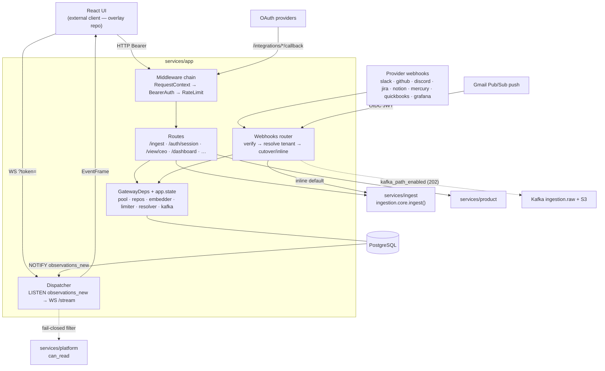

| Module | Path | Role |
|--------|------|------|
| App factory | `services/app/gateway/main.py` | `build_app()`, lifespan, middleware registration, exception handlers, route mounting call |
| Gateway middleware | `services/app/gateway/middleware.py` | request context, bearer auth, public path allowlist, rate limiting |
| Route mounting | `services/app/gateway/route_mounts.py` | ordered gateway/product/ingest router mounting |
| Gateway wiring | `services/app/gateway/state_wiring.py` / `ceo_view_wiring.py` | integration state, data-plane clients, CEO-view/product wiring |
| Bearer auth | `services/app/gateway/auth.py` | uuid7 token → SHA-256 → `actor_sessions` |
| Rate limiter | `services/app/gateway/rate_limit.py` | in-process token bucket, 2 tiers |
| Webhook router | `services/app/webhooks/router.py` | verify → resolve → cutover/inline |
| Tenant resolver | `services/app/webhooks/tenant_resolver.py` | `(provider, installation)` → tenant, cached |
| Secret store | `services/app/webhooks/secrets.py` | IN-08 envelope-encrypted `secret_ref` |
| Gmail Pub/Sub | `services/app/webhooks/gmail_pubsub.py` | OIDC-authed push ingress |
| WS endpoint | `services/app/realtime/main.py` | `WS /stream`, subscribe/replay protocol |
| Dispatcher | `services/app/realtime/dispatcher.py` | LISTEN → bounded-queue WS fan-out |

---

## Ingest Layer — Signal Intake

The ingest layer turns every external company signal into a tenant-scoped `observations` row and kicks off downstream reasoning by enqueuing a Think trigger. Source code lives under `services/ingest/` (packages `ingestion`, `integrations`, `synthetic`).

### The uniform ingest path

All routes converge on one function pair in `services/ingest/ingestion/core.py`, so the persisted observation is identical no matter how the signal arrived:

- `ingest(channel, raw_payload, ...)` — runs handler extraction (step 1), then delegates to `ingest_from_draft` (steps 2–7) with a once-only monthly-partition self-heal retry.
- `ingest_from_draft(channel, draft, ...)` — the shared normalize→persist→enqueue core, also called by the Kafka writer.

The **7-step path** (`core.py`):

| Step | What happens |
|------|--------------|
| 1 | `get_handler(channel)` extracts an `ObservationDraft` (content_text, content, source_actor_ref, external_id, occurred_at, entities_hint, trust_tier). |
| 2 | Pre-assign `observation_id = uuid7()`. |
| 3 | `ActorRepo.resolve_by_source_actor_ref`; misses → `content["_unresolved_actor_ref"]`, `actor_id=NULL`. |
| 4 | `EntityAliasRepo.fast_path_resolve` over 1–3-gram phrases (`candidate_phrases`); misses → `content["_unresolved_phrases"]` for the entity_resolver worker. |
| 5 | Ollama embedding (768-d, `EMBEDDING_DIM`); failure → `embedding_pending=True`. |
| 6 | `ObservationRepository.insert` inside a transaction; dedup on `(source_channel, external_id)` (a hit returns the existing row, `deduped=True`); post-commit `observations_new` NOTIFY flushed via `notify_scope`. |
| 7 | Unless deduped, insert a `T1` / `event_arrival` row into `think_trigger_queue`. |

`ingest()` enforces a 1 MB payload cap (`MAX_PAYLOAD_BYTES`) and rejects NUL bytes. Composed dedup keys come from the central `services/ingest/ingestion/idempotency/` constructors so a source's `external_id` can't drift across its webhook/backfill/poll paths.

### Two convergent ingestion paths

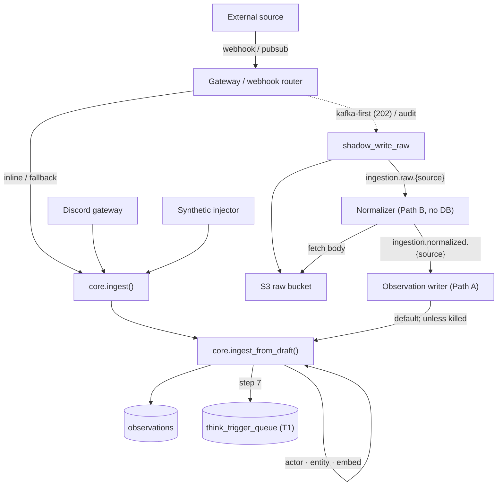

- **Inline** — `core.ingest()` is called synchronously from the gateway webhook router, the Slack/finance routers, the Discord gateway, and the synthetic injector (`services/ingest/synthetic/core.py`).
- **Kafka full pipeline** — `shadow_write_raw` (`services/ingest/ingestion/shadow_write.py`) hashes the body, PutIfAbsent to S3 (`s3://fyralis-raw`), builds a `RawEnvelope`, and publishes to `ingestion.raw.{source}`. The **normalizer** (`normalizer/worker.py`, **Path B** — fetch body, run handler, emit `NormalizedEnvelope`; statically/runtime-proven to import no DB modules) publishes to `ingestion.normalized.{source}`; the **observation_writer** (`writers/observation_writer.py`, **Path A**) consumes it and calls `ingest_from_draft` when full-mode.

**Per-source lanes.** `services/ingest/ingestion/kafka/topics.py` derives all topic names from `RawEnvelope.SourceLiteral`, producing `ingestion.{raw,normalized,embedding,dlq}.{source}`. Each source ingests on its own physical lane so lag/backpressure in one source cannot head-of-line block another. A per-source worker uses consumer group `{stage_group}.{source}` for independent lag.

**KAFKA_PATH_ENABLED gate (ADR-0001, kafka-first default).** The writer and every ingress reader resolve `ingestion.kafka_path_enabled` through the single helper `TenantFlags.kafka_path_enabled()` (default `KAFKA_PATH_ENABLED_DEFAULT=True`, fleet override `INGESTION_KAFKA_PATH_DEFAULT=false`):

- **No flag row → kafka-first**: ingress returns `202`, skips inline; the writer persists.
- **Explicit `FALSE` (operator or `auto:circuit_breaker` kill-switch) → inline**: ingress writes synchronously; the writer shadow-logs (no-op).

Because both ends read one helper, a publishing ingress can never pair with a shadow-logging writer (no split-brain). The request-path flush is bounded by `CUTOVER_FLUSH_TIMEOUT_SEC` (default 2.0s) so a slow broker trips the inline fallback fast. Synchronous-result endpoints (gateway debug ingest, slack/finance backfill consoles) deliberately call `ingest()` directly. The cutover circuit breaker (`feature_flags/circuit_breaker.py`) auto-flips a tenant to `FALSE` on sustained per-lane lag; recovery is operator-driven via `scripts/reenable_kafka_path.py`.

### Supported sources

Handlers self-register at import via `@register(channel)` in `services/ingest/ingestion/handlers/`; integrations (OAuth/client/onboarding) live under `services/ingest/integrations/<source>/`. The canonical source families are the 11 entries of `RawEnvelope.SourceLiteral`.

| Source | Channel(s) | Auth | Live ingress |
|--------|-----------|------|--------------|
| Slack | `slack:message` | OAuth (bot xoxb; per-user xoxp planned) | webhook (signed) |
| GitHub | `github:webhook` | GitHub App (JWT / installation token) | webhook + HMAC (`X-Hub-Signature`) |
| Discord | `discord:message/interaction/webhook` | OAuth bot token | gateway WSS (leader-locked) |
| Gmail | `gmail:` | Google DWD (service account) | Pub/Sub push + history poll |
| Notion | `notion:*` | OAuth | webhook |
| Google Calendar | `calendar:*` | Google DWD (reuses Gmail SA) | `events.watch` push + live poller |
| Google Drive | `gdrive:*` (per handler) | Google DWD (reuses Gmail SA) | `changes.watch` push + live poller |
| Jira | `jira:issue` | API token (Basic auth) | webhook + HMAC |
| Mercury | `mercury:*` | Bearer API token | webhook (HMAC, when supplied) |
| QuickBooks | `quickbooks:*` | OAuth (realm_id + access/refresh; operator-mediated install) | webhook (when supplied) |
| Grafana | `grafana:annotation`, `grafana:alert` | Service-account Bearer | webhook (opaque URL token) |

OAuth install/callback for Slack/Discord/GitHub/Notion mounts via `services/ingest/integrations/router.py`; Gmail/Calendar/Drive use a first-party DWD connect wizard (`{preflight,finalize}`); Jira and the finance sources (Mercury/QuickBooks) use Bearer-authed connect wizards that store credentials as opaque refs in the gateway `secret_store`. Additional in-code handlers exist for internal/system channels and Linear/Stripe/email/calendar.

### Intelligence enrichment & embedding backlog

- **GitHub Intelligence** *(extracted)* — `github_intel` + `code_intel` (PR/CI/branch/issue FSMs, inline `content["intelligence"]` enrichment, the `github_intel_queue` worker + `github_signal_enrichment`, the code graph / blast-radius, and the `/github-intel/*` read API) were **extracted to a separate repo (`Fyralisinc/github-intel`)**. The inline hook is removed from core; they return as the first external interface (ADR-0004).
- **Embedding** — when step 5 leaves `embedding_pending=TRUE` and an `embedding_producer` is wired, `ingest_from_draft` publishes (post-commit, best-effort) to `ingestion.embedding.{source}` for the async embedding worker. A backlog drainer that scans Postgres directly for `embedding_pending=TRUE` is the safety net when Kafka is down, so failed embeddings are never lost.

---

## Domain Layer — Substrate

The domain layer (`services/domain/`) is the tenant-scoped, persisted **system of record** every higher layer builds on. It is a namespace package of sub-packages, each owning specific Postgres tables and exposing a **plain-asyncpg repository (no ORM)** in `repo.py`. Rows hydrate into `lib.shared.types` Pydantic models on every read (so schema drift surfaces immediately), new IDs are `uuid7`, and nearly every row carries `tenant_id` with queries scoped by it. These repositories are *imported and constructed with a pool* — there is no process or router here.

| Sub-package | Repo / entry | Owns (tables) |
|---|---|---|
| `observations/` | `ObservationRepository` (`repo.py`) | `observations` (partitioned); `state_change.py` emits the audit chain |
| `models/` | `ModelsRepo` (`repo.py`), `EdgesRepo` (`edges_repo.py`) | `models`, `model_edges`, `model_signal_readings` |
| `acts/` | `goals.py` / `commitments.py` / `decisions.py` over `state_machines.py` | `goals`, `commitments`, `decisions` + edge tables |
| `resources/` | `ResourceRepo` (`repo.py`) | `resources`, `resource_transactions` (partitioned), `resource_deployments`, `customer_commitments` |
| `actors/` | `ActorRepo` (`repo.py`) | `actors`, `actor_identity_mappings` |
| `entity_aliases/` | `EntityAliasRepo` (`repo.py`) | `entity_aliases` |
| `bridge/`, `falsifiers/` | `bridge/queries.py` | (read-only dashboard queries; `falsifiers` re-exports `models/falsifier.py`) |

### Model — the first-class falsifiable belief

The central abstraction. A `models` row is a belief about the organization with confidence, falsifiers, evidence, and typed edges. Defined in `db/migrations/0001_foundation.sql`, written through the **9-step insert pipeline** in `services/domain/models/repo.py`.

| Concept | Detail |
|---|---|
| **Confidence** | `FLOAT CHECK (>= 0.05 AND <= 0.95)`; clipped at insert. `confidence_at_assertion` is write-once; calibration adjusts live confidence without rewriting it. |
| **Activation** | `[0,1]` recency/importance. Raised by retrieval (+0.15, capped), decayed exponentially (~5-day half-life); low/stale Models archived. |
| **Falsifier** | `JSONB`; mandatory when confidence ≥ 0.7. Five kinds (`services/domain/models/falsifier.py`): `observation_pattern`, `commitment_outcome`, `prediction_deadline`, `resource_threshold`, `explicit_contestation`. |
| **Proposition kind** | Epistemic stance: `observation` \| `belief` \| `prediction` \| `norm`. `proposition_kind` is a **GENERATED** column off `proposition->>'kind'`. Legacy 12-kind payloads are normalized to these four stances at the boundary (`models/propositions.py`, `_LEGACY_TO_STANCE`). |
| **Memory grammar (5 axes)** | GENERATED columns (`db/migrations/0047`): `claim_role` (fact/concern/hypothesis/prediction/pattern/...), `abstraction_level` (atomic/relationship/composite/pattern), `time_mode` (past/present/future/recurring/...), `modality` (actual/observed/normative/...), `polarity` (positive/negative). Classify a Model's structural role independent of stance. |
| **signal_readings** | JSONB sub-claims tracking which Observations contributed evidence; each independently contestable. Mirrored to typed sidecar `model_signal_readings` (`db/migrations/0038`; FK to `models`, `reading_kind` CHECK). |
| **Scope** | `scope_actors UUID[]` + `scope_entities JSONB` (+ `scope_temporal`) — the org context the Model applies to. |
| **model_edges** | First-class typed Model↔Model relationships (`db/migrations/0031`), single-writer `EdgesRepo`. `edge_kind` is registry-validated (`lib/shared/edge_registry.py`); symmetric kinds stored as two synced rows; edges go `inert` when an endpoint archives. Dual-written alongside legacy `supporting_model_ids`/`contributing_models` arrays during cutover. |

### Act = Goal | Commitment | Decision

Executable organizational primitives. Legal transitions are defined **only** in `services/domain/acts/state_machines.py` (pure, no DB); callers import `can_transition`. Invariants C1–C10 / G1–G4 live in `invariants.py`; a deadlock-retry shim is in `retry.py`. Relationship edge tables: `contributes_to`, `depends_on`, `constrained_by`.

| Act | Table | State machine |
|---|---|---|
| **Goal** | `goals` (`target_date`, `parent_goal_id`, `altitude`) | `active ↔ paused`; both → `achieved`/`abandoned` (terminal) |
| **Commitment** | `commitments` (`owner_id`, `due_date`, `ambition_level`, `last_confidence_basis`) | `proposed → active/closed`; `active → blocked/paused/doneunverified/closed`; `doneunverified → doneverified`; terminal `doneverified`,`closed` |
| **Decision** | `decisions` | `drafted → active → revisited/archived`; `revisited ↔ active`; terminal `archived` |

### Resource — assets / capacity

`services/domain/resources/`. A `resources` row is an asset or capacity (kind, identity, `current_value JSONB`, `utilization_state`, `controllability`). Balance math runs in `transactions.py` via `apply_delta` under `SELECT … FOR UPDATE` with capacity invariant **R1**. `resource_transactions` is monthly-partitioned by `occurred_at`. `resource_deployments` (resource→commitment) and `customer_commitments` form the **Bridge spine** that `bridge/queries.py` reads.

### Observation — the source of T1

`services/domain/observations/`. An ingested signal event: source channel, content, actor, timestamp, and **trust tier** (`authoritative`/`high`/`medium`/`low` and external variants, `TrustTierValue` in `lib/shared/types.py`; per-channel `CHANNEL_TRUST_MAP`). A new Observation is the **T1** reasoning trigger.

- **Partitioned** monthly by `occurred_at`; composite PK `(id, occurred_at)`, so all FKs *into* observations are application-level.
- Dedup on `UNIQUE (source_channel, external_id, occurred_at)`; 768-d `embedding` with HNSW cosine index; `embedding_pending` set when Ollama is down (retried by the backlog worker).
- `cascade_trace` is a recursive CTE up the `cause_id` chain. `state_change.emit_state_change` is the canonical helper every other domain write calls to record a `kind='state_change'` observation *inside the caller's transaction* — building the audit/cause chain. Post-commit `observations_new` NOTIFY is buffered in a ContextVar and flushed after commit (`events.py`).

### Entity alias — fast-path text→entity

`services/domain/entity_aliases/repo.py` over `entity_aliases`. Maps a phrase ("NBI") to a resolved entity (`resolved_entity_ref JSONB`) with a 768-d `alias_embedding` and `UNIQUE (tenant_id, alias_text, actor_id)`. Casefold/whitespace-collapse normalization, advisory-lock idempotency, and ambiguity detection. Unresolved phrases are deferred for LLM resolution.

### Substrate relationships

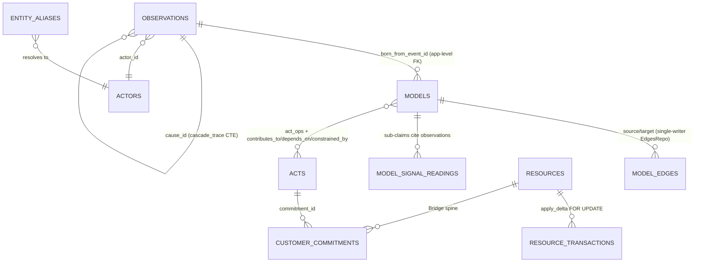

All of Models/Acts/Resources call `emit_state_change` to thread their writes into the Observation audit chain, which is why Observations sit at the center of both ingestion (T1) and the durable cause graph.

---

## Reasoning Layer — The Think Pipeline

The reasoning layer is the cognitive runtime. It drains trigger queues, retrieves context, reasons (deterministically or via an LLM), validates and applies a structured `Diff` to the Models substrate under region locks, then cascades, enqueues durable post-commit work, and proposes latent relationship candidates. Source: `services/reasoning/` (packages `think`, `retrieval`, `topology`, `relationships`, `judgment`, `dynamics`, `contestability`, `calibration`), plus the adaptive inquiry engine at `services/platform/execution/inquiry.py`.

### The `think()` pipeline (split inferential transaction)

`services/reasoning/think/reason.py::think` uses a split transaction boundary for
inferential triggers: retrieval/planning and the LLM call run outside an explicit
DB transaction, then validation/apply/cascade run inside a short mutation
transaction. Authoritative deterministic triggers keep the legacy wide
transaction because they do not call an LLM and some handlers intentionally
perform side-effectful reasoning.

1. Load any pending relationship candidate for the trigger.
2. **Retrieve context** via `platform.execution.inquiry.retrieve_for_execution(mode="deep")` (the active engine; legacy resolver is `retrieval/primary.py`).
3. Optional second-pass expansion (`retrieval/second_pass.py`).
4. Build a `ReasoningFrame` (`think/reasoning_frame.py`); detect ephemeral `dynamics` signals — a detected state-jump enqueues a deferred `T3:missing_transition`.
5. Assemble a bounded prompt context (`retrieval/assembler.py`).
6. **Reason:** authoritative triggers take the no-LLM `think/deterministic.py` path; inferential triggers call `think/llm_reason.py` → `lib.llm.provider.structured(schema=RawDiff | RawDiffClaimsOnly)`.
7. Deterministic safety-net injectors add create-commitment/block/decision/prediction ops when the LLM under-emits.
8. Enter the mutation transaction, compute the touched region (`think/region_locks.py`), insert a `think_runs` row, acquire an advisory **region lock**.
9. **Validate** the diff (`think/validator.py`); a strict region check can raise `OutOfRegionError`, which re-runs retrieval allowing the missing entities.
10. **Reconcile** claim inserts (`think/reconciler.py`) then **apply** claim/edge/act/resource ops (`think/applier.py`) — idempotent via the `applied_triggers` ledger.
11. Adjudicate the loaded relationship candidate against the applied diff.
12. Anomaly check/publish, enqueue durable post-commit actions, **cascade** from the first act op, update `think_runs` status, record LLM cost.

### The worker

`think/worker.py::ThinkWorker` polls `think_trigger_queue` with `FOR UPDATE SKIP LOCKED`, promotes `model_reeval_queue` rows into `T4` triggers (subkind `model_reeval`), applies a per-tenant `asyncio.Semaphore` cap, heartbeats the region lock (~30s), backs off polling under backpressure (default limit 500), retries, and dead-letters after **5 attempts** (`model_reeval` failures move to `model_reeval_dead_letter`). Launched by `scripts/run_think_worker.py` (compose `think_worker`); post-commit drains via `scripts/run_post_commit_worker.py`.

### Trigger taxonomy

| Kind | Meaning |
|------|---------|
| **T1** | Ingestion — a new Observation arrived; carries seed entities/text/time and scope actors. |
| **T2** | Prediction-reevaluation — a Model's `evaluate_at` deadline passed (often deterministic bookkeeping). |
| **T3** | Anomaly — a detected organizational anomaly (also reached via contestation); carries a region spec. |
| **T4** | Background/maintenance — topology relationship candidates, precipitation proposals, reeval promotions. |
| **T6** | Legacy topology-event trigger from the retired accepted-memory graph; kept for backward compatibility. |

### Retrieval pathways + inquiry

The adaptive inquiry runtime (`run_inquiry_retrieval` in `services/platform/execution/inquiry.py`) plans questions and dispatches `RetrievalAction`s onto five low-level, read-only pathways in `services/reasoning/retrieval/pathways.py` (each returns a `PathwayResult`, mutates nothing); pathways are weighted per trigger kind.

| Pathway | Strategy | Inquiry target name |
|---------|----------|---------------------|
| **A** | Structural proximity — graph walk over Acts edges | `structural` |
| **B** | Semantic similarity — embedding cosine over active Models | `semantic` |
| **C** | Temporal recency — Observations + Models in a time window (default 30d) | `temporal` |
| **D** | Pattern — Models with `claim_role='pattern'` | `pattern` |
| **G** | Model-graph traversal — edges + composition expansion (max 2 hops) | `model_edge` |

The inquiry layer adds hypothesis lines (e.g. counterevidence, recurrence) that map onto these targets and define stop conditions; `EXECUTION_RETRIEVAL_ENGINE=legacy` falls back to `retrieval/primary.py`.

### Diff structure & reconciliation

The LLM (or deterministic path) emits a `RawDiff` (`think/diff_schema.py`) — Pydantic discriminated unions on `op`:

| Field | Op vocabulary |
|-------|---------------|
| `claim_ops` (`ClaimOp`) | `insert` / `update` / `archive` over Models |
| `edge_ops` (`EdgeOp`) | edge add/mutate over the Model/Act graph |
| `act_ops` (`ActOp`) | `create_*`/`update_*`/`transition_*` goal/commitment/decision + `add_edge_contributes_to`/`depends_on`/`constrained_by` |
| `resource_ops` (`ResourceOp`) | resource mutations |

`RawDiffClaimsOnly` is the smaller schema used when only claim emission is safe.

**Reconciliation** (`think/reconciler.py`) dedups claim inserts before apply on four signals: embedding **cosine ≥ `HUMAN_REVIEW_COSINE`** (default 0.70), overlapping **scope**, identical proposition **kind**, and **recency** (default 30-day window). The adjusted score (cosine blended with graph structure) decides:

- `auto_merge` — score ≥ `AUTO_MERGE_COSINE` (default 0.85, or a per-kind override): the insert is converted to a `confirm` update on the existing Model.
- `human_review` — score in `[0.70, 0.85)`: pass through but flag, logged to `reconciliation_events`.
- `no_match` — no candidate in window: insert as new.

Per-kind rules (`_KIND_RULES`) tighten thresholds for heavily-paraphrasing kinds (`market_assessment`, `concern`) and can set `never_auto_merge` for kinds requiring a human.

### Topology, relationships, judgment

`topology/field.py::LatentTopologyService` is the **latent relationship field**. It converts a new/changed Model into an `ImpactSignature` (flows / pressures / surfaces / stakes / time-shape), searches bounded neighbor pools, scores consequence interactions (`0.45·flow + 0.40·pressure + 0.15·stake`), and persists high-yield **relationship candidates**. It runs inline on Model insert (called from `domain.models.repo`) and periodically from the `topology_sweeper` worker (`sweep_tenant`).

- `min_insert_score=0.46` — candidate must clear this to be persisted.
- `min_think_score=0.66` — candidate must clear this to enqueue a small **T4** Think pass.

`relationships/` generates and adjudicates per-edge-kind candidates; `judgment/scoring.py` provides the shared `judgment_leverage` attention score (impact, uncertainty, urgency, actionability, authority, novelty, reversibility, confidence) that ranks candidates by human-judgment worthiness. A candidate only becomes an edge op after T4 Think adjudication.

### Contestability & calibration

- **Contestability** (`contestability/service.py::contest_model`, reached via gateway `POST /contest/{model_id}`): checks standing (`contestability/standing.py`), and for belief-kind Models applies a first-person confidence **override** — primary subject `×0.3`, secondary `×0.5`, floored at `0.15` and clipped to `[0.05, 0.95]` — then enqueues a **T3** trigger so Think re-reasons.
- **Calibration** (`calibration/hit_rate.py`): conservative per-claim-class 30-day hit rate. Returns `None` below `MIN_SAMPLES_FOR_CALIBRATION = 5` resolved samples — honest absence over fabrication.
- **Dynamics** (`dynamics/`): emits ephemeral signals only (state-jump detection feeding `T3:missing_transition`); no new truth table.

### Think transaction boundary (flow)

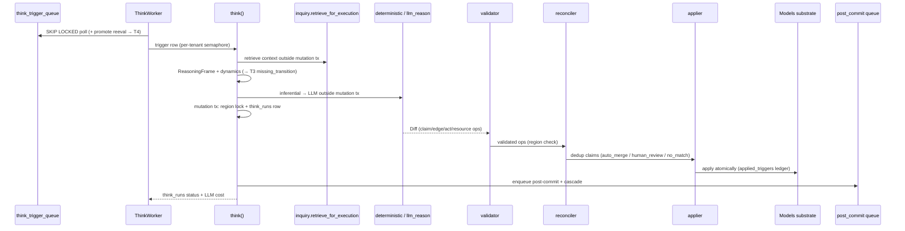

---

## Product Layer — CEO Surfaces

`services/product/` is the read/compose/render frontier: it turns cached substrate snapshots and reasoning retrieval into voice-compliant, LLM-rendered surfaces for the CEO. It does almost no signal mutation — the one exception is recommendation handlers (act/dismiss/ratify). Every package is mounted into the gateway; the only always-on worker is the greeting scheduler, started in-process by the gateway lifespan. (The demo tenancy subsystem that used to live here moved to the **fyraliscore-demo** overlay; see below.)

### Surfaces

| Surface | Package | What it shows | Backing data / cache |
|---|---|---|---|
| CEO view / Greeting (home) | `greeting/` | Pre-rendered home: greeting + close-line prose, query grid, status, per-kind cards | `view_ceo_cache` keys `greeting`, `cards`, `query_grid`, `status` (read via `GET /view/ceo/home`, never 500s) |
| Rendering (internal) | `rendering/` | LLM prose for greetings/cards/queries; not a UI surface | `lib.llm.provider`; writes cost rows to `view_render_costs` |
| Query / Ask | `query/` | Free-form CEO question → classified, retrieved, rendered conversation turn | `platform.execution` Fast-Path + `reasoning.retrieval`; prefetch cache key `query_prefetch:<id>` |
| Today | `today/` | Briefing/review list of recommendations as cards with severity, kind, tags, decision deltas | `services.domain` recs + calibration + acts; severity ≈ `expected_impact × confidence` |
| Recommendations | `recommendations/` | Ranked action list with act / dismiss / ratify | `services.domain` (norm-kind Models); act applies `proposed_change` + emits a `state_change` observation; SSE bus |
| Decision deltas | `decision_deltas/` | Proposed-change object: before/after, falsification, consequence preview, evidence chain | `decision_deltas` repo; promoted from recommendations |
| Forecasts | `forecasts/` | Three tabs: active predictions, resolved outcomes, calibration/accuracy | `predictions` + `prediction_signals` tables |
| History / Ledger | `history/` | Chronological audit / reconciliation / state-change events in six canonical buckets | `observations(kind='state_change')` joined to commitments/Models |
| Model trace / map | `model_trace/` | Trace Back (what supports a node) / Trace Forward (what it enables) | BFS walks over `model_edges` (`supports`, `instance_of`, `superseded_by`) |
| Conversations | `conversations/` | Per-card probe threads | persisted threads; free-form Ask routed through `QueryHandler` |
| Demo *(overlay)* | overlay `fyralis_demo` | Anonymous multi-tenant sandbox: company picker, session start, signal injection | moved to the **fyraliscore-demo** overlay repo; mounts back via the gateway extension seam |

### Greeting scheduler — the CEO-view pre-compute

`greeting/scheduler.py::GreetingScheduler` is an always-on in-process worker (started when `GATEWAY_START_GRT_SCHEDULER != 0`). It refreshes `view_ceo_cache` per tenant on four triggers:

- **Scheduled** — every `refresh_interval_seconds` (default 15 min).
- **Time-of-day boundaries** — tenant-local 6am/10am/2pm/6pm/10pm crossings.
- **Postgres `LISTEN view_ceo_refresh`** — NOTIFY from the post-commit worker.
- **Durable poll** of `pending_post_commit_actions` to catch lost NOTIFYs.

Each refresh composes a read-only `SubstrateSnapshot` (`greeting/snapshot.py`), fans out greeting / close-line / query-grid / per-kind card renders concurrently through a `RenderingAdapter` (`max_concurrent_renders` default 6, plus a per-card reasoning/evidence pass), writes the cache keys via `greeting/cache.py::ViewCeoCacheRepo`, and publishes WS updates (`greeting/stream.py` serves `WS /view/ceo/stream`). The UI's home read just hits the cache, so it is cheap and never blocks on the LLM.

### Rendering — voice-compliant prose with retry + cost tracking

`rendering/core.py::RenderingService` is the single prose orchestrator. Per render: build prompt (`rendering/prompts/`) → raw `lib.llm.provider` call (circuit-breakered, returns HTML) → `voice_rules.check_all` → **retry once** with a correction prompt if any REJECT-severity rule fires (return flagged output + log if still rejected) → record cost to `view_render_costs` when a pool is configured. It is exposed only as internal `/rendering/*` routes consumed by the greeting scheduler and the query layer — never by the UI directly.

### Query / Ask

`query/core.py::QueryHandler.answer_query` runs **classify → strategy → retrieve → render**. `query/classifier.py` is a six-category classifier: a cheap keyword-heuristic prefilter, falling back to a `deepseek-chat` structured call. The chosen category dispatches to a per-category strategy (`query/strategies/`) that runs `platform.execution` Fast-Path retrieval + `reasoning.retrieval` context assembly in one transaction, then renders a conversation turn. Supports prefetch caching and optional card context.

### Demo — anonymous multi-tenant sandbox

The demo subsystem (the public company picker, `/v1/demo/sessions/start` clone-on-demand provisioning, the signal simulator, per-session budgets, and demo model routing) **moved out of core** into the **fyraliscore-demo** overlay repo (the `fyralis_demo` package). It plugs back in through three core-defined extension seams and core imports nothing from it:

- **Gateway extension registry** — `services/app/gateway/extensions.py` (entry-point group `company_os.gateway_extensions`). The installed demo extension contributes the `/v1/demo/*` routers, its public path prefixes, and startup hooks: the Pelago seed (was core `services/app/gateway/demo_seed.py`, now overlay `fyralis_demo/seed.py`) and the simulation mount.
- **Process-local event bus** — `lib/shared/events.py` (entry-point group `company_os.event_subscribers`). Core publishes `recommendation.event`; the overlay subscribes and fans out to the demo SSE stream.
- **Reasoning context-augmentor registry** — `services/reasoning/think/hooks.py` (entry-point group `company_os.reasoning_augmentors`). Core defaults to strict retrieval; the overlay can register the "full active ledger" augmentation.

When the overlay is installed, the flow is as before: `start_session` provisions a fresh `tenant_id` (clone-on-demand), loads a snapshot with per-tenant UUID remap, mints a short-lived CEO `actor_sessions` token, promotes recommendations → decision deltas, and registers the tenant with the greeting scheduler; the simulator drives the full ingest pipeline. The demo's own tables (`demo_configs`, `demo_sessions`, `demo_session_costs`) and the `tenants.demo_config_id` column are overlay-owned — core dropped them in `db/migrations/0093_drop_demo_scaffolding.sql` and keeps only the generic `tenants` table with its `is_demo` column. The demo Pydantic models (TenantRow/DemoConfigRow/DemoSessionRow/DemoSessionCostRow) likewise moved out of `lib/shared/types.py` into the overlay's `fyralis_demo/types.py`.

---

## Platform Layer — Access Control & Execution Routing

The platform layer (`services/platform/`) is the cross-cutting runtime that decides **who may see what** (five-layer access control) and **how a signal should be processed** (deterministic execution routing + the adaptive-inquiry retrieval loop). Two packages:

| Package | Path | Role |
|---------|------|------|
| `access_control` | `services/platform/access_control/` | `can_read` engine, roles, manager-chain/channel hierarchy, materialized views, `@requires_access` decorator |
| `execution` | `services/platform/execution/` | `decide_route` gate, adaptive inquiry runtime, route/envelope contracts |

### Five-layer access control

`can_read(actor_id, entity, *, conn, tenant_id)` in `services/platform/access_control/checks.py` evaluates layers **in order** and returns an `AccessDecision(allowed, reason, override_applied)` — `reason` is the rule name that decided, so gateway/realtime can log *why* a 403 or dropped delivery happened. `can_read_by_id(kind, id, ...)` hydrates the row first via `_load_entity` (read-only SELECTs).

| Layer | Entity | Decision logic |
|-------|--------|----------------|
| 1 — **Tenant isolation** (mandatory) | all | `entity.tenant_id != tenant_id` → absolute deny (`tenant_mismatch`); no override bypasses it. |
| *(override gate)* | all except HR | After layer 1, `admin` → `admin_override`, `leadership` → `leadership_override` (both set `override_applied=True`). **Skipped for HR-channel observations.** |
| 2 — **Observation scope** | observation | author / mentioned actor (`entities_mentioned` JSONB or `source_actor_ref` mapping) / shared channel / manager chain (manager chain only for non-HR channels). |
| 3 — **Act ownership** | commitment, goal, decision | commitment owner/contributor, owner's manager chain, shared-goal teammate, entity-scoped `actor_roles` grant; goals via any visible contributing commitment; decisions via role grant or `constrained_by` a visible commitment. |
| 4 — **Resource kind** | resource | role gate by kind — `financial`→finance/leadership, `ip`→legal/leadership, `relational`/`capacity`/`infrastructure`→leadership(+inline), `regulatory`→leadership/legal; plus entity-scoped grant, relational `account_owner(s)` metadata, capacity `team_ids`/active deployment. |
| 5 — **Model visibility** | model | `visible_to_subjects` (public) → allow; actor in `scope_actors` → `model_self_scope` (first-person, *not* an override); else visibility flows through `scope_entities` via `actor_visible_commitments`/`actor_visible_goals`. |

**Manager chain** (`hierarchy.py`) walks `actors.metadata.manager_id` upward (`manager_chain_of`, depth cap 32, cycle-guarded). **Channels**: `is_hr_channel` matches prefixes `hr:`/`legal:`/`incident:` (HR skips both manager-chain and shared-channel visibility); `is_shared_channel` treats `internal:`/`system:` as implicitly tenant-shared and otherwise consults the `shared_channels` table.

**Materialized views** (`materialized.py`): `actor_visible_commitments` / `actor_visible_goals` / `actor_visible_models`, refreshed by `refresh_all()` (concurrent after first build) — invoked nightly by the maintenance worker and on role/hierarchy changes — used as a fast point-check path for layer-5 scope-entity lookups.

**Enforcement**: `@requires_access(entity_type, entity_resolver)` (`middleware.py`) decorates gateway routes — reads `request.state.auth` (set by `BearerAuthMiddleware`), resolves the entity id (None/`""` → skip, for list endpoints), calls `can_read_by_id`, returns `403 {error, reason, ...}` on deny (401 if unauthenticated, fail-closed otherwise), and writes an `access_override_log` row via `record_override` when `override_applied`. The realtime dispatcher and retrieval assembler call `can_read` via lazy imports.

### Execution routing

`decide_route(signal: SignalEnvelope) -> RoutingDecision` in `services/platform/execution/routing.py` is a deterministic, LLM-free gate: it scores text-pattern hits (risk / commitment / decision / human-validation / sensitive regexes), trust tier, entity overlap, signal kind, and source importance into a `[0,1]` score with a `score_breakdown`, then maps to one of six routes:

| Route | Fires when | Estimated cost |
|-------|-----------|----------------|
| `FAST_PATH` | explicit user query (`signal_ref_type=="query"`, `USER_QUERY`, `ui:query`) | fast_retrieval, 0–1 small LLM |
| `BACKGROUND_PATH` | `anomaly_flagged` / `internal:anomaly` source | async, budgeted |
| `HUMAN_VALIDATION_PATH` | human-validation language + (entities or risk or decision) | human, 0–1 small LLM |
| `DETERMINISTIC_UPDATE` | `state_change`/`prediction_resolution` from a high-trust tier | db_only, 0 LLM |
| `DEEP_INQUIRY_PATH` | score ≥ 0.45 with enough entity/trust/risk/commitment weight | deep_inquiry, up to ~3 small + 1 frontier |
| `IGNORE_OR_ARCHIVE` | low-value chatter, low-trust+low-score, or below materiality | none |

**Routing status**: `decide_route` currently has **no production caller** and is exercised only by execution tests. The former shadow-decision ledger (`signal_routing_decisions`) was dropped by migration `0127`, so active ingest writes Think triggers directly instead of persisting routing decisions.

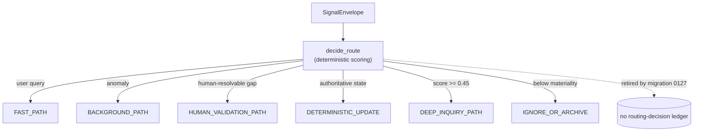

### Adaptive inquiry engine

`retrieve_for_execution(...)` / `run_inquiry_retrieval(...)` in `services/platform/execution/inquiry.py` is the **active** retrieval path (default; `EXECUTION_RETRIEVAL_ENGINE=legacy` falls back to `primary_retrieve`). It is wired into the Think worker (`services/reasoning/think/reason.py`, deep mode) and Query strategies (`services/product/query/strategies/base.py`, fast mode). It wraps the low-level retrieval pathways (`pathway_a_structural` … `pathway_g_model_edges`) in a question-planning loop:

1. **Baseline seeding** — `primary_retrieve` at an adaptive `top_n` keyed on signal class (`weak`/`material`/`broad`).
2. **Hypotheses** — `_generate_hypotheses` emits H1 (risk), H2 (commitment), H3 (recurrence), plus a standing H0 "noise / already-captured / no update".
3. **Discriminating questions** — six primitives (`DEPENDENCY`, `COMMITMENT`, `COUNTEREVIDENCE`, `OWNERSHIP`, `GOAL_IMPACT`, `RECURRENCE`); for T1 triggers an LLM plans questions (`LLMInquiryQuestionPlan`) merged with deterministic safety questions, otherwise deterministic-only fallback.
4. **Evidence reservoir** — each question compiles to ranked `RetrievalAction`s; results dedupe into `EvidenceCard`s tagged with supports/weakens/contradicts hypotheses.
5. **Sufficiency gate** — `_sufficiency_gate` returns `sufficient_for_reasoning` / `insufficient_continue` / `insufficient_defer` / `human_validation_required` / `no_update_needed` / `budget_exhausted`; needs support + a counterevidence check + a visible affected region to declare sufficient.
6. **Context packet** — `_compile_context_packet` builds a token-budgeted (`reasoning_packet_token_budget`, default 24000) packet of decisive + grouped supporting evidence attached to the Think prompt.

`FAST_PATH`/`HUMAN_VALIDATION_PATH` and fast mode run `max_rounds=0` (baseline only, no multi-round questioning); `DEEP_INQUIRY_PATH` runs up to `INQUIRY_MAX_ROUNDS` (default 2). When `persist`, the session is written to the `inquiry_*` tables. Config is overridable via `InquiryConfig.from_env()` (`INQUIRY_*` env vars).

---

## Workers, Shared Libraries & Data Plane

This layer covers the out-of-request processes (`services/workers/` plus the actually-deployed reasoning/ingestion workers), the shared `lib/` dependency floor every service imports, and the runtime/data-plane topology defined by `docker-compose.yml`.

### Background Workers

`services/workers/` holds substrate-maintenance worker packages. **Almost none are wired into `docker-compose.yml`** — they are implemented (and migrated) but not deployed as first-class processes. Only `topology_sweeper` has a launcher (`scripts/run_topology_sweeper.py`), and even that is a host process, not a compose service.

| Package (`services/workers/`) | Job | Deployed? |
|---|---|---|
| `anomaly_processor` | Wave 4-B. Detects six anomaly kinds, scores significance, debounces, writes sub-threshold signals to the Memory Fabric, enqueues `T3` triggers (`worker.py`, `detectors.py`, `significance.py`, `debounce.py`, `memory_fabric.py`). | No |
| `entity_resolver` | Deferred LLM resolution of `content._unresolved_phrases` → aliases + re-enqueue `T1` (`worker.py`, `context.py`). | No |
| `calibration_updater` | Wave 4-C weekly. Folds append-only `calibration_stats` into the mutable `calibration_offsets` table (`worker.py`, `compute.py`). | No |
| `deadline_resolver` | Wave 4-A. Polls prediction Models whose `evaluate_at` passed → enqueues `T2 prediction_overdue` (`worker.py`, `evaluators.py`). | No |
| `precipitation` | Wave 4-C nightly. Clusters `hypothesis`/`concern` Models into `pattern_candidates` (`worker.py`, `clustering.py`, `proposer.py`). | No |
| `edge_drift` | Samples `model_edges` vs. legacy array columns for typed-edge drift parity (`worker.py`). | No |
| `maintenance` | Wave 4-D in-process asyncio scheduler: `daily.py` (decay/archival/cleanup), `weekly.py`, `monthly.py`, `scheduler.py`. | No (in-process scheduler) |
| `topology_sweeper` | Re-runs the latent topology field over high-activation Models → `relationship_candidates` + `T4` (`worker.py`). | Launcher only — `scripts/run_topology_sweeper.py`, started by `scripts/dogfood_up.sh`; **not** a compose service |
| `neighborhood_detector`, `topology_updater` | No `.py` source on this branch (only stale `__pycache__/` + `tests/`); relate to the retired accepted-memory topology. | Absent |

None of the `services/workers/*` packages ship a `__main__.py`; the undeployed ones are reachable only as importable `worker.py` classes.

**Actually-run processes** live in other layers but do the comparable "out-of-request" work, polling Postgres durable queues with `FOR UPDATE SKIP LOCKED`:

| Process | Source / launcher | Role |
|---|---|---|
| Think worker | `scripts/run_think_worker.py` (compose `think_worker`) | Drains `think_trigger_queue`, runs the reasoning cycle. |
| Post-commit worker | `scripts/run_post_commit_worker.py` (compose `post_commit_worker`) | Drains `pending_post_commit_actions`. |
| Topology sweeper | `scripts/run_topology_sweeper.py` (dogfood host process) | Enqueues `model_reeval_queue`. |
| Ingest consumer chain | `python -m services.ingest…` (compose `normalizer`, `observation_writer`, `embedding_worker`, `embedding_backlog`, `dlq_writer`) | Kafka raw→normalized→observations→embeddings. |
| OAuth poller / onboarding / backfill | compose `oauth_poller`, `tenant_onboarding`, `source_onboarding`, `shard_fetch` | Token refresh + backfill. |
| Reconcilers | compose `reconciler`, `periodic_reconciler` | Drift/coverage reconciliation. |
| Live source workers | `discord_gateway_worker`, `gmail_watch_scheduler`, `gmail_history_poller`, `google_calendar_live_poller`, `google_drive_live_poller`, `google_calendar_watch_scheduler`, `google_drive_watch_scheduler` | Per-source live ingestion. |
| Circuit breaker / monitor | compose `circuit_breaker`, `feels_onboarded_monitor` | LLM circuit-breaker + onboarding monitor. |

### Shared Libraries (`lib`)

`lib/` is the dependency floor: building blocks every `services/*` layer imports, with one import-linter `forbidden` contract — **`lib` must not import `services`**.

| Package | Key modules | Role |
|---|---|---|
| `lib.shared` | `db.py`, `ids.py`, `errors.py`, `types.py`, `memory_grammar.py`, `edge_registry.py`, `claim_role_registry.py`, `trust.py`, `tenant_context.py`, `env.py`, `migrations.py`, `secrets/` | asyncpg pool + savepoint transactions + typed row hydration; `uuid7` + tenant ContextVar; `CompanyOSError` hierarchy; `*Row` schema-mirror models; Model epistemic grammar / edge / claim-role registries; 7-tier `TrustTier`; RLS `app.current_tenant` binding; Fernet `SecretStore`. |
| `lib.llm` | `provider.py` (~2000 lines) | One `LLMProvider.structured(system, user, schema)` surface returning a validated Pydantic instance with retry/JSON-repair. The app path is Codex-only; compatibility providers remain for tests/harnesses. Adds pricing, timeouts, error classification, circuit-breaker routing, usage aggregation, optional response cache. |
| `lib.embeddings` | `base.py` (`Embedder` Protocol), `factory.py` (`make_embedder()`), `ollama.py`, `openai_backend.py` | Backend-agnostic embedder; Ollama `nomic-embed-text` (default) or OpenAI `text-embedding-3-small`, both pinned to 768-d (matches `VECTOR(768)`). |
| `lib.integrations` | `endpoints.py`, `provider_lab.py` | Production outbound base-URL resolver (explicit per-source env > prod default) and loopback-only Provider Lab URL contract. |
| `lib.nexus` | `client.py` | Attestation **stub**, no service importers. |
| `lib.topology` | — | No active source (only stale `__pycache__/` + `tests/`); the real topology code lives in `services/reasoning/topology/`. |

**The only `lib → services` edges** are three deliberate function-local lazy imports inside `lib/llm/provider.py` reaching `services.reasoning.think.{circuit_breaker, diff_schema, strict_schema}` (verified at lines 805, 1931, 1936) — explicitly whitelisted in the import-linter `ignore_imports`, keeping reasoning schemas decoupled at module-load time.

### Runtime & Data Plane

Two deployment shapes. Local dev (`README.md` / `scripts/dogfood_up.sh`) runs only **Postgres + Ollama** in Docker plus host processes (gateway, Think worker, post-commit worker, topology sweeper). The full multi-container topology below is what core's backend-only `docker-compose.yml` defines. (The UI container and the nginx/acme TLS edge live in the overlay's `docker-compose.demo.yml`.)

**Data stores:**

| Store | Role |
|---|---|
| **PostgreSQL 16 + pgvector** | Substrate + control plane: actors/observations/models/acts/resources, durable queues, cache, audit/reconcile/topology tables, `VECTOR(768)` search (~79 migrations in `db/migrations/`). |
| **Ollama** | Local embedding service (`nomic-embed-text`, 768-d). |
| **Redis** | Rate-limiter state (token-bucket Lua `EVALSHA`); optional cache. |
| **Kafka (KRaft, single broker)** | Per-source ingestion lanes `ingestion.{raw,normalized,embedding,dlq}.{source}` + control-plane `tenant_traffic_signal`. Full-pipeline mode only. |
| **S3 / MinIO** | Raw-tier object storage (`fyralis-raw`). |

> The UI container and the **nginx-proxy + acme-companion** HTTPS/cert-automation edge are no longer in core compose; they moved to the overlay's `docker-compose.demo.yml`.

**Compose stack** (core `docker-compose.yml`, backend-only): infra (`postgres`, `ollama`, `kafka`, `minio`, `redis`); init one-shots (`migrate` → `scripts/docker-migrate.sh`, `kafka-init` → `scripts/provision_kafka_topics.py`, `minio-init`); ingress (`gateway` on uvicorn); and the worker set listed above. The `ui`, `nginx-proxy`, and `acme-companion` services moved to the overlay's `docker-compose.demo.yml`. Overlays: `docker-compose.per-source.yml` (one normalizer pinned per source), `docker-compose.dev.yml` (Kafka + moto-S3 mock).

**How processes communicate:**
- **HTTP / WS** — overlay UI ↔ gateway (`/api/*`, `/stream`); external providers → gateway webhooks/OAuth.
- **asyncpg** — every Python process talks to Postgres directly (gateway owns its pool; workers create their own).
- **Durable DB queues** — `think_trigger_queue`, `model_reeval_queue`, `pending_post_commit_actions`, polled `FOR UPDATE SKIP LOCKED`. Primary work-handoff, independent of Kafka.
- **Kafka** — full ingestion pipeline only; the inline gateway path does not require it (`kafka_path_enabled` is a per-tenant kill-switch).
- **Postgres `LISTEN/NOTIFY`** — `observations_new` drives the in-process realtime dispatcher.

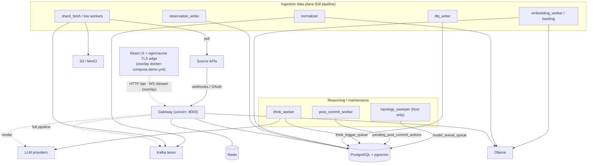

> Ingestion intentionally has **both** an inline synchronous path (gateway → `ingest()`) and the Kafka pipeline: the pipeline is the default (async ack, durability, backfill, replay) and inline is the fallback when the broker/S3 is unreachable plus the dev/test/demo synchronous path (see `docs/adr/0001-kafka-first-ingestion-default.md`).

---

## API & WebSocket Reference

The gateway (`services/app/gateway/main.py`, factory `build_app()`) is the single ASGI host. It mounts core routes plus routers drawn from `services/product`, `services/ingest`, and `services/app/webhooks` / `services/app/realtime`. This section enumerates the full HTTP + WS surface so you can call or extend it.

### Auth model

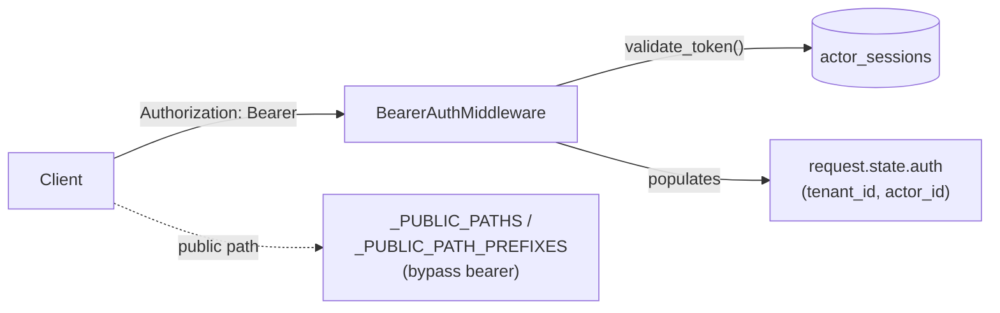

- **Standard auth (`Bearer`)** — `Authorization: Bearer <token>` is hashed and looked up in `actor_sessions` by `services/app/gateway/auth.py:validate_token`; success populates `request.state.auth` with `tenant_id` / `actor_id`. Tokens are minted by `POST /auth/session` (gated by `X-Bootstrap-Secret` matching `AUTH_BOOTSTRAP_SECRET`) or, when the demo overlay is installed, by its `POST /v1/demo/sessions/start`. (No `DEV_BEARER_TOKEN` constant exists in code; local dev mints a real session token.)
- **Public bypass** — `_PUBLIC_PATHS` / `_PUBLIC_PATH_PREFIXES` in `services/app/gateway/middleware.py` let a fixed set of **core** paths through with no bearer: `/healthz`, `/metrics`, `/auth/session`, all `/view/ceo/*`, `/rendering/*`, `/webhooks/*`, the OAuth `*/callback`/`*/installed`/`*/install-error` redirects, and the dev panels `/debug/*`, `/finance/*`, `/slack/*`. Overlay public prefixes — the demo picker routes (`/v1/demo/companies`, `/v1/demo/sessions/start`) and `/simulation*` — are **not** hardcoded here; they are contributed at runtime by the installed demo extension.
- **Webhook auth** is the per-provider HMAC/JWT signature (`services/app/webhooks/signatures.py`), not a bearer.
- **CEO-view auth** (`/view/ceo/*`) uses a separate `VIEW_CEO_TOKEN` resolved by the stream manager (`services/product/greeting/api.py:_auth`), falling back to a default tenant in single-tenant dogfood mode.
- **Dev-panel auth** (`/finance`, `/slack`, `/debug`) is scoped by an `X-Tenant-Id` header, no bearer; env-gated at mount.

In the tables below, **Auth** = `Bearer` (session required), `Public` (allowlisted), `Sig` (signature-verified webhook), `State` (OAuth state-token), `Tenant-hdr` (`X-Tenant-Id`), or `CEO-tok`.

### Health & metrics

| Method | Path | Purpose | Auth |
|---|---|---|---|
| GET | `/healthz` | Liveness probe (`{"status":"ok"}`). | Public |
| GET | `/metrics` | Prometheus text exposition of webhook-verify + tenant-resolver counters. | Public |

> No `/readyz` endpoint exists; `/healthz` is the only health probe.

### Auth / session

| Method | Path | Purpose | Auth |
|---|---|---|---|
| POST | `/auth/session` | Mint a session token for `(actor_id, tenant_id)`; returns `token`/`expires_at`/`session_id`. | `X-Bootstrap-Secret` |

### Ingest & substrate (`services/app/gateway/{core,substrate,contest,dashboard}_router.py`)

| Method | Path | Purpose | Auth |
|---|---|---|---|
| POST | `/ingest/{channel:path}` | Uniform signal ingestion → `ingestion.core.ingest()`; `slack:message` also HMAC-verified. | Bearer |
| GET | `/observations` | List observations for tenant (paged; stub). | Bearer |
| GET | `/models` | List substrate models. | Bearer |
| GET | `/commitments` `/goals` `/decisions` `/resources` | List substrate entities by kind. | Bearer |
| POST | `/contest/{model_id}` | Contest a model node (raise a contest record). | Bearer |
| GET | `/dashboard/revenue-at-risk` `/dashboard/goals` `/dashboard/capacity` `/dashboard/customer/{customer_id}` | Aggregated dashboard reads. | Bearer |
| GET | `/v1/artifacts/{artifact_type}/{artifact_id}` | Fetch a rendered artifact. | Bearer |
| GET | `/v1/structure/overlay/{commitment_id}` · `/v1/structure/recent` · `/v1/structure/resources/aggregate` · `/v1/structure/resources/{rid}/overlay` | Structure/overlay reads over the model graph. | Bearer |

### CEO view & greeting (`services/product/greeting/`)

| Method | Path | Purpose | Auth |
|---|---|---|---|
| GET | `/view/ceo/home` | Assembled CEO home payload from `view_ceo_cache` + viewer-state. | CEO-tok |
| POST | `/view/ceo/force-refresh` | Force a greeting/cache refresh for the tenant. | CEO-tok |
| WS | `/view/ceo/stream` | CEO-view live push stream (greeting/cache updates). | CEO-tok (`?token=`) |

### Ask / query & conversations (`services/product/query/`, `conversations/`)

| Method | Path | Purpose | Auth |
|---|---|---|---|
| POST | `/view/ceo/ask` | Answer a CEO query (prefetch fast-path + LLM handler); returns rendered HTML. | Tenant-hdr |
| POST | `/view/ceo/turn-action` | Turn lifecycle: `save` / `done` / `followup`. | Tenant-hdr |
| GET | `/v1/cards/{card_id}/conversation` | Fetch a card's conversation thread. | Bearer |
| POST | `/v1/cards/{card_id}/probe` | Post a probe/turn against a card. | Bearer |
| DELETE | `/v1/cards/{card_id}/conversation` | Clear a card conversation. | Bearer |

### Today (`services/app/gateway/today_routes.py`)

| Method | Path | Purpose | Auth |
|---|---|---|---|
| GET | `/v1/today` · `/today` | The Today brief (decision deltas + summary). | Bearer |
| POST | `/v1/today/brand` | Set the Today brand/theming. | Bearer |
| GET | `/today/deltas/{delta_id}` · `/today/deltas/{delta_id}/evidence` | Delta detail + supporting evidence. | Bearer |
| POST | `/today/deltas/{delta_id}/apply` · `/delegate` · `/correction` | Act on a Today delta. | Bearer |

### Recommendations (`services/app/gateway/recommendations_router.py`)

| Method | Path | Purpose | Auth |
|---|---|---|---|
| GET | `/v1/recommendations` | List active recommendations. | Bearer |
| POST | `/v1/recommendations/{id}/act` · `/dismiss` · `/ratify` · `/watch` · `/triage` | Recommendation lifecycle actions. | Bearer |
| DELETE | `/v1/recommendations/{id}/watch` | Un-watch a recommendation. | Bearer |

### Decision deltas (`services/product/decision_deltas/router.py`, prefix `/v1/decision_deltas`; also surfaced under `/v1/spec/decision_deltas` in `spec_routes.py`)

| Method | Path | Purpose | Auth |
|---|---|---|---|
| GET | `/v1/decision_deltas/` · `/{delta_id}` | List / fetch decision deltas. | Bearer |
| POST | `/{delta_id}/accept` · `/delegate` · `/contest` · `/add_context` (+ spec `/snooze`) | Decision-delta lifecycle. | Bearer |
| POST | `/from_recommendation/{recommendation_id}` | Materialize a delta from a recommendation. | Bearer |

### Forecasts (`services/product/forecasts/router.py`, prefix `/v1/forecasts`)

| Method | Path | Purpose | Auth |
|---|---|---|---|
| GET | `/v1/forecasts` (+ `/`) · `/summary` · `/accuracy` · `/risk_exposure` · `/upcoming` · `/patterns` · `/page` | Forecast reads / rollups. | Bearer |
| GET | `/detail/{forecast_id}` · `/{prediction_id}` | Single forecast / prediction. | Bearer |
| POST | `/v1/forecasts` (+ `/`) | Create a forecast. | Bearer |
| POST | `/ask` | Natural-language forecast query. | Bearer |

### History / ledger

| Method | Path | Purpose | Auth | Source |
|---|---|---|---|---|
| GET | `/v1/history` | Ledger-event history list. | Bearer | `services/product/history/router.py` |
| GET | `/v1/history/summary` | History rollup over a day range. | Bearer | `services/product/history/router.py` |
| GET | `/v1/spec/ledger_events` (+ `/`) | Spec-shaped ledger event feed. | Bearer | `spec_routes.py` |

### Model trace, model page & map (`services/product/model_trace/router.py`, `gateway/model_page_routes.py`, `gateway/map_routes.py`)

| Method | Path | Purpose | Auth |
|---|---|---|---|
| GET | `/v1/model/{node_id}/trace` · `/supports` · `/depends_on` | Per-node reasoning trace / support / dependency edges. | Bearer |
| GET | `/model/overview` · `/categories/{category_id}/focus` · `/relationships/{bundle_id}` · `/items/{item_id}` · `/items/{item_id}/trace` | Model-page reads (overview, focus, bundles, item trace). | Bearer |
| GET | `/map/snapshot` · `/map/topology_events` · `/map/models/{model_id}` | Topology map reads. | Bearer |
| POST | `/map/refresh_projection` | Rebuild the map projection. | Bearer |

### Spec surface (`services/app/gateway/spec_routes.py`)

| Method | Path | Purpose | Auth |
|---|---|---|---|
| GET | `/v1/spec/operating_threads` (+ `/`, `/recent_changes`, `/{thread_id}`) | Operating-thread reads. | Bearer |
| GET | `/v1/spec/decision_deltas` (+ `/`, `/{delta_id}`) | Spec-shaped decision deltas. | Bearer |
| POST | `/v1/spec/decision_deltas/{delta_id}/accept` · `/delegate` · `/contest` · `/snooze` · `/add_context` | Spec delta actions. | Bearer |
| GET | `/v1/spec/forecasts` (+ `/`, `/{forecast_id}`) · `/v1/spec/ledger_events` (+ `/`) | Spec-shaped forecasts / ledger. | Bearer |

### Demo (overlay-contributed)

The endpoints below are **not** built into core — they live in the **fyraliscore-demo** overlay (`fyralis_demo`) and are mounted via the gateway extension seam (`services/app/gateway/extensions.py`) only when that overlay is installed. The demo SSE stream is driven by core's process-local event bus: core publishes `recommendation.event` (`lib/shared/events.py`) and the overlay subscribes and fans out.

| Method | Path | Purpose | Auth |
|---|---|---|---|
| GET | `/v1/demo/companies` | Preloaded company picker cards. | Public |
| POST | `/v1/demo/sessions/start` | Provision a fresh demo tenant + return a bound auth token. | Public |
| POST | `/v1/demo/sessions/{session_id}/end` · `/reset` | End / reset a demo session. | Bearer |
| GET | `/v1/demo/sessions/{session_id}` | Demo session status. | Bearer |
| GET | `/v1/demo/simulator/suggested` | Suggested simulator injections. | Bearer |
| POST | `/v1/demo/simulator/inject` | Inject a synthetic signal into the demo tenant. | Bearer |
| GET (SSE) | `/v1/recommendations/stream` | Server-Sent-Events stream of recommendation updates (`StreamingResponse`, `text/event-stream`). | Bearer |

### Realtime WebSocket (`services/app/realtime/main.py`)

| Method | Path | Purpose | Auth |
|---|---|---|---|
| WS | `/stream` | Process-wide realtime fan-out: `LISTEN observations_new` → per-client `EventFrame`s with drop-oldest backpressure + cursor replay. | Bearer header **or** `?token=` |

Handshake: server `accept()`s, then validates the token (header or `?token=`); on failure closes with code 1008. On success it sends a `ready` frame carrying `subscription_id`, then drains the per-client queue (emitting a `stream_lagged` control frame on overflow).

### Webhooks (`services/app/webhooks/router.py`, prefix `/webhooks`)

| Method | Path | Purpose | Auth |
|---|---|---|---|
| POST | `/webhooks/{provider}/{subpath:path}` | Unified provider webhook ingress — verify signature → resolve tenant (`provider_installations`) → publish to `ingestion.raw` (Kafka-first, 202) with inline `ingest()` fallback. | Sig |
| POST | `/webhooks/gmail/pubsub` | Gmail Pub/Sub push ingress (`gmail_pubsub.py`). | Sig |
| POST | `/webhooks/google_calendar/push` · `/webhooks/google_drive/push` | Google push-channel ingress (`google_push.py`). | Sig |

Providers handled by the unified router (the `VERIFIERS` registry in `services/app/webhooks/signatures/__init__.py`): `slack` · `github` · `linear` · `stripe` · `discord` · `notion` · `jira` · `mercury` · `quickbooks` · `grafana` (10). Of these, `_CUTOVER_ENABLED_PROVIDERS` (`router.py`) routes six to the Kafka full pipeline when the tenant's `kafka_path_enabled` is set: `slack`, `github`, `jira`, `mercury`, `quickbooks`, `grafana`. Each maps to a channel (e.g. `slack:message`, `github:webhook`, `jira:issue`). URL-verification / ping handshakes are short-circuited per provider.

### OAuth & integration install (`services/ingest/integrations/`)

| Method | Path | Purpose | Auth |
|---|---|---|---|
| GET | `/integrations/{slack,discord,github,notion}/install` | Begin OAuth (returns provider authorize URL). | Bearer |
| GET | `/integrations/{slack,discord,github,notion}/callback` | OAuth callback → persist installation → redirect. | Public/State |
| POST | `/integrations/{gmail,google_calendar,google_drive,jira,mercury,quickbooks}/connect/preflight` | Validate creds / enumerate scope before finalizing. | Bearer |
| POST | `/integrations/{…}/connect/finalize` | Persist the installation + kick onboarding backfill. | Bearer |
| GET | `/integrations/gmail/status` | Gmail mount/watch status. | Bearer |
| POST | `/integrations/gmail/uninstall` · `/mailbox/stop` | Tear down Gmail watch / installation. | Bearer |

### Slack-DM panel (`services/app/gateway/slack_router.py`, prefix `/slack`; dev-gated)

| Method | Path | Purpose | Auth |
|---|---|---|---|
| POST | `/slack/{user_id}/install` · `/backfill` · `/live/emit` | Per-user Slack DM install / backfill / live-emit test ops. | Tenant-hdr |
| GET | `/slack/{user_id}/status` | Slack DM ingestion status. | Tenant-hdr |

### Finance panel (`services/app/gateway/finance_router.py`, prefix `/finance`; dev-gated)

| Method | Path | Purpose | Auth |
|---|---|---|---|
| GET | `/finance/sources` | List finance sources (Mercury, QuickBooks). | Tenant-hdr |
| POST | `/finance/{source}/install` · `/backfill` · `/live/emit` | Install / backfill / live-emit per source. | Tenant-hdr |
| GET | `/finance/{source}/status` | Per-source status. | Tenant-hdr |

### Debug & GitHub-intel (`services/app/gateway/debug_router.py` prefix `/debug`; `services/ingest/github_intel/api.py` prefix `/github-intel`)

| Method | Path | Purpose | Auth |
|---|---|---|---|
| GET | `/debug/signals` (+ `/{observation_id}`) · `/think-runs` (+ `/{run_id}`) · `/think-quality` (+ `/cases`) · `/models` (+ `/{model_id}`) · `/acts` · `/renders` · `/cache` · `/stats` | Read-only introspection of the pipeline (signals, think runs, quality, models, acts, renders, cache, stats). | Public (dev) |
| — | `/github-intel/*` | **Extracted** to `Fyralisinc/github-intel`; the GitHub-intelligence read API is no longer mounted in core. | — |

### Mounting summary

Most routers are mounted through `services/app/gateway/route_mounts.py` or `services/app/gateway/ceo_view_wiring.py`: always-on (decision-deltas, forecasts, model-trace, history, webhooks, integrations, spec, model-page, today, map, realtime, CEO stream); env-gated (finance, slack, debug, gmail/gcal/gdrive OAuth + push). Overlay-contributed routers (demo, simulation) are mounted at runtime through the gateway extension seam (`services/app/gateway/extensions.py`) when the demo overlay is installed. Provider Lab (`services/ingest/synthetic/provider_lab/`) is separate loopback-only test infrastructure, not part of the gateway.

---

## Database Schema & Migrations

PostgreSQL 16 + `pgvector` is the single substrate and control plane for Fyralis Core. The schema is defined entirely by filename-ordered SQL in `db/migrations/` — 83 files numbered `0001`–`0083` as of this writing. There is no ORM-managed schema and no destructive down-migrations; every file is forward-only and idempotent.

### How migrations work

| Aspect | Detail |
|--------|--------|
| **Format** | One `.sql` file per change in `db/migrations/`, applied in lexical filename order (`0001_…` → `0083_…`). |
| **Runner** | `scripts/docker-migrate.sh` — a `psql` loop that tracks applied files in a `schema_migrations(filename, applied_at)` table and skips ones already recorded. No standalone "prod runner"; integration tests apply the same files programmatically. |
| **Atomicity** | Each file runs under `psql --single-transaction` (the file's own `BEGIN/COMMIT` is the unit). Files containing `CONCURRENTLY` or a `-- migration:no-transaction` directive are run without the wrapper (Postgres forbids `CREATE INDEX CONCURRENTLY` inside a transaction). |
| **Idempotency** | Everything uses `CREATE TABLE/INDEX … IF NOT EXISTS`; partition creation lives in re-runnable `DO $$` blocks. Re-applying is a no-op. |
| **Prefix guard** | The runner aborts if two files share a numeric prefix (apply order would depend on locale collation). Note: the tree currently carries dup-prefixed `0014_*` and `0043_*` pairs — see the merge-branch memory; the guard is softened on the `cannonical` branch. |
| **Drift check** | `scripts/check_schema_drift.py` compares a live DB against a hand-authored expected schema (mirrors `SCHEMA-LOCK.md` + `0001_foundation.sql`); exits non-zero on any divergence. Editing a foundational migration requires editing this file too. |

Substrate-wide invariants worth knowing:

- **pgvector / 768-d.** `vector` extension (plus `pg_trgm`, `btree_gin`) is created in `0001`. Semantic columns are `VECTOR(768)` (Ollama `nomic-embed-text`), indexed with HNSW `vector_cosine_ops` (`observations.embedding`, `models.embedding`, `entity_aliases.alias_embedding`).
- **Partitioning.** `observations` and `resource_transactions` are `PARTITION BY RANGE (occurred_at)`, one partition per calendar month; `0001` seeds the current month + 3. Because the partition key must be in every unique constraint, their PKs are composite — `observations` is `PRIMARY KEY (id, occurred_at)` with `UNIQUE (source_channel, external_id, occurred_at)`.
- **App-level FKs.** Foreign keys *into* the partitioned tables (e.g. every `*_event_id` column) are **not** DB-enforced — Postgres cannot FK a partitioned PK that includes the partition column — the application layer enforces them.
- **RLS.** Row-Level Security policies exist (foundational cluster `0036`–`0041`; many later per-feature migrations re-enable `ROW LEVEL SECURITY` on their own tables). RLS is defense-in-depth; **app-level tenant filtering on `tenant_id` is the primary isolation mechanism**, and a superuser/owner DSN bypasses RLS (a common test gotcha).

### Core tables

Grouped by domain; one line each. File column is the migration that creates the table.

#### Substrate (the memory / world-model)
| Table | File | Purpose |
|-------|------|---------|
| `observations` | 0001 | Partitioned event log: every ingested signal (`content` JSONB, `content_text`, `embedding`, `trust_tier`, `external_id`). |
| `models` | 0001 | Beliefs/predictions about the org: `proposition`, `"natural"`, `embedding`, scope, `confidence` (0.05–0.95), `activation`, lifecycle/provenance. |
| `model_edges` | 0031 | Typed relationships between models (`edge_kind` validated by `lib/shared/edge_registry.py`, not a DB CHECK); app-enforced FKs, no cascade. |
| `model_signal_readings` | 0038 | Sidecar of confirm/contest/observe/falsify readings against a model (the brief's "signal_readings"). |
| `model_scope_actors`, `model_scope_entities` | 0043 | Normalized scope membership extracted from `models.scope_*` arrays for graph queries. |
| `model_reeval_queue` | 0007 | Re-evaluation work items when a supporting model changes/archives (also has a dead-letter sibling). |
| `goals`, `commitments`, `decisions` | 0001 | Org-level intent objects; plus edge tables `contributes_to`, `depends_on`, `constrained_by`, `commitment_contributors`. (There is no `acts` table — that vocabulary lives only as observation/proposition kinds.) |
| `resources`, `resource_transactions`, `resource_deployments`, `customer_commitments` | 0001 | Resource ledger; `resource_transactions` is partitioned by `occurred_at`. |
| `predictions` | 0041 | Product-facing prediction records (`status`, `category`, `statement`) — distinct from prediction-kind models. |

#### Identity
| Table | File | Purpose |
|-------|------|---------|
| `tenants` | 0023 | The org/tenant root (keeps the generic `is_demo` column; no core logic branches on it); referenced by FKs from 0037 onward. The demo-specific `demo_config_id` column and the `demo_configs` / `demo_sessions` / `demo_session_costs` tables were dropped from core by `0093_drop_demo_scaffolding.sql` and are re-created by the overlay. |
| `actors` | 0001 | People/systems/teams within a tenant (`type`, `email`, `metadata`). |
| `actor_identity_mappings` | 0001 | `(source_channel, source_actor_ref) → actor_id` cross-source identity links. |
| `entity_aliases` | 0001 | Fuzzy/canonical entity name resolution with `alias_embedding`. |
| `actor_sessions` | 0003 | Viewer sessions (gateway auth/state). |

#### Durable queues (work handoff, polled `FOR UPDATE SKIP LOCKED`)
| Table | File | Purpose |
|-------|------|---------|
| `think_trigger_queue` | 0004 | T1–T4 cognition triggers for `think_worker`; lease via `locked_by/locked_at`, ready-rows partial index. |
| `model_reeval_queue` | 0007 | (see Substrate) re-eval fan-out. |
| `pending_post_commit_actions` | 0015 | Post-commit side-effects (`publish_anomalies`, `schedule_predictions`, `broadcast_realtime`, `invalidate_metrics`) drained by `post_commit_worker`; has attempts/dead-letter columns. |

#### Audit & reconciliation
| Table | File | Purpose |
|-------|------|---------|
| `audit_events` | 0030 | Append-only per-model state-transition log (`cause_type` CHECK; `BIGSERIAL` PK; `ON DELETE CASCADE` from `models`). |
| `reconciliation_events` | 0029 | Records each claim-vs-existing-model resolution (`auto_merge`/`human_review`/`no_match`, `cosine_similarity`, original claim JSON). |

#### Ingestion control plane
| Table | File | Purpose |
|-------|------|---------|
| `provider_installations` | 0050 | Generic source install registry: `(provider, installation_id)` unique, `secret_ref`, `enabled`. |
| `onboarding_triggers` | 0058 | Outbox of install/reinstall/manual_replay events the onboarding poller consumes (per-source backfill kickoff). |
| `onboarding_runs` / shards | 0056, 0066 | Backfill run + shard progress tracking. |
| `ingestion_failures` | 0057 | Typed failure ledger (`failure_kind` CHECK) for DLQ/observability. |
| Per-source tables | 0049, 0051, 0071–0078, 0081 | One cluster per source: `gmail_*` (0049), `slack_installation_tokens` (0051), `google_calendar_*` (0071), `google_drive_*` (0072), `jira_*` (0073), `mercury_*` (0074), `quickbooks_*` (0075), `slack_dm_installations` (0076), `code_*` GitHub code-intel (0077), `github_intel_*` (0078/0079), `grafana_*` (0081). |
| Source CHECK widenings | 0070 (notion), plus inline CHECKs | The `source IN (...)` allowlists in `ingestion_failures`/`onboarding_triggers` are widened per new source (re-run landmine: the newest source poisons re-runs of the prior widening migration's tests). |

#### Product / read-side caches
| Table | File | Purpose |
|-------|------|---------|
| `view_ceo_cache` | 0017 | Precomputed CEO-view payloads keyed `(tenant_id, cache_key)` with `recomputed_reason`. |
| `view_render_costs` | 0018 | Per-render LLM cost accounting (`render_kind` CHECK). |
| `think_runs`, `think_run_costs`, `think_run_artifacts`, `applied_triggers` | 0008/0016/0020 | Reasoning execution trace + cost + artifacts. |

#### Memory-fabric / topology (coded; not all wired into compose)
| Table | File | Purpose |
|-------|------|---------|
| `signal_memory_fabric` | 0009 | Decaying signal substrate. |
| `pattern_candidates` | 0010 | Candidate cross-model patterns. |
| `calibration_stats`, `calibration_offsets` | 0011 | Confidence-calibration tables. |
| `model_neighborhoods`, `model_neighborhood_membership` | 0032 | Legacy topology read models retained for compatibility. `topo_dirty_queue` was dropped by migration `0127`. |
| `realtime_replay_cursors`, `orphan_log` | 0012/0013 | Realtime replay bookkeeping + orphan-edge log surfaced by the drift detector. |

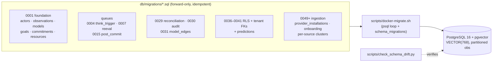

---

## Developer Onboarding

A new engineer goes from clone to a running backend stack (gateway on `:8000`) by following the numbered quickstart below. The whole flow is also in `README.md`; this is the condensed, command-dense version. The runtime needs only **Postgres + Ollama** locally — Kafka/MinIO/Redis in `docker-compose.yml` are the production data plane and are not required for dogfood dev (the synthetic ingestion harness is used instead). The UI lives in the **fyraliscore-demo** overlay repo; run it from there if you want the browser cockpit.

### Prerequisites

| Tool | Version | Why |
| --- | --- | --- |
| Python | 3.11+ (`pyproject.toml` requires `>=3.11`) | gateway, workers, scripts |
| Docker + Compose v2 | recent | brings up Postgres (pgvector) + Ollama |
| Node.js | 20+ | only for the React/Vite UI, which lives in the **fyraliscore-demo** overlay repo (not needed for the backend) |
| `psql` | 14+ | applies SQL migrations |
| `curl` | any | `dogfood_up.sh` health checks |

### Quickstart

```bash
# 1. Clone + configure
git clone <repo-url> fyraliscore && cd fyraliscore
cp .env.example .env
#    Edit .env: set LLM_PROVIDER=codex and CODEX_API_KEY.
#    Think main uses CODEX_MODEL / CODEX_REASONING_EFFORT; question planning
#    uses INQUIRY_CODEX_QUESTION_MODEL.
#    Optional .env.dogfood overlay is sourced LAST by dogfood_up.sh (its values win).

# 2. Start infra (Postgres + Ollama only)
docker compose up -d postgres ollama
docker compose ps                                   # wait for postgres "healthy"
curl -s http://localhost:11434/api/tags | grep nomic-embed-text   # embed model present?
# if missing: docker compose exec ollama ollama pull nomic-embed-text

# 3. Python env + package (editable, with dev extras)
python3.11 -m venv .venv && source .venv/bin/activate
pip install -U pip && pip install -e ".[dev]"

# 4. Apply migrations (no prod runner — loop the SQL files in filename order)
set -a && source .env && set +a
for f in db/migrations/*.sql; do psql "$DATABASE_URL" -v ON_ERROR_STOP=1 -f "$f"; done
python scripts/check_schema_drift.py                # exit 0 == live DB matches expected schema

# 5. Seed the dogfood tenant (CEO "Rachin" + 12 sim personas; idempotent)
python scripts/seed_dogfood_tenant.py

# 6. Bring up the backend stack (UI lives in the fyraliscore-demo overlay repo)
./scripts/dogfood_up.sh
```

Migrations are idempotent (`CREATE TABLE IF NOT EXISTS`, partition DO blocks), so re-running the loop is safe. `dogfood_up.sh` validates `.env` exists, the LLM key for the chosen `LLM_PROVIDER`, `pg_isready`, Ollama reachability, and that `.venv` exists — then prints:

```
Gateway:         http://localhost:8000
Healthz:         curl http://localhost:8000/healthz
```

(The Main UI and the Slack simulator are served by the **fyraliscore-demo** overlay, not by core's dogfood stack.) The overlay UI sends `Authorization: Bearer <token>` with a **real session token** — minted by `POST /auth/session` or, when the demo overlay is installed, its `POST /v1/demo/sessions/start` flow — validated against `actor_sessions`; there is no static-token bypass in the gateway. (`DEV_BEARER_TOKEN=dogfood-ceo-token` ships in `.env.example`/`README.md` as documented config, but no current code path honors it.) Logs go to `/tmp/company_os_logs/`, PIDs to `/tmp/company_os_dogfood.pids`. Helpers: `scripts/dogfood_logs.sh` (tail), `scripts/dogfood_inspect.sh` (DB state), `scripts/dogfood_down.sh` (kills the whole process group).

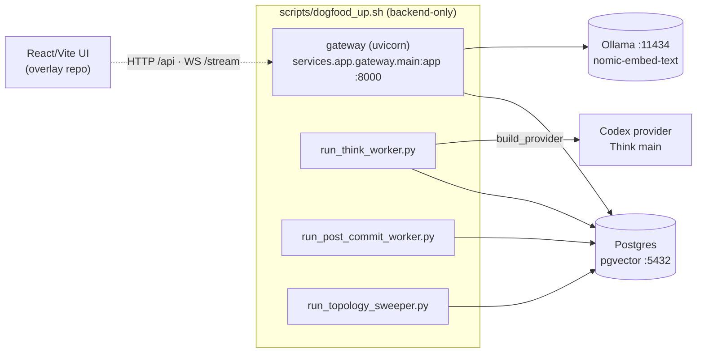

### Running components individually

Skip `dogfood_up.sh` and run pieces directly (each reads `DATABASE_URL` and other env from your shell — `set -a && source .env`):

| Component | Command | Notes |
| --- | --- | --- |
| Gateway | `uvicorn services.app.gateway.main:app --host 0.0.0.0 --port 8000 --reload` | spawns GRT scheduler + realtime dispatcher in-process; overlay-contributed routers (demo, simulation) mount via the gateway extension seam when the demo overlay is installed |
| Think worker | `python scripts/run_think_worker.py` | builds the LLM provider via `lib.llm.provider.build_provider`, runs `ThinkWorker(pool).run()` |
| Post-commit worker | `python scripts/run_post_commit_worker.py` | polls `process_batch` every `POST_COMMIT_WORKER_POLL_INTERVAL_S` (default 5s) |
| Topology sweeper | `python scripts/run_topology_sweeper.py` | `run_forever` on `TOPOLOGY_SWEEPER_INTERVAL_S` (900s); `TOPOLOGY_SWEEPER_ONCE=1` runs a single sweep and exits |
| UI | — | lives in the **fyraliscore-demo** overlay repo; run it from there (against this gateway or the overlay's mock server) |

### Running tests

Tests use a **real Postgres** (no mocks), so the compose services from step 2 must be up.

```bash
pytest                       # full unit + integration suite
pytest -m integration        # only tests needing live Postgres (DATABASE_URL)
pytest -m ollama             # only tests needing live Ollama (OLLAMA_URL)
pytest -m "not slow"         # skip slow (>1s) tests
RUN_REAL_LLM=1 pytest -m real_llm   # real-LLM tests (need a configured provider key)
```

Markers are declared in `pyproject.toml` (`--strict-markers`): `integration`, `ollama`, `slow`, `real_llm`, plus `requires_infra` (Kafka/Temporal/Redis/S3) and `requires_docker` (testcontainers Kafka, moto-s3) which skip cleanly when the service/daemon is absent. `lint-imports` enforces the architecture boundary contracts (lib never imports services; reasoning never directly imports app/product/ingest; core never imports the demo / simulation overlays).

UI tests (Vitest unit, Playwright E2E, typecheck) live with the frontend in the **fyraliscore-demo** overlay repo and are run from there.

### Docs site

Internal docs are MkDocs Material (`mkdocs.yml`). Mermaid renders via pymdown superfences — no separate plugin.

```bash
pip install -e ".[docs]"     # mkdocs-material (pulls mkdocs + pymdown-extensions)
mkdocs serve                 # local preview
mkdocs build --strict        # strict build (fails on broken links/nav)
```

---

## End-User Operations & Troubleshooting

This section covers running and operating the local dogfood stack, the surfaces a CEO user actually sees, and the most common failures during setup. Authoritative sources: `README.md` §8–§11, `scripts/dogfood_*.sh`, and `docker-compose.yml`.

### Using the app (end-user view)

After `./scripts/dogfood_up.sh`, the gateway runs on `http://localhost:8000`. The browser cockpit (the React/Vite UI) lives in the **fyraliscore-demo** overlay repo and is run from there; pointed at this gateway, its CEO-facing surfaces are:

| Route | Surface | Purpose |
| --- | --- | --- |
| `/today` | Today briefing | Default landing (`/` redirects here); the daily review of model deltas |
| `/model` | Model explorer | The active belief models the system holds about the org |
| `/forecasts` | Forecasts | Predictions over goals/commitments (backend `services/forecasts/`) |
| `/ledger` | Ledger | Decisions / commitments / goals history (`/history` redirects here) |
| `/debug/*` | Developer console | Sub-pages: `signals`, `think-runs`, `models`, `acts`, `renders`, `cache` |

- **Slack simulator** and the **demo tenancy** under `/v1/demo/*` are **overlay-contributed**: they live in the fyraliscore-demo overlay and mount into the gateway via the extension seam (`services/app/gateway/extensions.py`) only when that overlay is installed. The demo picker endpoints `GET /v1/demo/companies` and `POST /v1/demo/sessions/start` are public (the extension contributes those public-path prefixes); `start` mints the session token used for everything else (reset/end/inject).
- **Auth in dev:** the overlay UI sends `Authorization: Bearer <token>` and the gateway validates **every** token against `actor_sessions` via `BearerAuthMiddleware` — there is no static-token shortcut. Dev tokens are minted by `POST /auth/session` or, with the demo overlay installed, its session-start flow; the `DEV_BEARER_TOKEN` in `.env.example`/`README.md` is documented but unwired in current code. Core public paths (`/healthz`, `/metrics`, `/webhooks/`, `/debug/`, `/finance/`, `/slack/`, `/stream*`) skip the bearer check; overlay public paths (`/v1/demo/companies`, `/v1/demo/sessions/start`) are added by the demo extension.

### Operating the stack

Four orchestration scripts manage the dev stack. `dogfood_up.sh` is backend-only: it starts the gateway (uvicorn `services.app.gateway.main:app` on `:8000`), `think_worker`, `post_commit_worker`, and `topology_sweeper` — each backgrounded with its own log file. (The UI lives in the fyraliscore-demo overlay repo and is run from there.)

```mermaid
flowchart LR
  up[dogfood_up.sh] -->|env+sanity checks| procs
  subgraph procs[Started processes]
    gw[gateway :8000]
    tw[think_worker]
    pc[post_commit_worker]
    ts[topology_sweeper]
  end
  procs -->|stdout/stderr| logs[/tmp/company_os_logs/*.log]
  procs -->|PIDs| pids[/tmp/company_os_dogfood.pids]
  down[dogfood_down.sh] -->|kill PGIDs| procs
  logs --> tailit[dogfood_logs.sh]
```

| Script | What it does |
| --- | --- |
| `scripts/dogfood_up.sh` | Sources `.env` then `.env.dogfood` (overrides win); validates Codex LLM auth for `LLM_PROVIDER=codex`; runs `pg_isready` and `curl $OLLAMA_URL/api/tags`; checks `.venv` exists; truncates the backend logs; launches the backend processes; then polls `GET /healthz` for up to 30s |
| `scripts/dogfood_down.sh` | Reads `/tmp/company_os_dogfood.pids`, sends `kill -TERM` to each process group (then `-KILL` after 2s), and removes the PID files |
| `scripts/dogfood_logs.sh` | Tails all five logs (uses `multitail` if present, else prefixed `tail -f`) |
| `scripts/dogfood_inspect.sh` | One-shot SQL dump of the dogfood tenant: observation/model/commitment/goal counts, recent Think runs, LLM render costs, view-cache age, top active models |

- **Logs:** `/tmp/company_os_logs/{gateway,think_worker,post_commit_worker,topology_sweeper}.log`.
- **PIDs:** `/tmp/company_os_dogfood.pids`.
- **Health check:** the gateway exposes `GET /healthz` (returns `{"status":"ok"}`) and a Prometheus `GET /metrics` text endpoint; both are public. There is **no `/readyz`** on the gateway — readiness is implied by `/healthz` returning 200 after startup. (The Kafka *ingestion* consumers in `docker-compose.yml` expose their own `/healthz` on `INGESTION_HEALTH_PORT` 9300, used by the compose healthchecks; the dev dogfood stack does not run those.)
- **Compose healthchecks** (`docker-compose.yml`): `postgres` via `pg_isready`, `ollama` pulls `nomic-embed-text` on start, `kafka` lists topics, `minio` via `mc ready`/health endpoint, `redis` via `redis-cli ping`. Long-running workers wait on these plus the one-shot `migrate`/`kafka-init`/`minio-init`.
- **Individual processes** (no full stack): see `README.md` §10 — run the gateway with `uvicorn services.app.gateway.main:app`, or each worker via `scripts/run_*.py`. The UI (and its mock-server dev mode) lives in the fyraliscore-demo overlay repo.

### Troubleshooting (FAQ table)

| Symptom | Likely cause | Fix |
| --- | --- | --- |
| `ERROR: .env not found` | No `.env` file (dogfood needs LLM creds) | `cp .env.example .env`; set `LLM_PROVIDER=codex` and `CODEX_API_KEY`, or run `codex login` so `~/.codex/auth.json` exists |
| `ERROR: Postgres not running` | DB container down (script runs `pg_isready`) | `docker compose up -d postgres` and wait for the `healthy` status |
| Port `5432` already in use | A host Postgres is bound to 5432 | Stop it (`brew services stop postgresql`) or change the port in `docker-compose.yml` **and** `DATABASE_URL` |
| `ERROR: Ollama not reachable at http://localhost:11434` | Ollama still cold-starting / model not pulled | Wait ~30s on first run (it pulls `nomic-embed-text`); check `docker compose logs ollama`; manual pull: `docker compose exec ollama ollama pull nomic-embed-text` |
| Embedding model missing | `nomic-embed-text` not present in Ollama | `curl -s http://localhost:11434/api/tags \| grep nomic-embed-text`; pull manually if absent |
| Schema drift errors at startup | A migration wasn't applied | Re-run the migration loop (`README.md` §5: `psql` over `db/migrations/*.sql`, idempotent); confirm with `python scripts/check_schema_drift.py` (exit 0 = clean) against `company_os` |
| Empty UI pages (Today/Model/Forecasts blank) | Tenant not seeded or no signals ingested | Run `python scripts/seed_dogfood_tenant.py`. (Demo-tenant data via `/v1/demo/sessions/start` requires the fyraliscore-demo overlay installed; the demo tables are overlay-owned.) |
| Kafka-dependent tests hang | `workflows/` e2e tests need a live Kafka broker | Skip them or bring up Kafka (`docker compose up -d kafka`); the core dogfood stack does not use Kafka |
| `embedding_pending` backlog grows | Inline live path left observations unembedded (or an embed request was lost) | The `embedding_backlog` drainer (`services.ingest.ingestion.recovery.embedding_backlog`, rate-limited via Redis) covers this in the full compose stack; in dev confirm Ollama is reachable so embeds succeed |
| `permission denied` / empty rows when querying with RLS on | Row-Level Security bypass requires a **superuser** connection; ordinary roles see nothing without the tenant GUC set | Connect as a Postgres superuser for admin/debug queries (RLS is bypassed for superusers), or set the tenant context the app uses |
| Live workers consume/clobber your test triggers (the "0059 landmine") | A running dev/dogfood stack eats `think_trigger_queue` rows / drains onboarding triggers mid-test | Use a throwaway DB for e2e runs, or stop the dogfood stack (`./scripts/dogfood_down.sh`) before manual trigger/backfill experiments |
| Missing `observations` rows after insert | `observations` is partitioned; counts on shard/page counters can lie | Query the `observations` table directly (as `dogfood_inspect.sh` does) rather than trusting shard `pages`/`obs_seen` counters |

> The RLS-superuser, partitioned-`observations`, and live-worker-eats-triggers gotchas are operational lore from prior debugging sessions, not statements in `README.md`; they bite most often during manual SQL inspection and e2e runs against a shared dev DB.

---

## Code-Level Documentation & Conventions

The conventions that keep this codebase navigable at scale live in `CONTRIBUTING.md` (rules), `pyproject.toml` (enforced contracts), and `CLAUDE.md` (docs rule). The deeper references are `CODEBASE-ARCHITECTURE.md` (module-level map, §16 "How to Extend") and `CODEBASE-MANAGEMENT.md` (the *why* behind the layout).

### Layering & import discipline

`services/` and each `services/<layer>/` are **PEP 420 namespace packages** (no `__init__.py`); every layer carries a `README.md` stating its role and import direction. The rule of thumb is **import downward, not upward** — a higher layer may depend on a lower one; the reverse is a smell. The two enforced `import-linter` contracts and the layer-dependency graph are detailed under [System Architecture → Layered Design](#layered-design); they encode only invariants that are *empirically true today*, so a failure always means a real regression.

**To add a new layer dependency the right way:** make it a downward import. If you genuinely need an upward edge, that is a design smell — do not add it to the `import-linter` whitelist without recording it as tracked debt in `CODEBASE-MANAGEMENT.md` (as was done for the one known upward edge, `services/domain/models/repo.py` → `product`/`reasoning`).

### Code style

- **Ruff** — the CI ruleset is run inline (no `[tool.ruff]` block): `ruff check --select E9,F63,F7,F82,F821,F811,F401 .` (syntax errors, undefined/redefined names, unused imports).
- **Type hints** everywhere; modules open with `from __future__ import annotations`.
- **Structured-output LLM pattern** — the model never emits free text that code then parses. `lib/llm/provider.py` coerces output through JSON schemas (`response_format` / provider-native structured outputs where available). The production path uses Codex, so schemas are treated as enforced contracts by validation even when the transport treats them as hints; one repair retry is the fallback.
- **`repo.py` system-of-record pattern** — DB access for a package lives in `repo.py` exposing a `*Repo` class on the shared `lib.shared.db` pool (e.g. `services/domain/models/repo.py` `ModelsRepo`, `services/domain/observations/repo.py` `ObservationRepository`). Repos own their table's invariants: dedup, post-commit `NOTIFY` (via `schedule_notify` / `notify_scope`), immutable-column rules (e.g. `confidence_at_assertion` written once at INSERT, never UPDATEd), and generated columns never appearing in INSERT lists. No mocks — tests run against real Postgres.

### Documentation conventions

- **Docstrings as spec.** Module docstrings are substantial and tie code to its plan/schema (see the step-by-step pipeline docstrings at the top of `services/ingest/ingestion/core.py` and `services/domain/models/repo.py`). Inline comments explain **why, not what** (e.g. the `orjson` minor-pin rationale in `pyproject.toml`; the "precision > recall" note on the tokenizer in `core.py`).
- **Docs-in-same-PR rule** (`CLAUDE.md`): the MkDocs (Material) site under `docs/` is internal coordination, not an API reference. A change to a subsystem updates that subsystem's `docs/architecture/<layer>.md` page **in the same PR**. Preview with `mkdocs serve`; strict build `mkdocs build --strict`.
- **Never fabricate rationale.** If the *why* isn't in the code, leave a visible `> **TODO(human): …**` callout rather than guessing; label inferred technical claims as inferences.
- **Mermaid** diagrams use Material's superfences (a ```` ```mermaid ```` fence via `pymdown-extensions`) — do not add a separate mermaid plugin.

### How to extend the system

Recipes live in `CODEBASE-ARCHITECTURE.md` §16. The common one — **add a new ingestion source/channel**:

1. Add a handler under `services/ingest/ingestion/handlers/`; register with `@register("channel:name")` and ensure its module is imported so registration runs.
2. Handler `extract` returns an **`ObservationDraft`** (content text/JSON, actor ref, external id, occurred_at, trust tier, entity hints, kind); `core.py` `UniformIngestPath` normalizes it and `ObservationRepository.insert()` persists + dedups.
3. Add the channel to **`CHANNEL_TRUST_MAP`**.
4. Add the source to the **source allowlist** — the canonical list is `RawEnvelope.SourceLiteral` (`services/ingest/ingestion/raw_tier/envelope.py`), surfaced as `INGESTION_SOURCES` in `services/ingest/ingestion/kafka/topics.py`; full-pipeline routing is gated by the **`KAFKA_PATH_ENABLED`** feature flag (`services/ingest/ingestion/feature_flags/`).
5. Ensure an **`observations` partition** covers the source's `occurred_at` and add a **migration** `db/migrations/NNNN_short_name.sql` (applied in lexicographic order, idempotent `IF NOT EXISTS` / guarded `DO`; keep the 4-digit prefix unique and monotonic; run `python scripts/check_schema_drift.py` after).
6. Add ingestion + gateway tests, co-located in `<package>/tests/`.

Other §16 recipes: new model proposition kind (`services/domain/models/propositions.py` + `diff_schema`), new UI surface (in the fyraliscore-demo overlay repo, backed by a gateway adapter route in core), new worker (idempotent, Postgres-queue/cursor state, `FOR UPDATE SKIP LOCKED`).

### Local checks before pushing

```bash
ruff check --select E9,F63,F7,F82,F821,F811,F401 .   # CI ruleset
lint-imports                                         # layer boundaries
pytest -m "not slow and not real_llm"                # fast tests (needs Postgres)
```

Pytest markers (`pyproject.toml`): `integration`, `ollama`, `slow`, `real_llm`, `requires_infra`, `requires_docker`.
