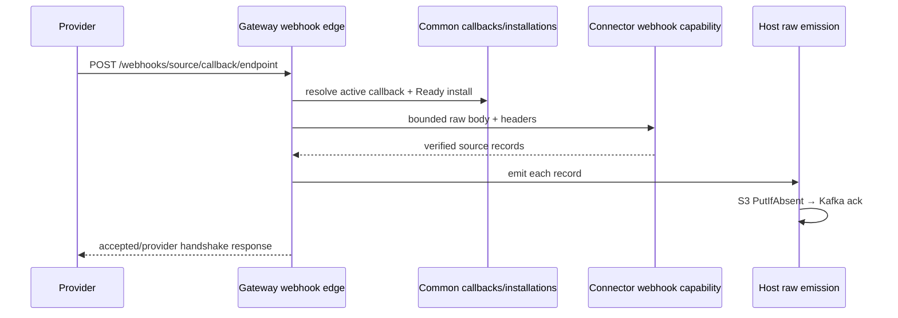

# Data ingestion reference

This reference describes the contract-only source ingestion implementation as of
2026-08-04.

## Supported external sources

| Family | Sources | Primary ingress |
| --- | --- | --- |
| Collaboration/session | Slack, Discord, Telegram, Signal, WhatsApp | OAuth/webhook, gateway, configured webhook |
| Developer/operations | GitHub, Jira, Grafana, AWS | REST/webhook/poll; AWS CloudTrail SigV4 |
| Google Workspace | Gmail, Google Calendar, Google Drive | backfill, incremental poll, watch/Pub/Sub |
| Knowledge/design | Notion, Miro, Figma | OAuth/configuration, REST poll/webhook |
| Finance/equity | Mercury, QuickBooks, Brex, Ramp, Carta | REST, OAuth/configuration, poll/webhook |
| People/recruiting | Gusto, Deel, Fireflies, HiBob, Ashby, LinkedIn | REST, poll/webhook |

The exact supported capabilities are machine-readable in
`services/ingest/connectors/manifests/*.json`. Unsupported capabilities are
absent.

## Core objects

| Object | Meaning |
| --- | --- |
| Connector definition | Immutable code + stable-v1 manifest for one source family |
| Installation | One tenant-bound provider workspace/account/session |
| Authority grant | Current credential-backed slots, scopes, hosts, trust and provenance allowed for an installation |
| Binding | Validated connector + installation + scoped host services |
| Capability | Versioned facet such as OAuth, pull, webhook, poll, gateway, identity or normalization |
| Raw envelope | Kafka pointer to immutable source-native bytes in S3 |
| Normalized envelope | Versioned semantic draft ready for observation persistence |

## Canonical definition files

- Source identities: `services/ingest/source_contract/source-index.json`
- Manifest schema/model: `services/ingest/source_contract/manifest.py`
- Manifests: `services/ingest/connectors/manifests/`
- Factories: `services/ingest/connectors/{native,rest_sources,google_sources,gateway_sources,aws_source}.py`
- Evidence: `services/ingest/connectors/release-evidence.json`
- Catalog/composition: `services/ingest/connector_platform/catalog.py`

Adding a source must not add a central planner, fetcher, reconciler, handler,
endpoint, webhook, installation or worker dispatch map.

## Installation APIs

### OAuth

```http
GET /integrations/{source}/install
GET /integrations/{source}/callback?code=...&state=...
```

The first route issues one-time tenant/provider-bound state and invokes
`installation.oauth2/v1`. The callback consumes state, executes the connector
exchange, validates exact returned scopes/slots, writes secret candidates,
persists common authority and schedules onboarding. Required credentials missing
after OAuth produce `Maintenance`, not a partially runnable Ready install.

### Configuration

```http
POST /integrations/{source}/configure
Content-Type: application/json

{
  "external_installation_id": "provider-native-id",
  "credentials": {
    "manifest_declared_slot": "secret-value"
  },
  "configuration": {
    "selected_resources": ["resource-id"]
  },
  "installation_data": {
    "manifest_declared_namespace": {"provider_option": "value"}
  }
}
```

Undeclared slots/namespaces, missing required credentials, invalid values and
cross-tenant installation collisions are rejected. Secrets are immediately
placed in the secret store; only references enter PostgreSQL.

### Common response

Configuration returns the common installation ID, lifecycle phase and optional
installation-scoped webhook path. OAuth redirects to an installed/error view and
includes the callback endpoint when applicable.

## Common control-plane tables

| Table | Purpose |
| --- | --- |
| `source_connector_installations` | Tenant/connector/external identity, desired/observed state, generations, bound version and enabled facets |
| `source_connector_authority_grants` | Active allowed slots/scopes/hosts/trust, owner and provenance |
| `source_connector_credentials` | Pending/current/retired secret references by slot and generation |
| `source_connector_installation_data` | Namespaced provider config, cursor, subscription and resume state with CAS generation |
| `source_connector_callbacks` | Installation-scoped webhook/watch endpoint and nonce reference |
| `source_connector_artifacts` | Measured/signed artifact admission records |
| `source_connector_routing_revisions` | Monotonic contract artifact revision policy |
| `source_connector_rollout_events` | Bounded connector execution/duration/lifecycle/DLQ evidence |

Tenant-bearing connector tables use row-level security. Migration
`0230_source_connector_contract_only.sql` removes old onboarding references and
dual-runtime rollout schema.

## Webhook flow



Bare source webhook routes return an installation-callback-required error.
Linear and Stripe billing are direct application channels and use the separate
non-source webhook branch.

## Backfill flow

1. Common install ingress inserts an `onboarding_triggers` row referencing the
   connector installation.
2. The trigger poller creates a tenant onboarding run and durable workflow
   signal.
3. Source onboarding selects Ready/Degraded common installations and invokes the
   connector historical-pull planner.
4. Shard fetch invokes the connector page capability with an opaque cursor.
5. For each page the host writes raw bodies to S3, publishes raw envelopes and
   awaits broker acknowledgement.
6. Only then does the workflow cursor advance.
7. Reconciliation invokes the connector reconciliation facet and may create
   repair shards.

## Incremental/watch flow

The generic poll worker discovers all `ingestion.incremental_poll/v1` manifests.
State is stored under `poll.cursor` and advances after raw publication. Google
subscription scheduling calls `ingestion.push_subscription/v1` and stores
`subscription.state`.

Gmail Pub/Sub validates Google OIDC, maps `emailAddress` through common Gmail
installation data and invokes polling. Calendar/Drive watch callbacks use common
callback rows, channel ID and nonce validation, then invoke polling.

## Gateway flow

The generic gateway worker supervises every Ready Discord, Telegram or Signal
installation. The connector opens/receives/closes through governed ports. The
host emits each batch, compare-and-set advances `gateway.resume`, and heartbeats
the installation lease. A session error is retried with bounded exponential
delay by the host worker.

## Raw tier

`services/ingest/ingestion/raw_emission.py::emit_raw` is the common publication
entry. It produces a `RawEnvelope` carrying source, tenant, ingress kind, raw S3
key, content hash, connector installation ID and bounded metadata/idempotency
hints. Topic and object layout derive from the canonical source index.

Ordering is always:

```text
provider bytes → content hash → S3 PutIfAbsent → Kafka produce/flush → cursor CAS
```

## Normalization and observation persistence

The normalizer reads the raw envelope/body and invokes the installation-bound
identity and normalization facets. The connector returns semantic observation
drafts; it does not write domain storage. The normalized writer applies shared
validation, trust ceilings, deduplication, actor/entity resolution and downstream
trigger creation.

Direct `ingestion.core.ingest()` is intentionally limited to internal and
non-source product channels registered in
`services/ingest/ingestion/handlers/__init__.py`.

## Authentication archetypes

- OAuth authorization code/lifecycle: connector capability plus host state and
  secret persistence.
- Bearer/API/service tokens: common configuration and rotation facets.
- Basic/passcode/webhook secret: declared slots; connector-owned header/signature
  semantics.
- Google watch/Pub/Sub: OAuth token plus namespaced watch configuration and
  OIDC/nonce callback authentication.
- Gateway/session: bot/linked-device tokens plus governed transport and resume
  state.
- AWS: access key/secret/session-token slots with connector-owned SigV4.

## Lifecycle operations

Use `scripts/manage_source_installations.py` with `status`, `pause`, `resume`,
`maintenance`, or `uninstall`. Mutations require a tenant operator, bump the
installation generation, align active authority fencing, schedule immediate
reconciliation and append an operator audit record.

The lifecycle worker invokes health and cleanup, persists conditions and retires
credentials/revokes authority after successful removal.

## Failure behavior

The runtime surfaces typed errors for binding/admission, authentication,
permission, rate limiting, transient provider failure, rejected payload,
incompatible state, timeout and cancellation. Retry/DLQ/scheduling policy stays
outside connector code. Quarantine or missing authority makes the source
unavailable; no legacy implementation is selected.

## Runtime entry points

| Work | Entry point |
| --- | --- |
| Polling | `scripts/run_connector_poll_worker.py` |
| Google subscriptions | `scripts/run_connector_subscription_scheduler.py --source …` |
| Gateway sessions | `scripts/run_connector_gateway_worker.py --source …` |
| Lifecycle | `python -m services.ingest.connector_platform.lifecycle_worker` |
| Backfill | `python -m services.ingest.ingestion.workflows.shard_fetch` |
| Normalization | `python -m services.ingest.ingestion.normalizer` |
| Observation writing | `python -m services.ingest.ingestion.writers` |

## Verification commands

```bash
.venv/bin/python scripts/check_source_connector_release_gate.py
.venv/bin/python scripts/check_source_lifecycle_contract.py
.venv/bin/python -m pytest -q \
  services/ingest/source_contract/tests \
  services/ingest/connector_conformance/tests \
  services/ingest/connector_runtime/tests \
  services/ingest/connector_platform/tests \
  services/ingest/connectors/tests
```

See [Ingestion architecture](../architecture/ingest.md) and the
[Source Connector development guide](../ingestion/source-connectors/development-guide.md).
