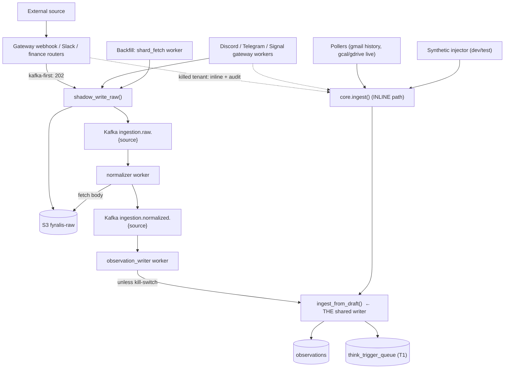
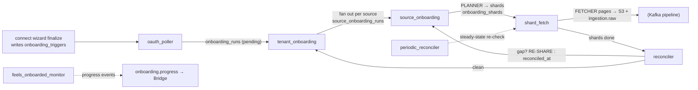

# Data Ingestion in Fyralis Core — A System Reference

> **Audience:** an engineer or AI agent who needs to understand *what the data
> ingestion layer is, how a signal physically becomes a stored observation, and
> where every moving part lives* — without first reading the whole codebase.
>
> **Source of truth:** `services/ingest/` (packages `ingestion`, `integrations`,
> `synthetic`, `code_intel`, `github_intel`), the `db/migrations/` tree, and
> `docker-compose.yml`. This document is a *companion* to the shorter
> [architecture page](../architecture/ingest.md); it goes deeper and is written
> to be self-contained.
>
> **Reading conventions.** Claims verified by reading the import/call site are
> stated plainly. Claims that are *inferred* (e.g. an archetype lineage, an exact
> wire header not re-read for this doc) are labelled **(inferred)**. File paths in
> `code font` are repo-relative.

---

## 0. Table of contents

1. [What this system is](#1-what-this-system-is)
2. [The one-paragraph mental model](#2-the-one-paragraph-mental-model)
3. [Core vocabulary](#3-core-vocabulary-the-nouns)
4. [The central invariant: two paths, one writer](#4-the-central-invariant-two-paths-one-writer)
5. [The uniform ingest path (the 7 steps)](#5-the-uniform-ingest-path-the-7-steps)
6. [Handlers, trust tiers, and idempotency keys](#6-handlers-trust-tiers-and-idempotency-keys)
7. [The Kafka full pipeline (the data plane)](#7-the-kafka-full-pipeline-the-data-plane)
8. [The kill-switch and circuit breaker](#8-the-kill-switch-and-circuit-breaker)
9. [The 25 integration sources](#9-the-25-integration-sources)
10. [Live ingestion edges (webhook / gateway / poll / push)](#10-live-ingestion-edges)
11. [Backfill & onboarding (how history is pulled in)](#11-backfill--onboarding-how-history-is-pulled-in)
12. [Intelligence enrichment (GitHub / code)](#12-intelligence-enrichment)
13. [Reliability machinery](#13-reliability-machinery)
14. [The synthetic & validation framework](#14-the-synthetic--validation-framework)
15. [Runtime topology & how to run it](#15-runtime-topology--how-to-run-it)
16. [The data model (key tables)](#16-the-data-model-key-tables)
17. [Where to look for X (agent index)](#17-where-to-look-for-x-agent-index)
18. [Known discrepancies & caveats](#18-known-discrepancies--caveats)

---

## 1. What this system is

**Fyralis Core** is an *organizational-intelligence runtime*: it ingests the
signals an organization emits across its tools (chat, code, calendar, email,
finance, HR, design, observability…), reduces them to a single uniform fact type,
and feeds a reasoning ("Think") pipeline that builds a continuously-updated model
of the company. The whole system is a **source-level monolith** organized into
layers under `services/`, with data flowing
**signal → ingest → domain substrate → reasoning → product surface → app
transport** (see the [architecture overview](../architecture/index.md)).

**Data ingestion is the front door.** Its single job: take an external event from
*any* source, in *any* shape, and turn it into a **tenant-scoped, deduplicated,
embedded `observation` row**, then kick off downstream reasoning. Everything
upstream of ingestion is a third-party API; everything downstream consumes
`observations`. Ingestion is therefore the **normalization + durability + fan-in**
boundary of the entire product.

Two properties define the layer's design:

- **Uniformity** — 25+ wildly different source APIs collapse into *one*
  intermediate shape (`ObservationDraft`) and *one* persistence function
  (`ingest_from_draft`). A Slack message, a GitHub PR merge, a Mercury bank
  transaction, and an Ashby candidate-stage change all become the same kind of row.
- **Two convergent delivery paths** — a synchronous **inline** path and an
  asynchronous **Kafka full-pipeline** path, which *must* produce byte-identical
  observations for the same input. The Kafka path is the default; inline is the
  fallback and kill-switch.

---

## 2. The one-paragraph mental model

> An external signal arrives at the gateway (webhook), a persistent gateway
> connection (Discord/Telegram/Signal), a poller, or a backfill fetcher. The raw
> body is hashed and written **once** to S3 (`fyralis-raw`) and a tiny pointer
> envelope is published to the per-source Kafka lane `ingestion.raw.{source}`. A
> **normalizer** worker fetches the body, runs the source's **handler** to produce
> an `ObservationDraft`, and republishes to `ingestion.normalized.{source}`. An
> **observation_writer** consumes that, and — unless the tenant's kill-switch is
> flipped — runs the shared 7-step `ingest_from_draft`: resolve actor, resolve
> entities, embed the text (Ollama, 768-d), **INSERT into `observations`** (dedup
> on `(source_channel, external_id, occurred_at)`), and enqueue a `T1`
> Think trigger. The synchronous inline path (`core.ingest()`) runs the *same*
> 7 steps directly in the request, and is what serves dev/test/demo and any tenant
> whose Kafka path has been killed. Backfill of historical data is a separate
> orchestration of long-running asyncio workers that *plan → fetch → reconcile*
> and feed the very same `ingestion.raw` lane.

---

## 3. Core vocabulary (the nouns)

These are the terms you must hold in your head; they recur everywhere.
(Code-derived; see [`docs/glossary.md`](../glossary.md).)

| Term | What it is |
|------|------------|
| **Observation** | The atomic output of ingestion: one fact from a source channel with `occurred_at`, `content_text`, `content` (JSONB), `actor_id`, `trust_tier`, `external_id`, `embedding` (`VECTOR(768)`), `entities_mentioned`. Stored in the **partitioned `observations` table** (monthly range partitions on `occurred_at`). Every observation is the seed of a `T1` Think trigger. |
| **Signal** | Synonym for an observation in the ingestion context — raw information flowing in. |
| **`ObservationDraft`** | The normalized intermediate a *handler* emits before persistence. Fields map 1:1 onto the persisted row plus a few hints. This is the **universal interface** between "weird source-specific payload" and "uniform storage." Defined in `services/ingest/ingestion/handlers/__init__.py`. |
| **Source channel** | The granular routing key, e.g. `slack:message`, `github:webhook`, `internal:state_change`. The first segment (before `:`) is the **source family** (`slack`, `github`, …). |
| **Trust tier** | A per-channel confidence label from `CHANNEL_TRUST_MAP` (`authoritative`, `attested_agent`, `reputable`, `inferential_external`, `unvetted`, …) that influences how Think weighs the signal. A handler may override per-event. |
| **`external_id`** | The dedup key. Composed by the central `idempotency` module so a source's key is identical across its webhook / backfill / poll paths. |
| **Actor** | The resolved identity behind a signal (`actors` table). Handlers emit a channel-native `source_actor_ref` (e.g. `slack:U01ALICE`); ingestion resolves it to an `actor_id`, or records `content._unresolved_actor_ref` for later resolution. |
| **Entity alias** | A fast-path text→entity mapping (`entity_aliases`); unresolved phrases are deferred via `content._unresolved_phrases` for an LLM resolver worker. |
| **Tenant** | The isolation unit. *Everything* in ingestion is tenant-scoped (RLS in Postgres, `tenant_id` as the Kafka partition key). |
| **Per-source lane** | The Kafka topic quad `ingestion.{raw,normalized,embedding,dlq}.{source}` — one isolated set per source so one source's lag/failure can't head-of-line-block another. |

---

## 4. The central invariant: two paths, one writer

Ingestion has **two delivery paths that converge on one persistence function.**
This is the single most important architectural fact in the layer.



- **Inline path** — `core.ingest(channel, raw_payload, …)` runs the handler and
  the 7 steps **synchronously in the calling process** (the gateway request, a
  gateway-worker dispatch, a poller, or the synthetic injector). Source: `services/ingest/ingestion/core.py`.
- **Kafka full pipeline** — `source → ingestion.raw.{source}` (body in S3 + a
  `RawEnvelope` pointer) → **normalizer** → `ingestion.normalized.{source}` →
  **observation_writer** → `ingest_from_draft()`.
- **They converge.** Both call `ingest_from_draft()` (`core.py`). The written
  observation is identical regardless of route — this is enforced as a cutover-safety
  property and guarded by the synthetic validation runs (§14).

**Which path runs?** The Kafka pipeline is **kafka-first by default**: a tenant
with no flag row takes the full pipeline; an explicit
`ingestion.kafka_path_enabled = FALSE` (operator or circuit breaker) forces it back
to inline. Ingress *and* the writer read this through one helper
(`TenantFlags.kafka_path_enabled()`, `services/ingest/ingestion/feature_flags/client.py`) so the two
can never drift. Full rationale: [ADR-0001](../adr/0001-kafka-first-ingestion-default.md).

> **Why two paths at all?** The Kafka path gives async ack (the request returns
> `202` immediately), a durability buffer, replay, and a place for backfill to
> converge. Inline is the always-safe fallback when the broker/S3 is unreachable,
> the dev/test/demo path, and the synchronous-result path. Inline was historically
> primary during a "zero-divergence soak" that validated the async lane against
> the synchronous source of truth; that complete, the default is now kafka-first.

---

## 5. The uniform ingest path (the 7 steps)

This is the heart of the layer — `core.ingest()` → `ingest_from_draft()` in
`services/ingest/ingestion/core.py`. Both convergent paths execute these steps;
the inline path adds step 1 (handler dispatch) on top, the Kafka path runs the
handler earlier in the normalizer and hands the draft straight to step 1.5+.

| Step | What happens | Failure behavior |
|------|--------------|------------------|
| **1. Handler extract** | `get_handler(channel)(payload, headers)` → `ObservationDraft` (content_text, content, source_actor_ref, external_id, occurred_at, entities_hint, trust_tier). Payload guards first: reject >1 MB, reject NUL bytes. | `HandlerNotFound` / `ValidationError` → 4xx (inline) or DLQ (pipeline). |
| **1.5 GitHub inline enrich** | If `channel == "github:webhook"`, `maybe_enrich_github_draft` augments `content["intelligence"]` in place (state transition + blast radius + causal "why"). | Fully swallowed — raw draft persists unchanged ("raw-on-failure"). |
| **2. Pre-assign id** | `observation_id = uuid7()` (time-ordered UUID). | — |
| **3. Actor resolution** | `ActorRepo.resolve_by_source_actor_ref("<channel>:<ref>")`. | Miss → `actor_id=NULL` + `content._unresolved_actor_ref`. |
| **4. Fast-path entity extraction** | Tokenize `content_text` into 1–3-grams (`candidate_phrases`), exact-match each against `EntityAliasRepo`. | Resolved → `entities_mentioned`; entity-looking misses → `content._unresolved_phrases` (for the entity-resolver worker). |
| **5. Embedding** | `OllamaClient.embed(content_text)` → 768-d vector. | Ollama error after retries → `embedding=None`, `embedding_pending=TRUE` (retried async, §13). |
| **6. INSERT in a transaction** | `ObservationRepository.insert(...)`. **Dedup pre-check** on `(source_channel, external_id)`; if present, return the existing row with `deduped=True` and skip step 7. Post-commit `observations_new` `NOTIFY` is flushed. | Missing monthly partition → unnamed `CheckViolationError` → self-heal the partition on a fresh connection, retry once. |
| **7. Enqueue T1 trigger** | INSERT a `T1` / `event_arrival` row into `think_trigger_queue` (carrying source_channel, kind, trust_tier, seed text/actors) — **unless deduped**. | — |

Post-commit, if the embedding didn't land *and* a Kafka producer is wired, a
best-effort request is published to `ingestion.embedding.{source}` for the async
embedding worker. This publish **cannot fail the ingest** — the Postgres backlog
drainer is the safety net.

**Key takeaway for an AI reader:** the dedup key `(source_channel, external_id)`
(plus `occurred_at` riding the partition index) is what makes the whole system
*idempotent* — re-deliveries, backfill/live overlap, and Kafka at-least-once
redelivery all collapse to one row. Everything else in the layer exists to feed
this function correctly.

---

## 6. Handlers, trust tiers, and idempotency keys

### Handler registry
`services/ingest/ingestion/handlers/__init__.py`. A `@register(channel)`
decorator self-registers each handler at import time; `get_handler(channel)`
dispatches. A handler is a **pure async function**
`(payload, headers) -> ObservationDraft` — no I/O, no DB. The module imports all
source handlers at the bottom so the decorators run on first import.

Registered handler families: `system` (internal channels), `slack`, `github`,
`linear`, `stripe`, `discord`, `gmail`, `notion`, `google_calendar`,
`google_drive`, `jira`, `mercury`, `quickbooks`, `grafana`, `telegram`, `brex`,
`ramp`, `gusto`, `deel`, `fireflies`, `signal`, `aws`, `miro`, `figma`, `carta`,
`hibob`, `ashby`, `linkedin`.

> Note: **Linear** and **Stripe** have handlers but are *not* in the canonical
> 25-source `SourceLiteral` (no Kafka lane) — their upstream ids are adopted
> verbatim and they ride the inline path / internal channels. The `internal:*`
> channels are system-originated, never enter via a signature-verified webhook,
> and carry the highest trust.

### Trust map
`CHANNEL_TRUST_MAP` in the same module is the authoritative `source_channel →
trust_tier` table (e.g. `github:webhook → authoritative`, `slack:message →
attested_agent`, `hibob:object/ashby:object/linkedin:object → authoritative`).
The handler copies the tier into the draft; it may override per event.

### Idempotency (`external_id`) constructors
`services/ingest/ingestion/idempotency/__init__.py` is the **single home for every
*composed* dedup key.** Every webhook/backfill/poll path for a source routes
through one handler that calls the matching constructor here, so a source's key
**cannot drift across paths** (the `test_backfill_external_id_parity` test makes
this structural). Two families:

- **Immutable** — the upstream id is globally unique & stable, so the key is just
  a namespaced id: `slack {channel}:{ts}`, `gmail:{install}:{message_id}`,
  `discord:{snowflake}`, `notion:{type}:{id}`.
- **Versioned (the "mutable-source" lesson)** — the resource mutates in place, so
  the key encodes the mutation dimension (status / version / sync-token /
  updated-time). A real change lands a *new* observation; identical re-fetches
  dedup. Used by sources like Jira, Mercury, QuickBooks, the GCal/GDrive
  sync-token sources, etc.

**Adopted-verbatim keys are deliberately *not* here** — Stripe `evt_…`, GitHub
`node_id`, RFC-5322 `Message-ID`, Linear ids are unique upstream and assigned
inline by their handler; there's nothing to compose.

### The "five source-literal lists" gotcha
Adding a source means updating **more than one** list. The canonical one is
`RawEnvelope.SourceLiteral` (`…/raw_tier/envelope.py`) — it drives the Kafka topic
registry and the embedding source-family enum automatically. But there are
**secondary literal lists** that must be kept in sync:

1. `…/raw_tier/envelope.py` — `SourceLiteral` (canonical; drives topics + embedding).
2. `…/progress/events.py` — the `Source` literal for onboarding-progress events.
3. `…/workflows/source_onboarding.py` — `VALID_SOURCES` planner gate.
4. `…/workflows/tenant_onboarding.py` — `VALID_SOURCES` fan-out gate.
5. `db/migrations/0107_linkedin.sql` (and prior widening migrations) — the
   `CHECK (source IN (...))` constraints on `source_onboarding_runs`,
   `onboarding_shards`, `ingestion_failures`, `onboarding_triggers`.

The migrations widen the CHECK forward each time a source lands; a stale literal
list **compiles green but backfill-zeros** (the planner/loader silently refuses
the new source), which is exactly the class of bug the all-25 overlap gate exists
to catch.

---

## 7. The Kafka full pipeline (the data plane)

When a tenant is on the kafka-first path (the default), a signal travels through a
set of **per-source-isolated** Kafka lanes. All topic/group names derive from one
module — `services/ingest/ingestion/kafka/topics.py` — which builds them from
`SourceLiteral`, so the topic registry and the envelope schema can never diverge.

### Topic layout
Per source `S`, four data-plane topics:
`ingestion.raw.S`, `ingestion.normalized.S`, `ingestion.embedding.S`,
`ingestion.dlq.S`. Plus one **control-plane** topic
`ingestion.tenant_traffic_signal` (a ~1% sampled per-tenant signal, *not*
per-source). Topics are provisioned explicitly by
`scripts/provision_kafka_topics.py` (broker auto-create is **off**, so a typo'd
name drops messages rather than creating a stray topic). The **Kafka message key
is `tenant_id`** — same tenant → same partition → per-tenant ordering preserved
across every stage. The producer runs with `enable.idempotence=true, acks=all`.

### Stage 1 — raw publish (`shadow_write_raw`)
`services/ingest/ingestion/shadow_write.py`:

1. `content_hash = sha256(raw_body)`.
2. **S3 `PutIfAbsent`** to `fyralis-raw`, key `{env}/raw/{source}/{tenant}/{ymd}/{hash}` — content-addressed, so identical bodies dedup in object storage.
3. Build a `RawEnvelope` (a ~1–4 KB *pointer*: `source`, `tenant_id`,
   `raw_s3_key`, `content_hash`, `ingress_kind`, `ingress_metadata`, `idem_hints`)
   and publish to `ingestion.raw.{source}`.

This one mechanism has **two roles**: for a kafka-first tenant it is the **primary
write** (the request returns `202` and skips inline); for a killed tenant it is a
best-effort **post-inline audit** that never fails the inline `200`. The
request-path flush is bounded by `CUTOVER_FLUSH_TIMEOUT_SEC` (default 2.0s) so a
slow broker trips the inline fallback fast.

`ingress_kind` (an enum on the envelope) records *how* the signal entered:
`webhook` | `gateway` | `pubsub` | `backfill` | `poll`. (`poll` is the Gmail
live-via-Kafka cutover: the push handler fetches the real Gmail message and
publishes it here instead of ingesting inline, so it dedups against backfill.)

### Stage 2 — normalizer (no DB)
`services/ingest/ingestion/normalizer/worker.py`. Consumes `ingestion.raw.{source}`,
fetches the body from S3, runs the **handler** to produce a `NormalizedEnvelope`,
publishes to `ingestion.normalized.{source}`. **It touches no database** — pure
transform. Per-source consumer group `normalizer.{source}`; a bad message is DLQ'd
and the offset committed so one poison message can't stall the lane.

### Stage 3 — observation_writer (the DB write)
`services/ingest/ingestion/writers/observation_writer.py`. Consumes
`ingestion.normalized.{source}`, reconstructs an `ObservationDraft`, reads
`kafka_path_enabled` for the tenant:

- **FALSE (killed):** record a shadow/audit event and return (the inline path
  already wrote the row).
- **TRUE (default):** call `ingest_from_draft()` — steps 1.5–7 above. It wraps the
  call with the same per-month **partition self-heal** (create the covering month
  and retry once); timestamps outside the guardrail window (≈10y back / 7d future)
  are DLQ'd as corrupt rather than healed.

### Side channels
- **Embedding** — `…/writers/embedding_worker/`. Consumes
  `ingestion.embedding.{source}`, re-embeds rows where `embedding_pending=TRUE`,
  and `UPDATE … WHERE embedding_pending=TRUE` (race-safe so inline and worker can't
  double-write). The **embedding-backlog drainer** (`…/recovery/embedding_backlog/`)
  scans Postgres *directly* for `embedding_pending=TRUE`, so a Kafka outage never
  blocks embedding recovery; it is Redis-rate-limited against Ollama.
- **DLQ** — `…/writers/dlq_writer/`. Consumes `ingestion.dlq.{source}` and UPSERTs
  into the `ingestion_failures` table keyed by
  `(tenant_id, source, raw_s3_key, failure_kind)`, bumping `attempt_count` on
  repeats. Failure kinds: normalizer parse/invariant, writer invariant, embedding
  ollama failure.

---

## 8. The kill-switch and circuit breaker

The Kafka pipeline is primary, so the system needs a **safety net** that pulls a
tenant back to the always-safe inline path before observations pile up.

`services/ingest/ingestion/feature_flags/circuit_breaker.py` (run as the
`circuit_breaker` compose singleton):

- **Measures** committed-offset lag-in-seconds on **every** per-source raw lane
  (`ingestion.raw.S` vs group `normalizer.S`), and samples active tenants from the
  1% `tenant_traffic_signal`. Each tenant is judged on its **worst lane**.
- **Trips** when lag > `BREAKER_THRESHOLD_SEC` (60s) for `BREAKER_WINDOW_TICKS`
  (5) consecutive ticks (~5 min sustained) → flips that tenant's
  `ingestion.kafka_path_enabled = FALSE` (`set_by=auto:circuit_breaker`), records
  `circuit_breaker_state`, and alerts. Ingress + writer observe the flip within the
  30s flag-cache TTL.
- **Recovery is operator-driven** (no auto-recovery, to avoid flapping mid-incident):
  `scripts/reenable_kafka_path.py <tenant> --operator <you>` (or `--list`). The
  breaker auto-resets its own bookkeeping once it sees the flag back at `TRUE`.
- Exposes `/healthz` + `/metrics` on `INGESTION_HEALTH_PORT` (9300); a wedged tick
  loop goes 503 and is restarted. A per-lane probe failure is isolated so one bad
  lane can't blind the others.

---

## 9. The 25 integration sources

The canonical list (`RawEnvelope.SourceLiteral`) defines **25 data-plane source
families**, each under `services/ingest/integrations/<source>/` (auth, client,
onboarding) with pipeline glue in `services/ingest/ingestion/` (handler, planner,
fetcher, reconciler). They cluster into a small number of **archetypes** by how
they authenticate and how live data arrives.

> **Accuracy note.** The auth model and live-edge *category* below are verified
> from each source's `oauth.py`/`client.py` and the compose worker set. Exact
> signature header strings live in each source's onboarding/handler and are only
> called out where novel/verified; treat unlisted per-source header names as
> implementation detail to confirm at the file.

| # | Source | Auth model | Live edge | Backfill cursor | Represents |
|---|--------|-----------|-----------|-----------------|------------|
| 1 | **slack** | OAuth2 (bot `xoxb` + per-user `xoxp`) | HMAC webhook | `conversations.history` cursor | messages, threads, reactions, DMs |
| 2 | **github** | GitHub App (JWT→install token) | HMAC webhook (`X-Hub-Signature-256`) | event stream | commits, PRs, issues, checks |
| 3 | **discord** | Bot token | **Gateway (WSS)** | guild/channel history | messages, interactions |
| 4 | **gmail** | **Domain-Wide Delegation** (service-account JWT) | **Pub/Sub push** + history poll | `historyId` | email messages |
| 5 | **notion** | OAuth2 | HMAC webhook | cursor pagination | pages, blocks, comments |
| 6 | **google_calendar** | DWD (reuses Gmail SA) | **poll + native `events.watch` push** | `syncToken` | calendar events |
| 7 | **google_drive** | DWD (reuses Gmail SA) | **poll + `changes.watch` push** | Changes-API `startPageToken` | files, revisions (My Drive + Shared Drives) |
| 8 | **jira** | API token (HTTP Basic `email:token`) | HMAC webhook | cursor pagination | issues, comments, transitions |
| 9 | **mercury** | Bearer API token | HMAC webhook | cursor pagination | bank transactions, accounts |
| 10 | **quickbooks** | OAuth2 + `realm_id` | webhook (verifier token) | query-language `SinceToken` | invoices, expenses, journal |
| 11 | **grafana** | service-account Bearer | webhook (**bare-hex HMAC**, opaque-URL token) | — (alerts only) | alert state-changes, annotations |
| 12 | **telegram** | **MTProto `auth_key` session** | **Gateway (MTProto updates)** | `messages.getHistory`/`offset_id` | messages, group updates |
| 13 | **brex** | Bearer API token | HMAC webhook | cursor pagination | card/transaction data |
| 14 | **ramp** | OAuth2 (access+refresh) | HMAC webhook | cursor pagination | spend transactions |
| 15 | **gusto** | OAuth2 (operator-pasted) | HMAC webhook | cursor pagination | employees, payroll, benefits |
| 16 | **deel** | Bearer API token | HMAC webhook | cursor pagination | contractor payments |
| 17 | **fireflies** | Bearer API token | HMAC webhook | cursor pagination | meeting transcripts |
| 18 | **signal** | linked-device session | **Gateway** | message-timestamp cursor | messages, group updates |
| 19 | **aws** | IAM creds (assume-role / static; SigV4) | **poll** (CloudTrail) | date-range | CloudTrail API events |
| 20 | **miro** | org-app Bearer | HMAC webhook | cursor pagination | boards, items, comments |
| 21 | **figma** | org/team Bearer | HMAC webhook | cursor pagination | files, components, changes |
| 22 | **carta** | OAuth2 | **poll-only** | cursor pagination | cap-table, shares, investors |
| 23 | **hibob** | service-user HTTP Basic | webhook (**SHA512/base64 `Bob-Signature`**) | cursor pagination | HR records, lifecycle, time-off |
| 24 | **ashby** | API token (Bearer/Basic) | HMAC webhook | cursor pagination | ATS candidates, jobs, activities |
| 25 | **linkedin** | OAuth2 (org URN scope; **partner-gated**) | **poll-only** scaffold | `updated_at` | org data, shares, followers |

**Archetype clusters** (how to reason about a new source):

- **OAuth2 app-bounce:** slack, github, notion (provider redirect).
- **OAuth2 no-bounce / operator-mediated:** quickbooks, gusto, ramp, carta,
  linkedin (creds pasted into a connect wizard; no in-repo OAuth redirect).
- **Domain-Wide Delegation (Google):** gmail, google_calendar, google_drive
  (one service account impersonates Workspace users).
- **Bearer / Basic API token:** jira, mercury, brex, deel, fireflies, aws, miro,
  figma, hibob, ashby, grafana (long-lived credential in the `secret_store` as an
  opaque ref — plaintext never hits the DB).
- **Persistent gateway connection:** discord, telegram, signal (a single live
  socket per authorization — see §10).

**Novel auth/verification worth knowing (verified):**
- **HiBob** verifies webhooks with **HMAC-SHA512, base64-encoded** in a
  `Bob-Signature` header — unique among the sources.
- **Grafana** uses a **bare lowercase-hex** HMAC (no `sha256=` prefix) plus an
  **opaque per-channel URL token**.
- **Telegram/Signal/Discord** authenticate a *connection*, not a request — there
  is no per-message signature; trust comes from the session.
- **LinkedIn** and **Carta** are **poll-only** (no webhook edge at all); LinkedIn's
  live edge is a partner-gated scaffold.

---

## 10. Live ingestion edges

"Live" means *steady-state* ingestion after backfill — new events as they happen.
There are **four edge types**, and a source uses one or two of them:

1. **HTTP webhook (signature-verified)** — the majority. The provider POSTs to the
   gateway; a per-source verifier checks the signature *before* `core.ingest`
   runs (core assumes a pre-verified payload). On a kafka-first tenant the gateway
   returns `202` and `shadow_write_raw` publishes to `ingestion.raw`; on a killed
   tenant it ingests inline and audits. Routers:
   `services/ingest/integrations/router.py` (+ the gateway webhook router in the
   app layer).
2. **Persistent gateway connection** — Discord, Telegram, Signal. A bot/user
   authorization may be driven by **exactly one** live connection (two replicas
   double-deliver every frame), so each runs as an **HA leader-locked worker**:
   - `discord_gateway_worker` — acquires the `gateway:discord:leader_lock` Redis
     lease before connecting, persists `gateway_session_state` for crash-RESUME.
   - `telegram_gateway_worker` — holds the MTProto updates connection on the *live*
     session, advances `pts/qts/seq/date` via `getDifference` as its native
     reconciler, shadow-writes each update to `ingestion.raw.telegram`
     (`ingress_kind=gateway`). Backfill runs on a **separate** authorization so the
     two never share one `auth_key` (see [ADR-0003](../adr/0003-telegram-mtproto-user-account-ingestion.md)).
   - `signal_gateway_worker` — the Signal analog.
   `REDIS_URL` is **mandatory** for these (without the lease there's no
   double-delivery guard; a missing DSN fails loud).
3. **Push provisioning (Google)** — Gmail provisions Pub/Sub watches; Calendar and
   Drive register native `events.watch`/`changes.watch` channels. The always-mounted
   `/webhooks/google_{calendar,drive}/push` ingress constant-time-verifies
   `X-Goog-Channel-Token`. A **poller guarantees liveness** when the push base URL
   is unset (`google_calendar_live_poller`, `google_drive_live_poller`,
   `gmail_history_poller`).
4. **Polling** — AWS, Carta, LinkedIn (and the Google pollers as a fallback). A
   `live_poller` leases cursor-seeded resources via a `last_live_poll_at` claim slot
   and drains the delta through the shared `drain_live` path (existing fetcher +
   `ingest()`, dedups at the `observations` UNIQUE).

All four edges ultimately call the **same** `ingest()` / `ingest_from_draft()` and
dedup on the same `external_id`, which is why live and backfill can run
concurrently without producing duplicates.

---

## 11. Backfill & onboarding (how history is pulled in)

When a tenant first connects a source, the system pulls the **historical**
data. This is a separate orchestration of **long-running asyncio workers** that
hand off work through **durable Postgres queues** (not Kafka): a `workflow_signals`
inbox table (consumed with claim-via-`UPDATE` / `FOR UPDATE SKIP LOCKED`) and a
`workflow_states` table that homes each shard's resumable cursor. Each worker is
launched by compose as its own process.

### The pipeline, end to end



1. **Trigger.** A source's connect-wizard `finalize` endpoint (or an OAuth
   callback) writes a row to **`onboarding_triggers`** (a transactional outbox) in
   the same transaction as the install rows.
2. **`oauth_poller`** consumes unconsumed triggers (`FOR UPDATE SKIP LOCKED`),
   creates an **`onboarding_runs`** row (`status=pending`), and emits an
   `onboarding_run_created` signal — atomically marking the trigger consumed.
3. **`tenant_onboarding`** loads the run, queries the tenant's *active installs* to
   decide which sources apply, inserts one **`source_onboarding_runs`** row per
   source, emits `source_onboarding_requested` per source, marks the run `running`.
   On the completion side it rolls source completions up into the run and emits
   `tenant_onboarding_completed`.
4. **`source_onboarding`** calls the source's **planner**
   (`…/ingestion/planners/<source>.py`, dispatched via `PLANNER_DISPATCH`) to
   enumerate the unit of fetch work — **shards**. A *shard* is a bounded fetch
   target: e.g. one Slack channel-window, one Gmail mailbox, one GitHub repo's
   events. It inserts **`onboarding_shards`** rows (each with a `shard_kind`,
   JSONB `shard_identifier`, optional time `window`, and a `recency_score` so
   recent/important shards fetch first) and emits `shard_fetch_requested` per shard.
5. **`shard_fetch`** is the **producer** of backfill data. It claims a shard
   (`state pending→in_progress`), then loops the source's **fetcher**
   (`…/ingestion/fetchers/<source>.py`, `FETCHER_DISPATCH`) page by page:
   `fetcher(install, shard_identifier, cursor) -> FetchResult(records, next_cursor,
   end_of_data)`. For each page it writes records to **S3** and publishes
   `RawEnvelope`s (`ingress_kind=backfill`) to `ingestion.raw.{source}` — i.e.
   **backfill converges onto the very same data plane as live**. The cursor is
   advanced **only after** the broker acks (the "N1" *publish-then-advance*
   invariant), so a crash re-publishes rather than skips; Kafka idempotency + the
   observation UNIQUE dedup the overlap. Fetches are token-bucket rate-limited per
   `(tenant, source, method)` via Redis (`…/ingestion/rate_limit/`).
6. **`reconciler`** runs after a source's shards complete: it calls the source's
   **reconciler** (`…/ingestion/reconcilers/<source>.py`, `RECONCILER_DISPATCH`) to
   detect coverage **gaps**. Clean → stamp `source_onboarding_runs.reconciled_at`
   and tell `tenant_onboarding` the source is done. Gaps → insert **re-share** child
   shards (linked by `parent_shard_id`, `state=reconciliation_resharded`), bump
   `reconciliation_pass_count`, and loop back through `shard_fetch`.
7. **`periodic_reconciler`** re-runs reconciliation on settled sources on a schedule
   — the steady-state safety net for sources (GitHub/Slack/Discord) that have no
   durable live watermark, so a missed live event is eventually re-fetched.
8. **`feels_onboarded_monitor`** watches for the first moment a source's recent
   data is queryable and emits progress events.

### Onboarding progress events
The backfill workers emit a stream of `onboarding.progress` Kafka events (7 Pydantic
models in `…/progress/events.py`), partitioned by `tenant_id`, that the **Bridge**
subsystem consumes to drive the onboarding UX:
`tenant.onboarding.started/complete/behind_schedule`,
`source.onboarding.started/complete/feels_onboarded`, `shard.fetched`. Each is
published **post-commit** and de-duped by Bridge; the load-bearing state
transitions are durable even if a progress publish is lost.

### Concurrency patterns (how it stays correct under multiple replicas)
- **`FOR UPDATE SKIP LOCKED`** on the signal inbox — concurrent workers each claim
  distinct rows; a failed transaction rolls back and the next tick re-claims.
- **Claim-via-`UPDATE`-with-guard** for single-fire transitions
  (`… SET reconciled_at=now() WHERE reconciled_at IS NULL`) — exactly one racer wins.
- **Publish-then-advance ("N1")** for shard cursors — never advance a cursor before
  the data it covers is durably on the broker.

---

## 12. Intelligence enrichment

Two subsystems enrich GitHub signals *inline* so the **same observation row**
carries reasoning, not just raw payload:

- **`github_intel`** (`services/ingest/github_intel/`) maintains
  PR/CI/branch/issue **finite-state machines** from `github:webhook` observations,
  and (step 1.5 of ingest) writes causal context into the observation's
  `content['intelligence']` (state transition + code blast radius + a causal
  "why"). It is **raw-on-failure**: any error is swallowed and the raw draft
  persists. An ordered, per-repo worker (`github_intel_worker`, draining
  `github_intel_queue`) does the heavier enrichment and writes
  `github_signal_enrichment`. A read-only `/github-intel/*` router exposes it.
- **`code_intel`** (`services/ingest/code_intel/`) maintains a commit-SHA-versioned
  per-repo **code graph + code-RAG embeddings** ("blast radius") that `github_intel`
  consults to answer "what does this change touch?"

---

## 13. Reliability machinery

The layer is built to **never lose a signal and never double-count one.** The
mechanisms, in one place:

| Concern | Mechanism |
|---------|-----------|
| **Exactly-one observation** | Dedup pre-check + `UNIQUE (source_channel, external_id, occurred_at)`; one composed `external_id` per source across all paths (idempotency module). |
| **At-least-once delivery, safely** | Kafka idempotent producer + consumer offset commits *after* work; the observation UNIQUE makes redelivery a no-op. |
| **Crash-safe backfill cursors** | Publish-then-advance ("N1") in `shard_fetch`; cursor homed in `workflow_states`. |
| **Embedding failures** | `embedding_pending=TRUE` + async retry worker + a Postgres-scanning backlog drainer (Kafka-independent), Redis-rate-limited against Ollama. |
| **Backfilled / old timestamps** | Per-month partition **self-heal** (create the covering partition, retry once) on inline *and* writer paths; out-of-guardrail dates DLQ as corrupt. |
| **Poison messages** | Normalizer/writer DLQ a bad message and commit the offset so the lane keeps moving; `dlq_writer` UPSERTs `ingestion_failures`. |
| **Broker/S3 outage** | Inline fallback (kill-switch) keeps ingestion working; raw publish is best-effort and never fails the inline `200`. |
| **Sustained consumer lag** | Circuit breaker auto-flips the tenant to inline; operator re-enables. |
| **Source rate limits** | Lua token-bucket gate before each upstream fetch (`rate_limit/`). |
| **Double-delivery on gateways** | Redis leader-lock per gateway authorization (Discord/Telegram/Signal). |
| **Missed live events (no watermark)** | `periodic_reconciler` re-checks coverage on a schedule. |

---

## 14. The synthetic & validation framework

`services/ingest/synthetic/` is a large, first-class subsystem whose job is to
**prove ingestion correctness end-to-end without real provider credentials.**

- **Synthetic injector** (`synthetic/core.py`) — a *blessed direct-injection
  bypass* that routes through the real `core.ingest()` and tags
  `content.synthetic=true`. Because it reuses the real path, a synthetic signal is
  indistinguishable from a real one at the `ingest()` boundary (entity resolution,
  embedding, dedup, NOTIFY, T1 all fire). Import-time guard refuses to load when
  `COMPANY_OS_ENV=production`.
- **Mock clients + fixtures** (`mock_clients/`, `fixtures/`) — one deterministic
  in-process fake per source, returning the provider's *literal* API field shapes,
  injected at the client-factory seam. So the real planners/fetchers/reconcilers
  run unmodified against fake upstreams. `fault_profiles/` injects rate limits,
  5xx, auth-expiry, partial pages.
- **Backfill harness** (`backfill_harness/`) — spins up the real onboarding worker
  set as subprocesses against the mocks and runs a multi-tenant onboarding to
  completion, then asserts **property-based invariants** (every tenant completed,
  no duplicate `external_id`, monotonic cursors, exactly-one completion signal,
  counts match fixtures).
- **Live generators + spammer** (`live_generators/`, `spammer/`) — in-process
  drivers that fire live webhook/gateway/push/poll events (with valid signatures)
  *concurrently with* backfill.
- **The overlap gate** (`validation_runs/run_all_sources.py`) — the capstone. It
  runs **backfill + live across all 25 sources simultaneously**, and for *each*
  source it waits until that source's backfill is `in_progress` before firing the
  source's live burst — proving **live-during-backfill overlap** per source. It
  asserts observation counts match fixtures, cross-path dedup holds (a backfilled
  observation replayed live collapses to one row), every live ingress took its
  expected status (`202` cutover / `200` inline / gateway dispatch), and tampered
  signatures are rejected. The run prints a **`READY` / `NOT_READY` verdict** and
  writes a markdown report under `docs/validation/path_i/`. **"READY" = the all-25
  ingestion gate passed for this milestone.**

Run it:
```bash
COMPANY_OS_ENV=test DATABASE_URL=… KAFKA_BOOTSTRAP_SERVERS=… \
  python -m services.ingest.synthetic.validation_runs.run_all_sources
```

---

## 15. Runtime topology & how to run it

Ingestion is **not one process** — it's a fleet. From `docker-compose.yml`:

| Group | Compose services |
|-------|------------------|
| **Ingress** | `gateway` (uvicorn; webhooks + OAuth + inline ingest) |
| **Onboarding/backfill** | `oauth_poller`, `tenant_onboarding`, `source_onboarding`, `shard_fetch`, `reconciler`, `periodic_reconciler`, `feels_onboarded_monitor` |
| **Kafka consumer chain** | `normalizer`, `observation_writer`, `embedding_worker`, `embedding_backlog`, `dlq_writer` |
| **Live source workers** | `discord_gateway_worker`, `telegram_gateway_worker`, `signal_gateway_worker`, `gmail_watch_scheduler`, `gmail_history_poller`, `google_calendar_live_poller`, `google_drive_live_poller`, `google_calendar_watch_scheduler`, `google_drive_watch_scheduler` |
| **Safety/flags** | `circuit_breaker` |
| **Init one-shots** | `migrate`, `kafka-init` (`provision_kafka_topics.py`), `minio-init` |

Backfill/Kafka workers are launched as `python -m services.ingest.ingestion.<…>`
(e.g. `…workflows.shard_fetch`, `…normalizer.worker`,
`…writers.observation_writer`). Gateway workers have dedicated launchers under
`scripts/run_*_gateway_worker.py`.

**Data stores** the layer depends on: **PostgreSQL 16 + pgvector** (the substrate,
queues, and `VECTOR(768)` search), **Ollama** (`nomic-embed-text`, 768-d
embeddings), **Redis** (rate-limit buckets + gateway leader locks), **Kafka (KRaft)**
(per-source lanes — only when the full pipeline is enabled), and **S3 / MinIO**
(`fyralis-raw` raw-tier bodies). Local dev can run with just Postgres + Ollama and
the inline path; the full pipeline needs Kafka + S3. See the
[runtime & data-plane page](../architecture/data-plane.md).

`docker-compose.per-source.yml` overlays a per-source-isolated consumer topology
(one normalizer/writer pinned per source via `INGESTION_SOURCE`), scaling the
all-source workers to zero.

---

## 16. The data model (key tables)

The substrate ingestion reads/writes (PostgreSQL; ~79 migrations in
`db/migrations/`). Everything is `tenant_id`-scoped with RLS.

| Table | Role | Notable columns |
|-------|------|-----------------|
| **`observations`** | The output. Monthly range-partitioned on `occurred_at`. | `source_channel`, `external_id`, `content_text`, `content` (JSONB), `actor_id`, `trust_tier`, `embedding VECTOR(768)`, `embedding_pending`, `entities_mentioned`, `cause_id`. `UNIQUE (source_channel, external_id, occurred_at)`. |
| **`think_trigger_queue`** | The hand-off to reasoning. | `trigger_kind=T1`, `trigger_subkind=event_arrival`, `observation_id`, `payload`. |
| **`onboarding_triggers`** | Transactional outbox written at install/connect. | `source`, `trigger_kind`, install ref, `consumed_at`. |
| **`onboarding_runs`** | One per tenant onboarding run. | `status` (pending→running→feels_onboarded→complete/failed), `sources_enabled[]`, `feels_onboarded_at`, `behind_schedule_emitted_at`. |
| **`source_onboarding_runs`** | One per (run, source). | `status`, `reconciled_at`, `reconciliation_pass_count`, `last_reconcile_check_at`. |
| **`onboarding_shards`** | The unit of fetch work. | `shard_kind`, `shard_identifier` (JSONB), `window_*`, `recency_score`, `state` (pending→in_progress→done/failed/reconciliation_resharded), `parent_shard_id`, `pages_fetched`, `observations_seen`. |
| **`workflow_signals`** | Durable inbox between workers. | `(workflow_kind, workflow_id)` routing, `signal_kind`, `idempotency_key`, `consumed_at`. |
| **`workflow_states`** | Per-workflow durable state / cursor home. | `state_data` (JSONB, holds the N1 `cursor`), `last_advanced_at`. |
| **`ingestion_failures`** | DLQ sink. | `(tenant_id, source, raw_s3_key, failure_kind)` UPSERT, `attempt_count`. |
| **`circuit_breaker_state`** | Breaker bookkeeping. | `consecutive_breach_ticks`, `tripped`, `tripped_at`. |
| **`tenant_flags`** | Per-tenant kill-switch et al. | `ingestion.kafka_path_enabled` (missing row = kafka-first). |
| **`actors` / `entity_aliases`** | Identity + entity resolution. | source_actor_ref → actor_id; alias text → entity (+embedding). |
| **`provider_installations` / `*_installations`** | Per-source connected installs + webhook keying. | credentials stored as opaque `secret_store` refs. |

Source-specific installs/resources have their own tables (e.g. `gmail_*`,
`jira_installations/jira_projects`, `mercury_*`, `quickbooks_*`,
`telegram_update_state`, `gateway_session_state`), added by the per-source
migrations that also widen the `source IN (...)` CHECK constraints.

---

## 17. Where to look for X (agent index)

A fast lookup for "I need to change/understand X":

| You want to… | Go to |
|--------------|-------|
| Understand the shared persistence path | `services/ingest/ingestion/core.py` (`ingest`, `ingest_from_draft`) |
| Add/inspect a source's payload→draft mapping | `services/ingest/ingestion/handlers/<source>.py` + `CHANNEL_TRUST_MAP` |
| Find/define a dedup key | `services/ingest/ingestion/idempotency/__init__.py` |
| Add a source family (the canonical list) | `services/ingest/ingestion/raw_tier/envelope.py` `SourceLiteral` — **then** the 4 secondary lists in §6 |
| Auth / OAuth / connect wizard for a source | `services/ingest/integrations/<source>/oauth.py`, `client.py`, `onboarding.py` |
| Webhook ingress / signature verify | `services/ingest/integrations/router.py` + the app gateway webhook router |
| The Kafka raw publish | `services/ingest/ingestion/shadow_write.py` |
| Kafka topic / group names | `services/ingest/ingestion/kafka/topics.py` |
| Normalizer (raw→normalized) | `services/ingest/ingestion/normalizer/worker.py` |
| The DB write from Kafka | `services/ingest/ingestion/writers/observation_writer.py` |
| Backfill orchestration | `services/ingest/ingestion/workflows/*.py` |
| What a source backfills (plan) | `services/ingest/ingestion/planners/<source>.py` |
| How a source pages the API | `services/ingest/ingestion/fetchers/<source>.py` |
| Coverage/gap detection | `services/ingest/ingestion/reconcilers/<source>.py` |
| Kill-switch / circuit breaker | `services/ingest/ingestion/feature_flags/` |
| Embedding retry / backlog | `services/ingest/ingestion/writers/embedding_worker/`, `…/recovery/embedding_backlog/` |
| DLQ | `services/ingest/ingestion/dlq/`, `…/writers/dlq_writer/` |
| GitHub/code enrichment | `services/ingest/github_intel/`, `services/ingest/code_intel/` |
| Prove ingestion correctness | `services/ingest/synthetic/validation_runs/run_all_sources.py` |
| Gateway workers (Discord/Telegram/Signal) | `services/ingest/integrations/{discord,telegram,signal}/gateway/`, `scripts/run_*_gateway_worker.py` |

---

## 18. Known discrepancies & caveats

- **Source count drift in older docs.** The shorter
  [architecture page](../architecture/ingest.md) and
  `docs/ingestion/README.md` predate the later source waves and say "ten" /
  "twelve" / "eight" sources. The **verified current count is 25** data-plane
  source families (`SourceLiteral`) plus the `linear`/`stripe` handlers and
  `internal:*` system channels. Trust the code (`SourceLiteral` + the
  `integrations/` directory + the handler imports), not the prose count.
- **Routing not wired in ingest.** `CODEBASE-ARCHITECTURE.md` describes a routing
  decision (`signal_routing_decisions`) in the ingest path; **no such import exists
  in `services/ingest/`** — routing lives in the Platform layer and is shadow-only.
- **Exact per-source signature schemes.** §9's auth/live-edge *categories* are
  verified; specific header strings beyond the called-out novel ones (HiBob,
  Grafana) should be confirmed at the source's `onboarding.py`/handler before you
  rely on them.
- **`docker-compose.yml` deployment target.** The compose stack ships
  single-broker Kafka (`replication_factor=1`); whether it targets
  dogfood/staging/production is not asserted here.
- **This doc is a snapshot** (2026-06-09, `main`). The ingestion layer changes
  frequently (a new source roughly every few commits); re-verify counts and the
  source list against `SourceLiteral` before acting on them.
