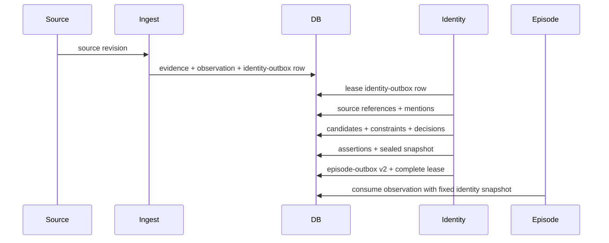

# Entity Resolution Subsystem — Final Implementation Report

## Outcome

Fyralis now has a source-grounded entity-resolution boundary between the
Perception Plane and episode construction. A normal observation cannot enter
episode intake contract v2 until a resolver run has sealed an immutable,
content-addressed identity snapshot. Partial snapshots are valid: uncertainty
is preserved and does not block episode formation.

The work was delivered in three commits/phases:

1. `912dddb5` — source-grounded references, mentions, connector capabilities,
   resolver-run ledger, architecture, and admission policy.
2. `17a625ea` — candidates, constraints, explainable ranking, typed assertions,
   and immutable resolution snapshots.
3. Phase 3 — durable orchestration, lifecycle, query grounding, episode handoff,
   the Audit Week scenario, and final regression coverage.

## Final architecture

```mermaid
flowchart LR
    subgraph P[Perception Plane]
      X[External source] --> C[Connector contract]
      C --> E[Immutable source evidence]
      E --> O[Observation]
    end

    subgraph I[Identity and Knowledge Plane]
      O --> IO[Identity outbox]
      IO --> MR[Mention registrar]
      MR --> SR[Installation-scoped source references]
      MR --> M[Evidence-bound mentions]
      SR --> CG[Candidate generation]
      M --> CG
      CG --> HC[Hard constraints]
      HC --> SC[Explainable scoring]
      SC --> DP[Decision policy]
      DP --> AL[Versioned assertion ledger]
      AL --> IS[Immutable identity snapshot]
    end

    subgraph S[Situation Plane boundary]
      IS --> EO[Episode intake v2]
    end

    HD[Human correction] --> RR[Targeted re-resolution]
    RR --> IO
```

## What was implemented

### Source-grounded foundation

- A capability registry is checked against the current connector catalog, so
  entity scope follows the signals Fyralis can actually receive.
- Source references are keyed by tenant, connector installation scope, source,
  native type, and native ID. The same Slack or Jira ID in two workspaces cannot
  collide.
- Non-query mentions require an observation and exact immutable evidence.
- Canonical admission is explicit. People are initially durable; artifacts,
  meetings, and work records are conditional; audits, goals, projects, teams,
  software systems, and abstract topics remain contextual without stronger
  authoritative evidence.

### Explainable resolution engine

- Candidate sources include deterministic source references, accepted principal
  mappings, structured hints, aliases, actor names, and bounded context providers.
- Must-link and cannot-link constraints are temporal and override statistical
  scores.
- Decisions use type-specific thresholds and runner-up margins, producing
  `resolved`, `probable`, `ambiguous`, or `unresolved` outcomes.
- Candidate features, retrieval methods, scores, constraints, alternatives, and
  reasons are persisted for inspection and replay.
- Assertions distinguish `refers_to`, `same_as`, `not_same_as`, `represents`,
  `part_of`, and `version_of`.
- Resolution snapshots are immutable and content-addressed; database triggers
  reject updates or deletes.

### Durable orchestration and lifecycle

- Ingestion and summarize-on-ingest now enqueue `observation.ready_for_identity`
  transactionally instead of writing directly to episode intake.
- The identity worker uses leases, bounded retries, and dead-letter state. It
  registers mentions, resolves them, seals the snapshot, emits an identity
  change event, creates episode intake v2, and completes identity intake in one
  database transaction.
- Episode intake v2 requires the snapshot ID, hash, and resolution status, with
  tenant-scoped foreign keys enforcing provenance.
- Assertion dependents allow a correction to request re-resolution only for
  affected observations. History is appended; old snapshots are not rewritten.
- Query resolution creates a requester-bound, auditable snapshot without
  creating durable assertions. Candidate evidence is fail-closed under ACLs,
  while the full query remains available as the episode topic seed.

## Exact observation flow

If a large document needs summarization, it enters identity intake only after
the summary is committed, ensuring entity extraction sees the settled
observation representation.

## Alpen Audit Week example

Input: Slack reports, “Audit Week: Simanta says the authentication audit is
complete; Sam is checking payments.” The message came from native user `U42` in
the `slack:alpen-workspace` installation.

1. Evidence records the exact Slack revision and its source ACL.
2. The mention registrar creates an installation-scoped principal reference for
   `U42`, plus mentions for the actor and unresolved phrases `Audit Week` and
   `Sam`.
3. An accepted principal mapping resolves `U42` to the canonical Simanta actor
   deterministically.
4. `Audit Week` remains a contextual topic seed rather than being invented as a
   canonical Audit entity. `Sam` stays unresolved or ambiguous without enough
   discriminating evidence.
5. The resulting snapshot is `partial`, preserving all three outcomes and their
   explanations.
6. Episode intake still proceeds with the exact snapshot hash. The situation
   layer can group this observation with Notion, Jira, meeting, or later Slack
   evidence about the same audit while keeping identity uncertainty visible.
7. If a human later identifies Sam, the assertion-dependent index schedules
   only affected observations for a new run. The original snapshot remains
   available for historical reproducibility.

For a CEO query such as “What did Simanta say about Audit Week?”, the query
resolver grounds Simanta to an accessible actor, leaves Audit Week as a topic
seed, and produces a requester-bound snapshot for downstream query-episode
construction and reasoning.

## Guarantees achieved

- Tenant and installation isolation for native identities.
- Exact evidence lineage for non-query identity decisions.
- Deterministic replay keys and idempotent intake.
- Explainable candidates and explicit ambiguity/abstention.
- Immutable, content-addressed snapshots.
- No normal contract-v2 episode handoff without an identity snapshot.
- Corrections trigger append-only, targeted re-resolution.
- Query grounding cannot use inaccessible assertion evidence.

## Verification

- 270 focused regression tests passed across identity, episodes, evidence,
  actors, observations, source contracts, connectors, connector runtime, normal
  ingestion, and summarize-on-ingest.
- The test set included a new database bootstrapped from the complete migration
  chain through migration `0196`.
- Static type checking passed for all 17 changed source modules with missing
  third-party stubs ignored; bytecode compilation and whitespace checks passed.
- One broader connector-platform test remains red because the pre-existing
  migration `0190_source_connector_contract_only.sql` skips when its expected
  legacy `installation_row_id` column is absent. This is not introduced by the
  entity subsystem and is recorded as an existing target-branch migration issue.

## Remaining boundaries and risks

- Entity extraction currently consumes structured hints, source actors, and
  ingestion-supplied unresolved phrases; richer span/coreference extraction is
  intentionally a replaceable registrar stage.
- Candidate scoring is deterministic and inspectable but requires offline
  calibration on labeled organizational data before thresholds should be
  treated as empirically optimal.
- Connector-native artifact identity is registered, but promotion into durable
  canonical projects, audits, goals, teams, or systems remains governed by the
  admission policy and future source-specific evidence rules.
- Query resolution stops at an identity snapshot and topic seed. Constructing
  the query-specific episode and reasoning answer belongs to the Situation and
  reasoning layers, outside this subsystem.
- Cross-observation cluster merge/split interfaces are represented by the
  existing constraint and event model; operator UI and adjudication workflow are
  separate product work.
