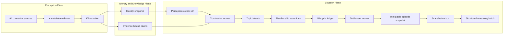
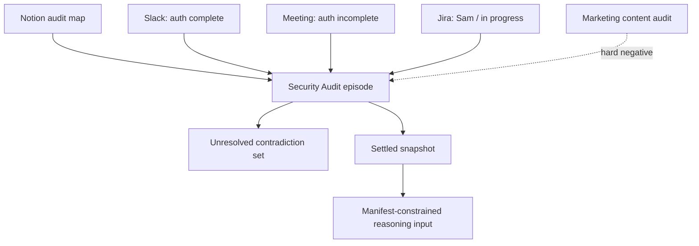

# Episode Creation Subsystem — Final Implementation Report

## Outcome

Fyralis now turns identity-grounded observations from every connector source
into explainable, cross-source episodes. Episodes preserve uncertain identity,
contradictory employee claims, exact evidence revisions, temporal history, and
access restrictions. Settled episodes are sealed as immutable,
content-addressed snapshots and handed to reasoning through a durable outbox.

The subsystem ends at the structured reasoning batch. It does not decide which
claim is true or mutate the Company World Model.

## Delivered phases

### Phase 1 — Topics, routing, and membership

- Durable automatic, query-seeded, and human-pinned topic intents.
- Durable episode identities and append-only topic versions.
- Source-agnostic signal assembly from observations, identity snapshots,
  claims, source structure, and lexical terms.
- Deterministic candidate retrieval and explainable include/hold/exclude
  decisions.
- Multi-membership, hard negatives, identity dependencies, exact evidence
  lineage, tenant/install isolation, and idempotent replay.

### Phase 2 — Lifecycle, trust, and snapshots

- Serialized append-only lifecycle events for open, dormant, settled, reopened,
  and superseded states, with split/merge event contracts.
- Event-time and ingestion-time watermarks and late-evidence reopening.
- Quiet-period, explicit-close, query-scope, and supersession settlement
  provenance.
- Contradiction materialization from evidence-bound claims without adjudication.
- Conservative evidence-policy intersection; unknown policy remains fail-closed.
- Immutable, content-addressed snapshots with normalized membership indexes.
- Query-created episodes with requester ACL checks and recorded topic
  equivalence before reusing an automatic topic.

### Phase 3 — Durable construction and handoff

- Lease/retry/dead-letter constructor worker with tenant-fair intake claiming.
- Settlement worker for due automatic episodes.
- Atomic settled-snapshot reasoning outbox with replay-safe deduplication.
- Structured reasoning reader over observations, claims, contradictions,
  membership explanations, temporal order, and exact citations.
- Read/replay services for snapshot history, citations, membership explanations,
  contradictions, and snapshot diffs.
- Identity correction compatibility through observation re-resolution and new
  snapshot-specific perception deliveries.

## Complete runtime architecture

## Routing semantics

The router evaluates stable identity anchors, claim predicates, source
thread/container structure, lexical overlap, and temporal proximity in that
order. A shared stable audit/workstream/project/goal/incident anchor can connect
Notion, Slack, Jira, meetings, and any other normalized source. Lexical overlap
alone cannot override conflicting stable anchors: “security audit” and
“marketing content audit” remain separate even if both say “the audit is
complete.”

Each decision records its score, feature snapshot, structured reasons, router
version, identity assertion IDs, claim IDs, observation ID, and exact evidence
revision. `hold` and `exclude` are retained instead of discarded.

## Alpen Audit Week scenario

The implemented end-to-end scenario ingests:

- a Notion audit map;
- a Slack assertion that authentication is complete;
- a Fireflies meeting claim that authentication is not complete;
- a Jira update attributed to an ambiguous employee named Sam; and
- an unrelated marketing audit with nearly identical language.

The first four observations share the stable `security-audit` workstream anchor
and enter one episode. The marketing audit has a conflicting stable workstream
anchor and becomes a separate episode with a hard-negative membership against
the security audit. Sam's identity snapshot remains partial, but the Jira
observation still participates in the episode.

The settled security-audit snapshot contains all four source revisions, both
opposing authentication claims, an unresolved contradiction, complete citation
lineage, and the composed tenant access policy. The reasoning reader exposes
this structure without flattening it into a summary.

## Query behavior

A CEO query creates a requester-scoped topic. It can reuse an automatic episode
only after the constructor records a typed equivalence with its matching
anchors/features. Evidence is filtered using the requester's exact source ACL
before membership and checked again at reasoning read time. The resulting query
snapshot is retained as the reproducible evidence batch behind the answer.

## Guarantees achieved

- Source-agnostic routing over all normalized observations.
- Cross-source episode membership through stable organizational anchors.
- Append-only, explainable positive, negative, and uncertain decisions.
- No mutation of prior lifecycle events or snapshots.
- Late evidence creates reopened state and a successor snapshot.
- Contradictions and ambiguous identities survive construction.
- Snapshot visibility never exceeds its evidence-policy intersection.
- Query snapshots contain only requester-readable evidence.
- Reasoning citations are constrained to snapshot evidence IDs.
- Intake, construction, settlement, and reasoning handoff are replay-idempotent.

## Verification

- 94 focused regressions passed on a newly created PostgreSQL database migrated
  through `0199`.
- Coverage included episode and identity contracts, cross-source routing,
  evidence ACLs, contradictions, lifecycle transitions, late arrivals,
  query-scoped construction, constructor and settlement workers, reasoning
  handoff, ingestion, and summarize-on-ingest.
- All episode source modules pass static type checking with third-party missing
  stubs ignored; bytecode compilation and whitespace validation pass.
- The target branch retains its known unrelated migration warnings in `0068`
  and `0190`; neither was introduced or broadened by this subsystem.

## Remaining boundaries and risks

- The deterministic router is deliberately inspectable. Thresholds require
  calibration against growing labeled corpora before they should be considered
  empirically optimal.
- Connectors with incomplete object ACLs remain `unknown` and non-shareable
  until provider-specific permission snapshots are captured.
- Rich model-based claim and coreference extraction can improve recall, but must
  remain versioned and evidence-bound behind the existing contracts.
- Split/merge persistence contracts exist through topic equivalence and
  lifecycle event kinds; operator adjudication UI is separate product work.
- Downstream reasoning quality, production canary rollout, and replacement of
  the direct T1 lane require an explicit later rollout decision and production
  measurements. They are not falsely reported as constructor implementation.
