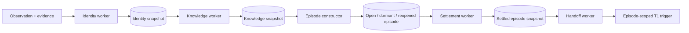

# Perception Runtime and Episode Cutover Implementation Report

## Outcome

The source-to-episode path is now a deployed runtime chain rather than a set of
domain services awaiting orchestration. Production reasoning authority is the
settled episode snapshot, with a reversible direct-ingress switch.

## Gaps closed

| Gap | Closure |
| --- | --- |
| Identity worker had no production process | Added a health-checked, monitored runtime role. |
| Identity routed directly to episodes | Added a durable knowledge-completion barrier. |
| No general automatic claim extraction | Added conservative deterministic structured/status extraction with exact evidence spans and producer versioning. |
| Episode routing read mutable current claims | Added immutable, content-addressed knowledge snapshots and v3 intake that fixes the claim set. |
| Late claims did not reroute | Claim insert/status triggers enqueue knowledge reprocessing; snapshot and outbox dedupe converge repeated work. |
| v2 uniqueness discarded corrected claim sets | Replaced identity-only delivery uniqueness with identity-plus-knowledge lineage. |
| Legacy v2 work could coexist during cutover | Backfilled knowledge work and retired only pending/leased legacy episode input. |
| Memberships lacked knowledge provenance | Router runs and membership assertions now store knowledge snapshot and claim-set hashes. |
| Dormant episodes ignored new evidence | Constructor now records `dormant -> open`; settled episodes record `settled -> reopened`. |
| Snapshot outbox had no consumer | Added access-validating, exactly-once episode reasoning handoff. |
| Direct T1 and episode T1 had split authority | Added global and tenant-level `direct`/`episode` ingress policy; production defaults to episode. |
| Runtime roles absent from deployment | Registered all five roles in the process manifest, Compose, health checks, environment template, and Prometheus. |
| Pipeline queues lacked operational visibility | Added per-role pending, leased, and dead-letter gauges plus worker-down/dead-letter alerts. |

## End-to-end Alpen Audit Week example

1. Notion, Slack, Jira, and meeting connectors persist independent immutable
   evidence revisions and normalized observations.
2. Identity work resolves known principals and retains ambiguous names as
   partial outcomes; the episode path continues because uncertainty is data.
3. Knowledge settlement retains source-supplied claims when present and
   conservatively extracts status claims otherwise. It freezes exact claim IDs,
   identity snapshot lineage, extractor version, and hashes.
4. The episode constructor routes all observations with the stable Security
   Audit anchor into one episode while a Marketing Audit observation receives a
   distinct episode. Every membership explains its score and inputs.
5. Opposing Slack and meeting claims remain an unresolved contradiction in the
   episode; they are not silently reconciled.
6. After the quiet period, settlement seals a citation-complete snapshot and
   emits a durable handoff item.
7. The handoff worker validates the snapshot and requester access, then creates
   one T1 reasoning trigger containing all snapshot observation, evidence,
   claim, and contradiction IDs.
8. If a later audit claim is inserted or superseded, it creates a new knowledge
   snapshot and routing assertion, reopens the settled episode, and eventually
   produces a successor snapshot without mutating history.

## Verification coverage

- Fresh PostgreSQL migration replay through migration `0200`.
- Identity -> knowledge -> episode integration and re-resolution.
- Cross-source routing and contradictory-claim preservation.
- Immutable knowledge and episode lineage behavior.
- Late-claim reprocessing plus dormant reactivation and settled reopening.
- Exactly-once snapshot-to-Think handoff under episode authority.
- Runtime manifest, Compose registration, health-check, and Prometheus target
  consistency.

## Deliberately unresolved research, not runtime wiring

- The deterministic claim extractor is a conservative baseline, not a complete
  semantic extraction system. A model extractor needs calibrated evaluation,
  source-aware policies, and explicit producer-version rollout.
- Entity canonical-admission metadata still requires policy enforcement before
  broad automatic canonical object creation is safe.
- Reasoning quality over episode batches must be evaluated downstream; this
  cutover guarantees coherent, provenance-complete input, not answer quality.
