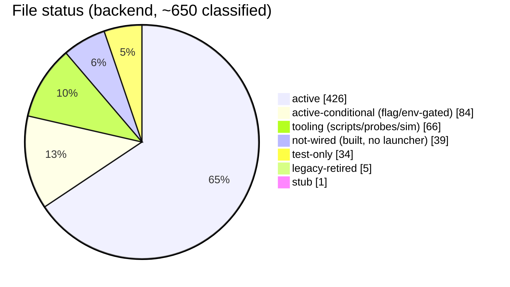

# Codebase Status

A point-in-time, file-by-file health audit of the **backend runtime** —
`services/`, `lib/`, `scripts/`, `db/migrations/`, and the compose files. It
answers, for every file: *what does it do, where does it enter the implementation
flow, and if it doesn't — why?* Plus a per-feature **expected-vs-actual** status.

!!! info "Scope, method & freshness"
    - **Branch / date:** `cannonical` working tree, audited **2026-06-01**.
    - **Method:** an automated file-by-file sweep (every backend `.py`, every
      migration, every compose service) followed by an **adversarial verify** pass
      that re-greps the whole repo before any "unused/unwired" claim is allowed to
      stand (it overturned ~28 first-pass claims). ~650 files classified.
    - **"not-wired" means** *no runtime launcher/caller was found* — **not** that the
      code is broken. Much of it is deliberately staged behind flags or "future PR"
      seams. Treat this as a map of seams to finish, not a defect list.
    - This is a snapshot. To refresh it, re-run the audit workflow (see
      [How to refresh](#how-to-refresh)).

## Health snapshot

| Status | Count | Meaning |
|--------|------:|---------|
| `active` | 426 | Reached from a live entrypoint. |
| `active-conditional` | 84 | In the flow, but behind a flag/env (e.g. `KAFKA_PATH_ENABLED`, demo-only, dev/test panels). |
| `tooling` | 66 | Scripts, probes, benchmarks, the synthetic/sim harness (expected). |
| `not-wired` | 39 | **Implemented but no runtime launcher/caller** — the core of this report. |
| `test-only` | 34 | Referenced only by tests. |
| `legacy-retired` | 2 | Superseded, compat-only (post-verify; raw count 5). |
| `stub` | 1 | Empty placeholder (`ingestion/idempotency/__init__.py`). |

The headline: **the core request→ingest→Think→render→stream path is fully wired
and active.** The gaps are concentrated in the *background maintenance fabric* and
in *enforcement/observability seams* that were built ahead of being hooked up.

## Top themes

1. **The Wave-4 background worker fabric is built but undeployed.** Of 8
   `services/workers/*` packages, **only `topology_sweeper` has a launcher**. The
   rest — `anomaly_processor`, `entity_resolver`, `deadline_resolver`, `edge_drift`,
   `precipitation`, `calibration_updater`, `maintenance` — have no compose service
   or `scripts/run_*`. This cascades into many dormant features (decay/archival,
   `T3` anomalies, `T2` deadline resolution, deferred entity resolution, calibration
   refresh, precipitation inputs) and orphaned tables. See
   [Wiring gaps](wiring-gaps.md) and [Workers](../architecture/workers.md).
2. **Access-control enforcement is mostly dormant.** The `@requires_access`
   decorator is applied on **zero** routes (the gateway does one inline
   `can_read_by_id` on `/dashboard/customer`); the `actor_visible_*` matview refresh
   and the `access_override_log` audit writer are only reachable through that
   unwired decorator + the undeployed maintenance worker. Most entity routes have no
   `can_read` enforcement. See [Platform](../architecture/platform.md).
3. **Execution routing isn't even shadow-wired.** `decide_route` +
   `record_routing_decision` exist and are tested, but ingestion never constructs a
   `SignalEnvelope` from an observation, so **no `signal_routing_decisions` rows are
   ever written** — not even in shadow mode.
4. **Post-commit side-effects are no-ops.** The durable `pending_post_commit_actions`
   queue is enqueued and drained by the deployed `post_commit_worker`, but all four
   dispatchers (anomaly publish, prediction scheduling, realtime broadcast, metric
   invalidation) are `_default_*` no-op loggers ("left for a later integration PR").
5. **The Kafka full-pipeline is now the default; inline ingest is the fallback.**
   _(Updated 2026-06-02 — see [ADR-0001](../adr/0001-kafka-first-ingestion-default.md).)_
   `observation_writer` persists from the normalized lane for every tenant without
   an explicit `kafka_path_enabled=FALSE` kill-switch; ingress returns `202` and
   falls back to inline only when the publish fails. The auto-cutover circuit
   breaker — flagged in the original audit as built-but-undeployed and watching a
   now-dead default topic — is now wired as the `circuit_breaker` compose singleton
   and made source-aware: it measures every `ingestion.raw.<source>` lane and trips
   a tenant on its worst lane. See
   [Cutover circuit breaker](../architecture/ingest.md#cutover-circuit-breaker).
6. **Several "v2/spec" surfaces are fixture- or mock-backed.** `spec_routes.py`
   serves in-code seed payloads (not substrate); the Query/Ask layer defaults to a
   `MockRenderingAdapter` + in-process cache unless `QUERY_RENDERING_BASE_URL` /
   `QUERY_CACHE_BACKEND=pg` are set; the CEO Map reads compat-only topology tables.
7. **`code_intel` is read-only in prod.** Blast-radius/code-search read paths are
   live via `github_intel`, but the index/embed/reindex write path has no production
   caller (reindex is gated on `CODE_INTEL_REINDEX_ROOT`, absent from the worker's
   compose env), so the code graph is never populated in a normal deploy.
8. **Per-source install gaps.** Mercury/QuickBooks install only via the dev
   `finance_router` panel; **Google Calendar, Google Drive, and Jira have no gateway
   install router at all** (sandbox-script-only). Gmail mounts its Pub/Sub ingress
   only if `GMAIL_SERVICE_ACCOUNT_JSON` is set (silent skip otherwise).

!!! success "Duplicate migration prefixes resolved"
    Resolved 2026-06-03. Historical `0014_*` / `0043_*` collisions were
    renumbered, and the post-merge Sage migrations moved to `0084_*`-`0092_*`.
    The shell migration runner, Python migration helper, and CI now reject any
    future duplicate numeric prefix.

## The detail pages

- **[Codebase category map](codebase-category-map.md)** — current folder/file
  purpose map, runtime links, and cleanup order generated on 2026-06-03.
- **[Feature status](feature-status.md)** — expected-vs-actual for every feature
  with a gap, by theme and severity (21 high, 46 medium, 64 low).
- **[Wiring gaps](wiring-gaps.md)** — the 39 not-wired files + the stub, grouped by
  subsystem, each with *why it isn't in the flow* (verified).
- **[Legacy & test-only](dead-legacy.md)** — retired/compat-only code, orphaned
  tables, "safe-to-remove" candidates, and the test-only inventory. (No file was
  found to be truly dead — see that page for why.)

## How to refresh

This report is generated, not hand-maintained. Re-run the audit workflow at
`/.claude/.../codebase-audit.js` (a 23-partition audit → adversarial-verify
pipeline) and re-synthesize these pages. Re-run after large re-layerings, when a
worker/route is wired up, or each release. Update the **date** above when you do.

> **TODO(human):** For each theme above, confirm whether it's *intended staging*
> (finish later) or *drift to fix now*, and record the decision — ideally as an
> [ADR](../adr/README.md). The audit can say *what* is unwired; only the team knows
> which gaps are deliberate.
