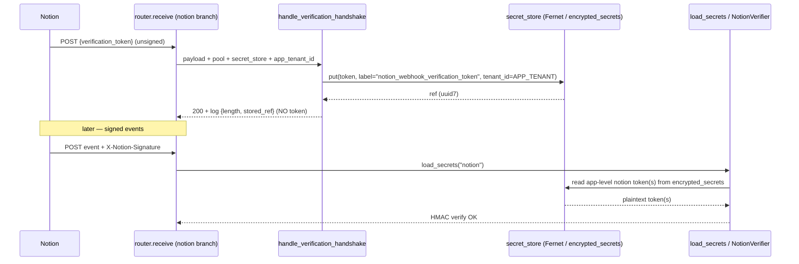

# Design: move the Notion webhook verification token off the plaintext WARNING log into the secret store

**Finding #29** — `services/ingest/integrations/notion/webhook.py::handle_verification_handshake`
logs the Notion `verification_token` in plaintext at `WARNING`. That log is
the *documented operator-retrieval mechanism*: the operator copies the value
into the `NOTION_WEBHOOK_VERIFICATION_TOKEN` env var and redeploys the
gateway, after which the signed-event verifier loads it back from the env var.

Naively deleting the log **breaks onboarding** — there is no other way the
operator obtains the token (Notion delivers it exactly once via this POST body).

**Status:** DESIGN ONLY. No code is changed by this document. This is a
writeup of the proposed change, its wiring, a safe rollout, risks, and a test
plan. All claims about external behavior are scoped to OUR codebase; nothing
here assumes a Notion API schema beyond what the existing handshake already
parses (a body field `verification_token`).

> **TODO(human):** confirm the product/ops decision on the app-level secret
> owner tenant (the `DEFAULT_TENANT_ID` approach in §3) vs. relaxing
> `encrypted_secrets.tenant_id` to nullable. This design recommends the former
> (no DDL, no FK/RLS rework) but the choice is an operator/security call.

---

## 1. Current flow (token delivery → log → env var → verifier)

The token makes a one-way trip from Notion's unsigned handshake POST into a
WARNING log, then a human copies it into an env var, and the signed-event
verifier reads it from that env var on the next request.

| Step | Where | File:line |
| --- | --- | --- |
| 1. Router intercepts the unsigned handshake **before** tenant resolution and signature verification | `receive()` notion branch | `services/app/webhooks/router.py:794-797` |
| 2. Handshake detection (non-empty `verification_token`, no event fields) | `is_verification_handshake` | `services/ingest/integrations/notion/webhook.py:72-83` |
| 3. **Token logged in plaintext at WARNING** + 200 ack | `handle_verification_handshake` | `services/ingest/integrations/notion/webhook.py:86-106` (the `verification_token=token` kwarg at `:104`) |
| 4. Operator copies the logged value into the env var `NOTION_WEBHOOK_VERIFICATION_TOKEN` and redeploys | (manual / runbook) | documented at `webhook.py:91-95` and `secrets.py:318-323` |
| 5. Signed events: secrets loaded App-level from the env var | `_load_notion_app_secrets` (called by `load_secrets` for `provider == "notion"`) | `services/app/webhooks/secrets.py:260-261`, `:307-344` (reads `NOTION_WEBHOOK_VERIFICATION_TOKEN` / `..._PREV` at `:325-328`) |
| 6. Verifier HMACs the body with each active token | `NotionVerifier.verify` | `services/app/webhooks/signatures/notion.py:42-82` |

Key facts that constrain the redesign:

- **App-level, not per-tenant.** Notion has one subscription per integration;
  every workspace's events arrive on the one endpoint signed with the one
  `verification_token` (`secrets.py:307-323`, `signatures/notion.py:8-14`).
  This is the same shape as the GitHub App webhook secret. The per-workspace
  `provider_installations.secret_ref` column is a *different* secret (the bot
  token) and must not be reused here (`secrets.py:314-317`).
- **The handshake is pre-tenant.** It is intercepted at `router.py:794-797`
  *before* `tenant_resolver.resolve(...)` runs (`router.py:819`), and the
  handshake body names no workspace/tenant (`webhook.py:73-79`). So at the
  moment we hold the token, **no tenant_id is known**.
- **The handshake handler is sync and dependency-free.** It takes only
  `payload` and returns a `JSONResponse` (`webhook.py:86-88`); it has no
  `request`, no pool, no secret_store. The event handler, by contrast,
  reaches the data plane via `request.app.state.notion_data_plane`
  (`webhook.py:241`).

---

## 2. Proposed flow (handshake writes to the secret store; verifier reads from it)

Replace the plaintext log with a **durable, envelope-encrypted write** into the
same secret store used everywhere else (`encrypted_secrets`, Fernet,
`lib.shared.secrets`), and have the signed-event verifier resolve the token
from that store instead of (eventually, instead of *only*) the env var. The
log line is downgraded to a **non-sensitive confirmation** (token length +
the stored-at ref/marker) so operators still get an observable signal that the
handshake succeeded, but the secret never hits the logs.



### 2.1 Where the App-level token lives in a tenant-scoped store

The blocker: `encrypted_secrets.tenant_id` is `NOT NULL` with an FK to
`tenants(id)` and `FORCE ROW LEVEL SECURITY` (`db/migrations/0051_slack_installation_tokens.sql:37-66`),
and the store API requires a non-null `tenant_id` on both `put` and `get`
(`lib/shared/secrets/store.py:88-98`, `:129-134`). But the Notion token is
App-level and the handshake has no tenant.

**Recommended approach (no DDL):** store the App-level token under a fixed
**"app-level owner" tenant** — the gateway's existing `DEFAULT_TENANT_ID`
(`services/app/gateway/settings.py:71`, `:131`). This is a real `tenants` row
(so the FK and RLS are satisfied), and both the handshake write and the
verifier read use the same fixed UUID, so the App-level semantics are
preserved without a nullable-tenant migration. A dedicated, deterministic
"system" tenant UUID (e.g. one of the reserved `00000000-0000-7d23-...`
demo-infra UUIDs already seeded in `db/migrations/0023_demo_infrastructure.sql`)
is an alternative if ops prefers not to overload `DEFAULT_TENANT_ID`.

This is consistent with how GitHub's App-level secret is handled today (a
single deployment-wide value, not per-tenant); we are simply moving the
storage medium from an env var to the encrypted store while keeping the
"one value for the whole deployment" property.

**Rejected alternative — make `encrypted_secrets.tenant_id` nullable:** that
requires a migration to drop `NOT NULL`, rework the FK, and rewrite the RLS
policy + the store's mandatory-`tenant_id` contract — a cross-cutting change
to a shared security table for one App-level secret. Out of proportion and
explicitly out of scope (we must not touch the core write path / shared
security plumbing more than necessary).

### 2.2 Secret label

Use a stable, App-level label, e.g. `notion_webhook_verification_token`
(optionally suffixed with a generation marker for rotation, see §4). The
verifier read selects rows by `(tenant_id=APP_TENANT, label LIKE
'notion_webhook_verification_token%')` newest-first, mirroring the
multi-secret rotation-overlap pattern already in `_load_from_db`
(`secrets.py:178-224`) and the env `..._PREV` overlap in
`_load_notion_app_secrets` (`secrets.py:325-344`).

> Note: the existing `encrypted_secrets` store keys reads by `ref` (the
> uuid7), not by label (`store.py:129-149`). To resolve the App-level token
> *without already knowing the ref*, the new read path queries
> `encrypted_secrets` by `(tenant_id, label)` directly (a small new helper in
> `secrets.py`, analogous to `_load_from_db`'s direct SQL), rather than going
> through `secret_store.get(ref)`. The write still goes through
> `secret_store.put(...)`, which returns the ref and does the Fernet
> encryption.

### 2.3 The replacement log line

`handle_verification_handshake` keeps emitting an INFO/WARNING event so the
handshake remains observable, but with **no secret material**:

```text
notion_webhook_verification_token_stored
    token_length=<int>          # length only — not the value
    secret_ref=<uuid7>          # stored-at marker (opaque; safe to log)
    label=notion_webhook_verification_token
    action="Stored in the encrypted secret store; no manual env-var copy needed."
```

`token_length` + `secret_ref` give operators a confirmation and a correlation
handle without exposing the token.

---

## 3. Exact files to change + wiring

> All of these are additive/local. The shared core write path
> (`services/ingest/ingestion/core.py`) is **not** touched.

### 3.1 `services/ingest/integrations/notion/webhook.py` — handshake handler

- Change `handle_verification_handshake` from sync/dependency-free to **async**
  and give it the dependencies it needs. Two viable signatures:

  - **(preferred)** `async def handle_verification_handshake(*, request: Request, payload) -> JSONResponse`
    and pull `pool` + `secret_store` off `request.app.state` (the same place
    the event handler already reaches `notion_data_plane` at `webhook.py:241`,
    and the same attributes the router resolves in `_webhook_runtime` at
    `router.py:97-117`). The App-tenant UUID comes from
    `request.app.state` settings / `DEFAULT_TENANT_ID`.
  - (alt) pass `pool`, `secret_store`, `app_tenant_id` explicitly from the
    router. More wiring at the call site, fewer hidden lookups.

- Inside: `ref = await secret_store.put(token, label="notion_webhook_verification_token", tenant_id=APP_TENANT)`,
  then emit the non-sensitive log (§2.3) and 200. On a store failure
  (`SecretStoreError`), log a **non-sensitive** error and still 200 (so Notion
  doesn't retry-storm) **but** fall back to the legacy behavior only as long
  as the env-var path is still the live retrieval mechanism — see the rollout
  in §4. Once env retrieval is removed, a store-write failure must surface
  loudly (it means onboarding silently failed); the handshake should then log
  an error directing the operator to retry, never re-logging the token.

### 3.2 `services/app/webhooks/router.py` — handshake interception point

- The interception block at `router.py:794-797` currently calls the sync
  handler. Make it `await` the now-async handler and pass `request` (so the
  handler can reach `app.state.pool` / `app.state.secret_store`). The router
  already computes `runtime = _webhook_runtime(request)` lower down
  (`router.py:799`); the handshake branch can either build the runtime first
  or hand `request` through and let the handler resolve deps. **Minimal
  change:** pass `request` to the handler.

- No other router logic changes — the handshake still short-circuits before
  tenant resolution (`router.py:819`) and signature verification
  (`router.py:834-840`); we are only changing what the handshake *does* with
  the token.

### 3.3 `services/app/webhooks/secrets.py` — verifier read path

- Extend `_load_notion_app_secrets` (or add `_load_notion_app_secrets_from_store`
  called from the `provider == "notion"` branch at `secrets.py:260-261`) to:
  1. Read App-level token rows from the store
     (`(tenant_id=APP_TENANT, label LIKE 'notion_webhook_verification_token%')`,
     newest-first, decrypt each), returning them as `Secret(provider="notion",
     value=..., tenant_id=None, label="app:store:<ref>")`.
  2. **Dual-read during rollout (§4):** if the store yields nothing, fall back
     to the existing env-var read (`NOTION_WEBHOOK_VERIFICATION_TOKEN` /
     `..._PREV`, `secrets.py:325-344`). After rollout completes the env read
     can be dropped (or kept as a permanent dev-only fallback gated like
     `WEBHOOK_SECRETS_ENV_FALLBACK_ALLOW`, mirroring `_load_from_db`'s posture).
- This needs `pool` + `secret_store` + the App-tenant UUID. `load_secrets`
  already receives `app_state` (`secrets.py:231-235`, `:263`) and has the
  `_app_state_attr` helper to pull `pool` / `secret_store`
  (`secrets.py:152-158`). The notion branch currently ignores `app_state`
  because the env path needs nothing; the store path will use it.

### 3.4 Config — App-tenant UUID

- Reuse `GatewaySettings.default_tenant_id` / `DEFAULT_TENANT_ID`
  (`settings.py:71`, `:131`) as the App-level secret owner, **or** add a
  dedicated `NOTION_APP_TENANT_ID` setting if ops wants to decouple it. Either
  way it is config, surfaced on `app.state` for both the handshake write and
  the verifier read. No new env var is strictly required if `DEFAULT_TENANT_ID`
  is reused.

### 3.5 Migration / new secret label — **none required**

- **No migration.** `encrypted_secrets` already exists
  (`db/migrations/0051_slack_installation_tokens.sql:37-66`) and the `put`/read
  shape fits an App-level token stored under the fixed App-tenant. The current
  highest migration is `0122` (`db/migrations/0122_deel_contracts_metadata.sql`),
  so the *only* reason to add `0123` would be to seed a dedicated system-tenant
  row — and that is avoidable by reusing `DEFAULT_TENANT_ID` (an existing
  tenant) or an already-seeded reserved UUID.
- **New secret label**, yes — `notion_webhook_verification_token` — but a label
  is just a `TEXT` column value (`encrypted_secrets.label`,
  `0051:42`), not DDL.

---

## 4. Safe rollout sequence (onboarding never breaks)

The invariant: **the plaintext log must not be removed until a working
non-log retrieval mechanism is live in production.** Sequence the change so at
every step the operator can still onboard.

1. **Ship the verifier dual-read first (read store, then env).** Deploy
   `secrets.py` change from §3.3 so the verifier prefers the store but falls
   back to the env var. No behavior change for existing deployments (store has
   no notion rows yet → env var still used). Onboarding unaffected.

2. **Ship the handshake store-write + non-sensitive confirmation log, but
   KEEP the plaintext token log for one release** (dual-emit). At this point a
   new handshake both (a) writes the token to the store and (b) still logs it
   plaintext. New onboarding works via the store; the old log is a safety net.
   *(If you want to skip dual-emit, step 2 must come strictly after step 1 is
   confirmed live, and the plaintext log stays until step 4.)*

3. **Deploy + backfill existing deployments.** For any deployment already
   running on the env var, either (a) re-trigger the Notion verification POST
   (Notion can re-send the handshake on subscription re-verify) so the token
   lands in the store, or (b) run a one-shot admin/ops step that takes the
   current `NOTION_WEBHOOK_VERIFICATION_TOKEN` value and calls
   `secret_store.put(...)` under the App-tenant. After this the store is the
   source of truth and the env var is redundant.

4. **Remove the plaintext token log.** Only now delete the
   `verification_token=token` kwarg from `handle_verification_handshake`
   (`webhook.py:104`), leaving the non-sensitive confirmation. This is the step
   that closes finding #29.

5. **(Optional, later) retire the env-var read.** Drop the env fallback in
   `_load_notion_app_secrets`, or gate it dev-only behind a flag analogous to
   `WEBHOOK_SECRETS_ENV_FALLBACK_ALLOW` (`secrets.py:92-93`).

> Rollback at any step is safe: steps 1–2 are purely additive (store write +
> dual-read), so reverting them falls back to the env var; the log is still
> present until step 4.

---

## 5. Risks + test plan

### Risks

1. **App-tenant FK/RLS.** The chosen App-tenant UUID **must** exist in
   `tenants` (FK at `0051:39-41`) or `put` raises a `db_error`
   (`store.py:118-122`). `DEFAULT_TENANT_ID` is a real tenant; a fabricated
   UUID is not. Mitigation: validate the App-tenant resolves to a real row at
   gateway startup, or reuse `DEFAULT_TENANT_ID`.
2. **MASTER_KEK instability in dev.** `build_secret_store` generates a
   *one-shot in-memory* Fernet key when `MASTER_KEK` is unset in dev
   (`lib/shared/secrets/__init__.py:107-127`). A token written to the store in
   one process won't decrypt after restart. This is fine for prod (KEK is set,
   fail-fast) but means **dev onboarding via the store requires a stable
   `MASTER_KEK`** — call this out in the runbook. The env-var fallback (kept
   per §4) covers dev.
3. **Handshake now does DB I/O.** The handshake becomes async and writes to
   Postgres; a slow/unavailable DB could delay the 200 to Notion. Mitigation:
   the handler already 200s on the happy path regardless; wrap the `put` so a
   store failure logs (non-sensitively) and still 200s during the dual-emit
   window, and only hard-fails after the log is removed (§3.1).
4. **Duplicate store rows on re-verify.** Notion can re-send the handshake;
   each call `put`s a new row (uuid7). The newest-first read tolerates this
   (it just picks the latest), but rows accumulate. Mitigation: acceptable
   (matches the rotation-overlap model); optionally prune older
   `notion_webhook_verification_token` rows on write.
5. **Token never logged again** — operators relying on grepping logs for the
   token (the *old* runbook) must switch to the store. The non-sensitive
   confirmation log + an ops doc update covers this.

### Test plan

Focused, fixture-free (internal wiring only — no Notion API mocks needed for
the handshake path):

- **Unit — handshake write (`services/ingest/integrations/notion/tests/test_webhook.py`):**
  extend the existing `test_handle_verification_handshake_*` cases
  (`test_webhook.py:38-43`). With a fake `secret_store` (records `put` calls)
  and a fake `pool`, assert: (a) `put` is called with the token, label
  `notion_webhook_verification_token`, and the App-tenant; (b) the response is
  still `200 {"handled": "verification"}`; (c) the structured log carries
  `token_length` + `secret_ref` and **never** the token value (capture logs,
  assert the raw token string is absent). Add a store-failure case asserting
  still-200 + non-sensitive error log.
- **Unit — verifier read (`services/app/webhooks/tests/`):** with a fake
  secret_store returning a stored App-level token, assert `load_secrets("notion",
  app_state=...)` returns the stored token; assert dual-read fallback to env
  when the store is empty; assert newest-first ordering with two rows.
- **Router integration (`services/app/webhooks/tests/test_router.py`):**
  mirror `test_slack_url_verification_handshake` (`test_router.py:194`): POST
  the notion handshake body through `receive`, assert 200 + that the token was
  written to the (fake) store and not present in captured logs. A follow-up
  signed event then verifies using the stored token end-to-end.
- **Negative / log-scrub assertion:** a test that captures structlog output
  for the handshake and asserts the token literal does not appear in any
  emitted event — this is the regression guard for finding #29.

### Validation already run for this design doc

- `python -m mkdocs --version` to confirm the docs toolchain is present (doc
  is Markdown under `docs/validation/`, not part of the strict `nav`).
- No code changed, so no ruff/pytest run is applicable to this PR beyond a
  docs build. The test plan above is what the *implementation* PR must run.
