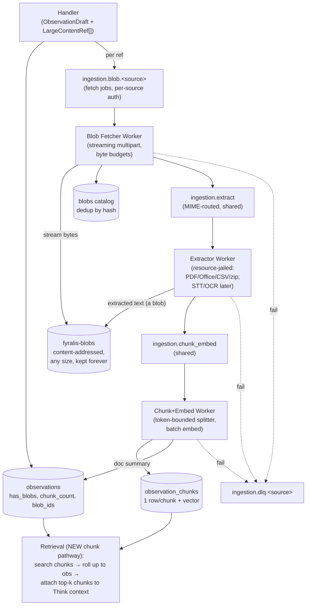

# Handling Large Payloads in Ingestion — Full Design & Rationale

> **Status:** Design narrative for review (no code written yet).
> **Date:** 2026-06-14
> **Decision record:** `docs/adr/0005-large-object-pipeline.md` (Proposed).
> **Implementation plan:** `specs/large-object-pipeline/plan.md`.
> **Audience:** anyone who needs to understand *why* large-payload handling is
> built the way it is — engineers and AI agents alike.

This document is self-contained. It explains how large content flows through the
system **today**, why the current design cannot ingest it without dropping or
truncating it, which sources produce it, and the **Large Object Pipeline (LOP)**
we propose to fix it — with every load-bearing decision and its consequences
spelled out.

---

## Table of contents

1. [The motivating question](#1-the-motivating-question)
2. [How ingestion works today](#2-how-ingestion-works-today)
3. [The read path today (it matters for the design)](#3-the-read-path-today)
4. [Source audit: where the huge payloads come from](#4-source-audit)
5. [Why the current design can't absorb large payloads](#5-why-the-current-design-cant-absorb-large-payloads)
6. [The proposed architecture: Large Object Pipeline](#6-the-proposed-architecture-large-object-pipeline)
7. [The eight decisions, in detail, with consequences](#7-the-eight-decisions-in-detail)
8. [Locked product decisions](#8-locked-product-decisions)
9. [Phased rollout](#9-phased-rollout)
10. [Cross-cutting concerns](#10-cross-cutting-concerns)
11. [Open items needing a human decision](#11-open-items-needing-a-human-decision)
12. [File/reference map](#12-filereference-map)

---

## 1. The motivating question

> *"How are large files handled in sources like Google Drive — how are they
> ingested, embedded, and all?"*

Short answer for Drive today: **the system never ingests a large file's full
content.** It extracts a bounded text excerpt — or skips the file entirely — and
embeds that excerpt as a single vector. There is **no chunking anywhere**.

Concretely, the Google Drive path (`services/ingest/ingestion/fetchers/google_drive.py`,
`services/ingest/integrations/google_drive/client.py`):

- Files **> 10 MB** (`GOOGLE_DRIVE_MAX_EXTRACT_FILE_BYTES`) are **never
  downloaded** — you get metadata only.
- Extractable files (Google-native docs, PDFs, `text/*`) are downloaded, text is
  extracted, then **hard-truncated to the first 64 KB**
  (`GOOGLE_DRIVE_EXTRACT_MAX_BYTES = 65536`): `raw[:max_bytes].decode(...)`.
- PDFs stop after **50 pages** (`GOOGLE_DRIVE_PDF_MAX_PAGES`).
- Images, video, archives, Office binaries → **metadata only**, never extracted.

That excerpt becomes `observations.content_text`, which is embedded into **one**
768-dim vector. So for a 200-page contract or a 50 MB spreadsheet, the system
captures metadata plus at most the opening ~64 KB, represented as a single
vector. The back half of every long document is invisible to search.

The requirement that drives this whole effort: **no shortcuts, no exclusions** —
large content must be ingested in full and made fully searchable, not skipped,
truncated, or capped on *coverage*.

---

## 2. How ingestion works today

The pipeline is built on one assumption:

> **one event = one small JSON payload = one `content_text` = one embedding
> vector.**

That assumption is enforced at three places:

1. **Gateway / validation.** `MAX_PAYLOAD_BYTES = 1 MB`
   (`services/ingest/ingestion/payload_validation.py`) rejects anything larger
   with HTTP 413, and also rejects non-dict payloads and NUL bytes.
2. **Per-source truncation.** The canonical handler pattern is
   `_truncate(text, 600)` on `content_text`; Gmail caps the body at 4000 chars;
   Drive applies the 10 MB / 64 KB / 50-page caps above.
3. **Single-vector storage.** `observations.embedding VECTOR(768)` holds exactly
   one vector per observation. There is no per-chunk representation.

### The 7-step ingest (`services/ingest/ingestion/core.py`)

1. Handler extracts an `ObservationDraft`.
2. Pre-assign a `uuid7`.
3. `ActorRepo` resolves the source actor ref.
4. `EntityAliasRepo` fast-path entity lookup over 1–3-gram phrases.
5. **Ollama embedding** of `content_text` (768-d; failure → `embedding_pending=True`).
6. `ObservationRepository.insert` in a transaction — dedup on
   `(tenant_id, source_channel, external_id, occurred_at)`.
7. Enqueue a `T1`/`event_arrival` row into `think_trigger_queue` unless deduped.

There are **two convergent routes** into this: a synchronous **inline** path
(gateway → `ingest()`), and the **Kafka full pipeline**
(`source → ingestion.raw.{source}` → normalizer → `ingestion.normalized.{source}`
→ observation_writer). Both converge on `ingest_from_draft`, kafka-first by
default (ADR-0001).

### What already exists in our favour

This is an *extension*, not a greenfield build. The data plane already provides:

| Asset | Where | What it gives us |
|---|---|---|
| **S3 raw tier** | `services/ingest/ingestion/raw_tier/s3.py`, bucket `fyralis-raw` | Content-addressed (`blake2b`) keys, zstd, idempotent `put_if_absent`. Key scheme `{env}/{source}/{tenant}/{yyyy-mm}/{hash[:2]}/{hash}.json.zst`. |
| **Per-source Kafka lanes** | `services/ingest/ingestion/kafka/topics.py` | `DATA_PLANE_STAGES = (raw, normalized, embedding, dlq)` × source; idempotent producer; per-source DLQ. |
| **Async embedding worker** | `services/ingest/ingestion/writers/embedding_worker/` | `embedding_pending` flag, retry, DLQ — an async embed lane to copy. |
| **Partitioned observations** | `db/migrations/0001_foundation.sql` | Monthly partitions; `content JSONB`, `content_text TEXT`, `embedding VECTOR(768)`, HNSW index, RLS, dedup unique key. |
| **Object storage in compose** | `docker-compose.yml` (MinIO + `minio-init`) | A working S3-compatible store and bucket-init pattern. |
| **Redis token-bucket limiter** | `lib/` | Reusable backpressure primitive. |

### What gets stored vs. dropped

The **raw tier stores the webhook *notification* body, not file bytes.** When a
webhook says "Drive file X changed," `shadow_write_raw` persists that *envelope*
JSON to `fyralis-raw`. The actual file bytes are **never persisted anywhere** —
only the bounded extracted text lands in `observations.content_text`. There is no
`raw_payload` column in `observations`; the structured `content` (JSONB) and
`content_text` (TEXT) are all that's kept in Postgres.

---

## 3. The read path today

**This section is critical to the design and is the part most people get wrong.**

The reasoning layer's primary semantic search runs against **`models`, not
`observations`** (`services/reasoning/retrieval/pathways.py:1593`):

```sql
SELECT ... FROM models
WHERE tenant_id = $1 AND status = 'active' AND embedding IS NOT NULL
ORDER BY embedding <=> $2::vector
LIMIT $3
```

- The query vector is the embedding of the trigger's `seed_natural_text`
  (`pathways.py:1481-1506`), or a precomputed/prior-model vector for T2.
- Results flow through `services/reasoning/think/context_planner.py`
  (`plan_context` → `assemble_context`) into a `ContextBundle` with budgets of
  roughly **24 models** and **12 observations** (`retrieval/assembler.py`).

**Observations are retrieved temporally** — by `occurred_at` window ("Pathway C")
— and are **never cosine-searched today**, even though they carry an embedding
and an HNSW index (`obs_embedding_idx`). Models are the reasoning layer's
*distilled beliefs*, produced by Think from observations; the main memory loop
searches those beliefs, not the raw observations.

**Consequence for this design:** "make chunks searchable" is **not** extending an
existing observation search — there is no observation semantic search to extend.
Chunk retrieval is a *new* surface (see decision 8). The chunk store primarily
serves **trigger-time context assembly** (giving Think the relevant pages of a
large document when it reasons) and, secondarily, a **new content-search
pathway**. It does not automatically upgrade the models-based memory loop.

There is **no chunk/sub-document granularity anywhere today** — strictly one row,
one vector, for both `models` and `observations`.

---

## 4. Source audit

All 25 ingestion sources were audited. They split into two physically different
"large payload" problems that need different machinery.

> **Note on sizes:** the ceilings below are **inferences** from each provider's
> documented limits plus a code audit of each fetcher/handler — not measured
> production figures.

### Class A — large binary / file content the system never even downloads

| Source | What's big | Realistic ceiling | Today |
|---|---|---|---|
| **Google Drive** | File bodies (docs, PDFs, video, zips) | **GBs** | Skips > 10 MB; extracts ≤ 64 KB; binaries dropped |
| **Gmail** | Attachments | 25 MB/msg × N | **Attachments never downloaded**; body capped 4000 chars |
| **Slack** | File uploads (`url_private`) | up to 1 GB/file | **Only counts attachments**, never fetches bytes |
| **Discord** | Attachments | up to ~500 MB/file | Only `attachment_count` |
| **Fireflies** | Transcripts (+ recordings) | transcript unbounded; media 100s of MB | Transcript truncated to 600 chars; recording never fetched |
| **Notion** | Block trees + file blocks | unbounded | Depth-capped at 3; file blocks dropped |
| **Telegram / Signal** | Media (photo/video/doc) | up to 2 GB (TG) | Media not extracted at all |
| **Figma / Miro** | Board/file exports (PNG/SVG/PDF) | 10s of MB | Exports never fetched |
| **Google Calendar** | Event attachments | small–medium | Attachments dropped |

### Class B — a single structured JSON record that blows the 1 MB inline cap

| Source | What's big | 1 MB risk | Today |
|---|---|---|---|
| **Carta** | Cap table: 1000+ grants × vesting schedules | **HIGH (1.5–3 MB)** | No cap on entity dicts → rejected at gateway |
| **QuickBooks** | Invoices with 100+ line items | **MOD–HIGH** | No line-item cap |
| **Jira** | `expand=changelog` inlines 100s of transitions | **MODERATE** | Description capped 600; changelog uncapped |
| **HiBob** | Bulk employee + payroll runs | **MOD–HIGH** | Full profile dicts |
| **AWS** | CloudTrail `responseElements`/`requestParameters` | MOD | Full event JSON uncapped |
| **Gusto / Deel** | Payroll runs, large company | MODERATE | Earnings arrays uncapped |
| **GitHub** | Large diffs/patches, huge PR bodies | LOW–MOD | Body uncapped; diff handled by separate intel layer |

**Takeaway:** Class A needs a **blob + extraction + chunk-embed pipeline**.
Class B needs **fan-out into child observations** plus an **oversized-JSON
overflow path**. Both converge on the *same* chunk-and-embed backend.

---

## 5. Why the current design can't absorb large payloads

1. **Handlers download + extract inline, synchronously**, in the request path —
   you cannot stream a 2 GB file there without blowing latency and memory.
2. **The 1 MB gateway cap** rejects Class B with HTTP 413.
3. **Raw shadow-write stores the notification, not the file** — the bytes are
   never persisted, so there's nothing to re-process.
4. **One vector per observation** — even fully-extracted text isn't fully
   searchable; there's no multi-chunk representation.
5. **Extraction is capped everywhere** (64 KB / 600 chars / 50 pages) — these are
   exactly the "exclusions" the requirement forbids.

---

## 6. The proposed architecture: Large Object Pipeline

**Core idea:** handlers stop fetching/extracting large content and instead
*declare* it as typed references. A dedicated **asynchronous, content-addressed,
backpressured** pipeline does fetch → store → extract → chunk → embed, writing a
**multi-vector** store that the retrieval layer rolls up.



### The seam: `LargeContentRef`

Handlers become cheap and pure again. Instead of calling `export_text(...)`, a
handler emits its `ObservationDraft` **plus** zero-or-more references:

```python
@dataclass(frozen=True)
class LargeContentRef:
    kind: Literal["file", "attachment", "transcript", "export", "oversized_json"]
    source_uri: str            # Drive fileId, Gmail attachmentId, Slack url_private, ...
    mime_hint: str | None
    size_hint: int | None      # bytes, if the API told us
    filename: str | None
    auth_scope: str            # which install/credential to fetch with
    extract: bool = True       # False ⇒ store bytes only
```

`ObservationDraft` gains `large_refs: list[LargeContentRef]` (default empty, so
every existing handler is unaffected).

### The components

- **Blob tier (`fyralis-blobs`)** — full bytes, any size, streamed in via
  multipart, content-addressed by streamed `blake2b`, kept indefinitely. Backed
  by a `blobs` catalog table.
- **Three worker stages** — `ingestion.blob.{source}` (per-source fetch),
  `ingestion.extract` (shared, MIME-routed, resource-jailed),
  `ingestion.chunk_embed` (shared splitter + batch embed).
- **Multi-vector store (`observation_chunks`)** — one row per chunk, each with its
  own 768-d vector and HNSW index; parent `observations` keeps a bounded summary.
- **Class B fan-out** — collections become child observations; single oversized
  records spill as `oversized_json` into the blob tier.
- **Retrieval roll-up** — a new chunk-search pathway + trigger-time attachment of
  top-k chunks to the Think context.

---

## 7. The eight decisions, in detail

Decisions 1–8 are stated tersely in ADR-0005. The three load-bearing ones
(2, 7, 8) are expanded here with full mechanics and consequences; the others are
summarized.

### Decision 1 — Handlers *declare*, they don't fetch or extract

A handler emits `ObservationDraft` + `LargeContentRef[]`; all slow/dangerous work
moves out of the request path. *Rejected: keep extracting inline but raise the
caps* — that pushes multi-second, multi-hundred-MB work into the synchronous
gateway path and couples every source to heavy parser/STT dependencies.

---

### Decision 2 — Full bytes in a new `fyralis-blobs` tier, kept indefinitely

#### What it means

`fyralis-raw` stores the **notification envelope** ("file X changed"). It is *not*
the file. `fyralis-blobs` is a second bucket for the **package** — the real
PDF/video/attachment bytes the envelope refers to. They are different objects with
different physics, which is why they get different buckets:

| | `fyralis-raw` | `fyralis-blobs` |
|---|---|---|
| Holds | notification JSON | real file bytes |
| Typical size | < 10 KB | MB–GB |
| Purpose | pipeline replay/audit buffer | **source-of-truth content** |
| Retention | days (a buffer) | **indefinite** |
| Re-fetchable? | yes | often **no** (file deleted, token revoked) |

One bucket would mean you can't expire envelopes without nuking source-of-truth
bytes. Separate buckets = independent lifecycle, cost, access policy.

#### Why "streaming multipart" and "streamed blake2b" are load-bearing

- **Streaming multipart upload:** a 2 GB file cannot sit in worker RAM. Multipart
  streams ~8–64 MB parts straight from the source's HTTP response into S3, so peak
  memory is *one part*, not the whole file. This is the property that makes "no
  exclusions" operationally safe — you physically cannot OOM on a big file, so
  there is no engineering pressure to reintroduce a size skip.
- **Content-addressed by streamed `blake2b`:** the blob's identity *is* the hash
  of its bytes, computed incrementally as you stream. Identical bytes → identical
  key → **automatic dedup**.

#### The catalog and idempotency

`blobs(blob_id, tenant_id, source, content_hash, storage_key, mime, byte_size,
filename, status, extracted_text_key, created_at)`, `UNIQUE(tenant_id,
content_hash)`, RLS on `tenant_id`. The unique constraint is the idempotency
lever: a redelivered webhook or re-run backfill finds the existing row and
**skips the download entirely**. `status` (`pending → stored → extracting →
extracted → failed`) drives the state machine. `extracted_text_key` points at the
extraction output (itself a blob, because extracted text can be large).

#### Why the rejected option is wrong

*Store extracted text only / expire bytes.* The entire reason to keep a blob tier
is **re-processing**. Discard the original PDF after one pypdf pass and you can
never re-extract with a better parser, OCR the scanned pages you missed, re-chunk,
or re-embed with a better model — you're permanently capped at your *worst*
extraction. Keeping bytes turns every future improvement into a **replay** instead
of a **re-fetch** (which is often impossible).

#### Consequences

**Good**
- Future parser/model upgrades backfill cheaply — replay, not re-fetch.
- Dedup saves storage + egress + extraction CPU.
- Streaming = no OOM; "no exclusions" is safe at runtime.
- Durable source-of-truth even after the source deletes the file.

**Bad / costs**
- **Storage grows monotonically forever** — a deliberate unbounded cost
  commitment; needs a budget alarm + eventual cold-tier policy.
- **Content-addressing wrinkle:** S3 multipart requires naming the key at upload
  *start*, but the hash isn't known until the *whole* file is streamed → upload to
  a staging key, then server-side-copy to the hash key; orphaned staging objects
  on failed uploads need a janitor.
- **Dedup is per-tenant only** (RLS); the same file across tenants is stored
  twice — correct for isolation (cross-tenant dedup would leak file
  existence/timing) but less storage-efficient.
- **Right-to-be-forgotten tension** — keeping bytes forever collides with GDPR-
  style erasure; needs a deletion/cascade path before regulated data.
- **New encryption-at-rest / key-management scope** at scale.

---

### Decision 3 — Three worker stages; fetch per-source, extract + chunk-embed shared

Fetch needs source credentials, so `ingestion.blob.{source}` is per-source like
`raw`. Extraction and chunk-embed are MIME-driven (a PDF is a PDF regardless of
source), so they are **shared** lanes. Each reuses the idempotent producer,
per-source DLQ, and `embedding_pending` patterns. *Rejected: one monolithic
worker* — fetch (I/O+auth-bound), extract (CPU/memory-bound, security-sensitive),
and embed (embedder-bound) have different scaling and failure profiles and must be
independently back-pressured.

---

### Decision 4 — Extraction bounds *resources*, never *coverage*

The extractor is MIME-routed (PDF → **all** pages; Office docx/xlsx/pptx; CSV →
all rows; archives → recurse) and runs **resource-jailed** (hard wall-clock /
memory / recursion caps). This is the line between *bounded* (allowed) and
*excluded* (forbidden): we always **attempt the whole artifact**; we cap the
*resources* a single item may consume, and a cap-hit **DLQs with a reason and
emits a metric — never silently truncates.** Untrusted file parsing (zip bombs,
malicious PDFs, decompression bombs, SSRF via signed URLs) is treated as an attack
surface.

---

### Decision 5 — Media bytes stored now; STT/OCR deferred behind a cost gate

Audio/video/image **bytes are captured into the blob tier immediately** (nothing
lost), but STT (Whisper-class) and OCR/caption run in a later phase (P5) gated on
cost, because they need GPU/STT infra that materially changes the budget. Until
then media is *stored-but-not-yet-searchable*, and because bytes are kept forever
(decision 2), transcripts backfill by **re-running extraction with no re-fetch**.
This coverage gap must be **surfaced (a metric/status), not implicit** — a silent
gap reads as "covered" when it isn't. *Rejected: full STT/OCR in phase 1* — highest
fidelity but front-loads the largest cost onto the riskiest part of the build.

---

### Decision 6 — Long text becomes many vectors via `observation_chunks`

A structure-aware splitter produces token-bounded overlapping chunks (target
**~512 tokens, ~15% overlap**, respecting page/paragraph boundaries); each chunk
is a row in a partitioned `observation_chunks` table:

```sql
observation_chunks(
  chunk_id, tenant_id, observation_id, occurred_at, blob_id,
  chunk_index, char_start, char_end, token_count, chunk_text,
  embedding VECTOR(768), embedding_pending
)  -- HNSW(vector_cosine_ops); btree(tenant_id, observation_id); RLS
```

The parent `observations` row keeps a **bounded summary** `content_text` (headline
stays meaningful; a coarse doc-level vector still exists) and gains `has_blobs`,
`chunk_count`, `blob_ids[]`. **Every page of every document becomes an
independently searchable vector.** *Rejected: average chunk embeddings into one
vector* — mean-pooling a long document destroys the local detail that makes
retrieval useful.

---

### Decision 7 — Class B (large structured JSON) fans out into child observations

#### What it means

Class B isn't files — it's a single API response whose *JSON* is huge because it's
really a **collection**: a Carta cap table is N grants; a QuickBooks invoice is N
line items; a Jira issue with `expand=changelog` inlines N transitions; HiBob
returns N employees/payroll lines.

"Fan out" = the handler stops cramming the collection into one observation's
`content` JSONB and emits **one child observation per logical unit**:

- Carta → one per grant / stakeholder
- QuickBooks → one per invoice
- Jira changelog → one per transition
- HiBob → one per employee / payroll line

Each child gets its own deterministic `external_id`, `content_text`, embedding, and
dedups independently.

#### Why this is the right grain

The substrate is *already* per-entity. Observations dedup on `(tenant,
source_channel, external_id, occurred_at)` and actor/entity/Think machinery
operates at "one event/entity = one row." Three payoffs:

1. **Meaningful embeddings.** One vector for a 1000-grant cap table is semantic
   mush; a per-grant observation embeds *"Jane Doe ISO 10,000 shares, 4-yr vest,
   1-yr cliff"* — actually retrievable.
2. **The 1 MB cap stops mattering** for the common case — each unit is small.
3. **It's consolidation, not invention.** Carta already emits per-entity
   (`services/ingest/ingestion/handlers/carta.py`); the fix is auditing each
   Class B handler so no single observation accumulates an unbounded array (the
   audit caught Jira's inlined changelog and QBO's inlined line items).

#### The `oversized_json` escape hatch

Fan-out doesn't help when a *single* unit is itself huge (one Jira issue with a
5 MB description; one CloudTrail event with a massive `responseElements`). For
those: spill the full serialized JSON as an `oversized_json` ref into the blob
tier, keep a **bounded projection** of key fields in `content`, and push the
flattened form through the same chunk-embed backend. The gateway stops 413-ing
these and routes them async.

#### Why the rejected option is wrong

*One observation + always-overflow-blob.* You could keep one observation per
record and always blob the array — but then "how many shares does Jane hold?" hits
a *chunk of the cap-table JSON* instead of a clean per-grant observation (coarser,
fuzzier), and it hides entities from the actor/entity/model machinery that expects
entity-grain rows. Fan-out keeps collections native and reserves the blob path for
the genuinely-atomic-but-huge case.

#### Consequences

**Good**
- Every logical unit is independently searchable with a real embedding.
- Children flow through existing dedup/entity/trigger machinery unchanged.
- The common case never touches the blob tier — cheaper, simpler.
- No 413s, nothing dropped.

**Bad / sharp edges**
- **Row explosion.** One Carta sync of 1000 grants = 1000 observations,
  ×tenants, ×re-syncs — impacts table size, partition sizing, embedding-worker
  load.
- **Think-trigger amplification — the dangerous one.** Each new observation
  enqueues a T1 trigger (`core.py` step 7). 1000 grants = 1000 triggers =
  potentially 1000 LLM reasoning runs. **Fan-out must ride the existing trigger
  batching (`think_trigger_batch_parent`, migration 0125) or it detonates Think
  cost.** This is a hard dependency, not a nicety.
- **`external_id` design burden.** Each child needs a deterministic, collision-
  free `external_id` so re-syncs dedup and field changes version correctly —
  collisions are a documented finance-source gotcha.
- **Snapshot-vs-event semantics.** A cap table is a *snapshot*; fan-out re-emits
  every grant each sync, so you need a supersession/removal story (analogous to
  Drive's `_fyralis_removed`).
- **Per-handler manual audit** — "no unbounded array" must be checked
  source-by-source; easy to miss one.

---

### Decision 8 — Retrieval must search chunks and roll up (the part that reaches into reasoning)

> **This decision is stated imprecisely in ADR-0005 and is corrected here.** The
> ADR says "the retrieval/memory layer searches `observation_chunks` and rolls
> up." Verified against the code, the read path is different and the work is
> larger than that phrasing implies.

#### The reality of the read path

As covered in §3: the primary semantic search runs against **`models`, not
`observations`** (`retrieval/pathways.py:1593`). Observations are retrieved
**temporally**, never cosine-searched today. So there is **no observation
semantic search to extend** — chunk retrieval is a *new* surface, serving two
distinct consumers:

1. **Trigger-time context (write → think) — the primary, concrete need.** When a
   large chunked observation fires a T1 trigger, its `content_text` is now just a
   bounded summary (decision 6). To give Think the *actual relevant pages* of a
   300-page doc, the context planner (`think/context_planner.py`) attaches the
   **top-k chunks of that observation**, ranked against the trigger's seed text,
   to the prompt.
2. **Ongoing semantic content search (read) — a new capability.** "Find the
   termination clause across every contract we've ingested" requires cosine search
   over `observation_chunks`, which doesn't exist today.

#### Roll-up mechanics

A vector search over chunks returns many rows per parent observation. You dedup to
the parent and pick a scoring rule — **max-pool** (best chunk represents the doc),
**mean-pool**, or **top-k observations then attach their best chunks**. The SQL
shape is `SELECT DISTINCT ON (obs.id) ... JOIN observation_chunks ... ORDER BY
chunk.embedding <=> $vec`, with the Postgres wrinkle that `DISTINCT ON (obs.id)`
can't directly `ORDER BY` the distance expression — it needs a subquery/window.

#### Why it's part of *this* decision, not a follow-on

The chunk store (decision 6) is **pure overhead until something reads it.** Ship
chunks without chunk retrieval and you get zero user-visible benefit — more
storage, more embeddings, no smarter reasoning. That coupling is why it's one
decision. (The plan still *sequences* it as P2, right after the Drive end-to-end
in P1, to prove the read path before the expensive fan-out.)

#### Consequences

**Good**
- Long-document content finally becomes usable by reasoning at page granularity —
  the entire point of the pipeline.
- Adds a real semantic search over raw ingested content, which the system lacks.

**Bad / underestimated by the ADR's phrasing**
- **More work than "search chunks" implies.** The main memory loop is
  model-based; chunks improve trigger-time context and a new content-search
  pathway, but don't automatically upgrade the models retrieval.
- **Ranking heterogeneity.** Retrieval would mix model vectors (beliefs),
  observation temporal hits, and chunk vectors (raw content). What wins when a
  model *and* a chunk both match, inside the `ContextBundle` budgets, is a real
  design problem.
- **Token-budget pressure.** Top-k chunks of a big doc compete with
  models/acts/resources for the prompt window; assembler budgets must be reworked.
- **HNSW at chunk scale.** `observation_chunks` dwarfs `observations` in row count
  (one doc = hundreds of chunks); index build/memory/query cost grows accordingly.
- **Provenance plumbing.** `ContextBundle` and the `allowed_region` /
  `touched_entity_ids` machinery must track "this text came from chunk N of
  observation M of blob B" so citations and mutation-scoping stay correct.

---

## 8. Locked product decisions

These were decided explicitly (and bind the design):

| Question | Decision |
|---|---|
| Media (audio/video/image) depth | **Store bytes now, STT/OCR deferred to P5** behind a cost gate. Nothing dropped. |
| Blob retention | **Keep original bytes indefinitely** (`fyralis-blobs`); re-extraction is a replay, not a re-fetch. |
| Class B (collections) shape | **Fan out into child observations**; single oversized records spill as `oversized_json`. |
| First artifact | The ADR + this design + the plan; **review before code.** |

---

## 9. Phased rollout

Ordered so the architecture is **proven on one source (Google Drive) before the
expensive fan-out.** Each phase is independently shippable and ends in a gate.
Migrations continue from head `0128`, so new ones start at **`0129`**.

- **P0 — Blob tier + catalog + the `LargeContentRef` seam.** `fyralis-blobs`
  bucket + compose/init; streaming multipart `BlobClient`; migration
  `0129_blobs_catalog.sql`; `LargeContentRef` + `ObservationDraft.large_refs`.
  *No behaviour change yet.*
- **P1 — End-to-end on Google Drive only.** New Kafka lanes; blob fetcher
  (stream, no 10 MB skip); resource-jailed extractor (all pages); migrations
  `0130_observation_chunks.sql` + `0131_observations_blobs.sql`; chunk+embed
  worker; Drive handler emits a ref and drops the 10 MB/64 KB/50-page caps.
- **P2 — Retrieval roll-up (read side).** New chunk-search pathway + trigger-time
  top-k-chunk attachment in `context_planner`; define ranking vs. the models
  pathway. *(This is the corrected scope from decision 8.)*
- **P3 — Fan out Class A** to Gmail/Slack/Discord/Fireflies/Notion/Telegram/
  Signal/Figma/Miro/Calendar (attachments, media bytes, full transcripts).
- **P4 — Class B** fan-out + `oversized_json` for Carta/QBO/Jira/HiBob/AWS;
  relax the gateway 413.
- **P5 — STT/OCR** for audio/video/images (cost-gated; re-runs extraction over
  existing blobs — no re-fetch).

Full step-by-step gates are in `specs/large-object-pipeline/plan.md`.

---

## 10. Cross-cutting concerns

- **Idempotency / dedup** — content-hash on bytes; `UNIQUE(tenant, content_hash)`;
  chunk re-embed guarded by `embedding_pending`. Redelivered webhooks and identical
  files never re-download or re-embed.
- **Backpressure / cost** — per-tenant + global byte/egress budgets (Redis token
  bucket); concurrency caps on the CPU-bound extractor; all heavy work async so the
  gateway stays fast.
- **Security** — resource-jailed extraction (zip/PDF/decompression bombs); SSRF
  egress allowlist on signed attachment fetches; NUL-byte handling preserved.
- **Observability** — reuse the Prometheus registry: bytes fetched, extract
  latency by MIME, chunks/doc, embed backlog, DLQ depth per new stage, and a
  metric for "stored-but-not-yet-extracted" coverage gaps.
- **Docs discipline** — flip the "Planned (ADR-0005)" notes in
  `docs/architecture/ingest.md` and `docs/architecture/data-plane.md` to "live"
  per phase; add per-source notes under `docs/ingestion/sources/`.

---

## 11. Open items needing a human decision

- **TODO(human):** storage budget cap / cold-tiering policy for indefinitely-
  retained `fyralis-blobs`.
- **TODO(human):** confirm the production embedder's exact token window; tune chunk
  size/overlap empirically (target ~512 tokens is provisional).
- **TODO(human):** STT/OCR provider + cost ceiling for P5 (self-hosted Whisper vs.
  managed).
- **TODO(human):** SSRF egress allowlist policy for fetching signed attachment URLs.
- **TODO(human):** deletion / right-to-be-forgotten cascade across blobs + chunks
  + observations.
- **TODO(human):** apply the decision-8 correction back into ADR-0005 (and P2 of
  the plan) so the canonical record matches §8 above.

---

## 12. File/reference map

**Decision records & plans**
- `docs/adr/0005-large-object-pipeline.md` — the decision record (Proposed).
- `specs/large-object-pipeline/plan.md` — phased implementation plan.
- This file — full design narrative.

**Current code touchpoints (for implementers)**
- `services/ingest/ingestion/payload_validation.py` — `MAX_PAYLOAD_BYTES = 1 MB`.
- `services/ingest/ingestion/core.py` — the 7-step ingest; T1 trigger enqueue.
- `services/ingest/ingestion/raw_tier/s3.py` — `S3Client`, content-hash key builder.
- `services/ingest/ingestion/kafka/topics.py` — `DATA_PLANE_STAGES`.
- `services/ingest/ingestion/writers/embedding_worker/` — async embed lane pattern.
- `services/ingest/ingestion/fetchers/google_drive.py`,
  `services/ingest/integrations/google_drive/client.py` — Drive caps to remove.
- `services/ingest/ingestion/handlers/carta.py` — existing per-entity fan-out.
- `services/reasoning/retrieval/pathways.py:1593` — models cosine search.
- `services/reasoning/think/context_planner.py` — context assembly into Think.
- `services/reasoning/retrieval/assembler.py` — `ContextBundle` budgets.
- `db/migrations/0001_foundation.sql` — `observations` / `models` schema + HNSW.
- `db/migrations/0125_think_trigger_batch_parent.sql` — trigger batching (decision 7).
- `docker-compose.yml` — MinIO + `minio-init` (bucket pattern to copy).

**New code to create (by phase)**
- `services/ingest/ingestion/large_object/refs.py` — `LargeContentRef`.
- `services/ingest/ingestion/large_object/blob_store.py` — streaming `BlobClient`.
- `services/ingest/ingestion/large_object/blob_fetcher/` — per-source fetch worker.
- `services/ingest/ingestion/large_object/extractor/` — shared MIME-routed extractor.
- `services/ingest/ingestion/large_object/chunk_embed/` — splitter + batch embed.
- Migrations `0129_blobs_catalog.sql`, `0130_observation_chunks.sql`,
  `0131_observations_blobs.sql`.
