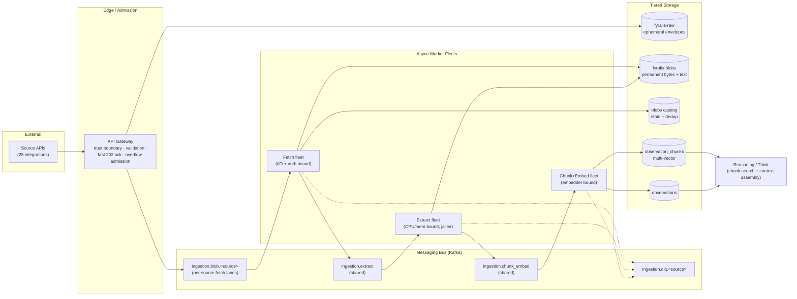
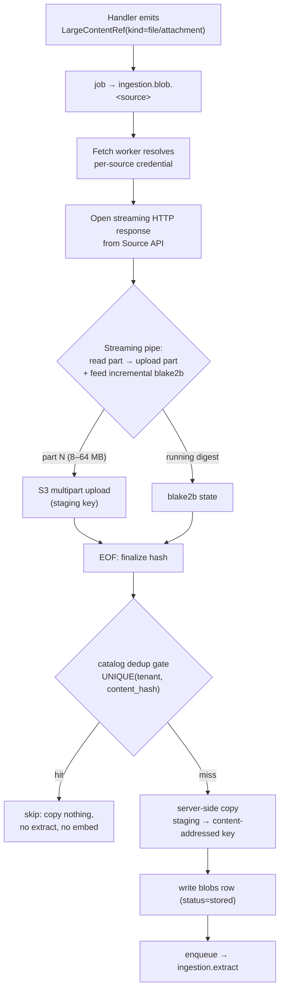

# Large Object Pipeline — System Design Document

> **Document type:** System Design Document (architecture & data flow).
> **Status:** For review.
> **Date:** 2026-06-14.
> **Author:** Principal Systems Architect.
> **Synthesized from:** `specs/large-object-pipeline/large-payload-handling.md`,
> `docs/adr/0005-large-object-pipeline.md`.
> **Scope:** component boundaries, data flow, and non-functional design. This
> document deliberately contains **no implementation code and no phased rollout
> plan** — those live in the spec and the plan respectively.

## Non-functional requirements (NFRs) this design must satisfy

| # | NFR | Definition for this system |
|---|---|---|
| **N1** | **Consolidation** | One set of shared utilities handles large content for *all* sources; no per-source extraction/embedding silos. |
| **N2** | **Scalability** | The system ingests arbitrarily large artifacts (GB-scale binaries, multi-MB JSON) with bounded, independently-scalable resource use and no coverage exclusions. |
| **N3** | **Cost Optimization** | Expensive operations (egress, extraction CPU, embedding, LLM reasoning, indefinite storage) are bounded, deduplicated, and tiered. |

Each section below closes with an explicit **NFR mapping**. A consolidated
traceability matrix appears at the end.

---

## 1. Architecture Overview (System Context)

### 1.1 System boundary

The Large Object Pipeline (LOP) is a subsystem *inside* the ingestion domain. Its
boundary is drawn around five owned components:

- **Blob tier** (`fyralis-blobs`) — object storage for full artifact bytes and
  extracted text.
- **Blob catalog** (`blobs` table) — the metadata/state registry for every blob.
- **Three async worker fleets** — fetch, extract, chunk-embed.
- **Multi-vector store** (`observation_chunks` table) — one searchable vector per
  content chunk.
- **The `LargeContentRef` seam** — the typed contract by which the rest of
  ingestion hands work to the LOP.

Everything else is *outside* the boundary and integrates through defined
interfaces: external **Source APIs**, the **API Gateway**, the existing
**observation/model substrate** (Postgres), the **Kafka** data plane, and the
**Reasoning (Think) layer**.

### 1.2 Ingress and egress points

**Ingress (work entering the LOP):**

- **Handler-declared references.** During normal ingestion (webhook or backfill),
  a source handler emits an `ObservationDraft` *plus* zero-or-more
  `LargeContentRef` descriptors. Each reference is the unit of ingress to the LOP,
  materialized as a job on a per-source fetch lane.
- **Gateway overflow admission.** Oversized structured payloads that previously
  drew an HTTP 413 are admitted by the Gateway and routed into the LOP as an
  `oversized_json` reference rather than rejected.

**Egress (results leaving the LOP):**

- **`observation_chunks`** → consumed by the Reasoning layer's new chunk-search
  pathway and by trigger-time context assembly.
- **Parent `observations`** → enriched with a bounded summary, `has_blobs`,
  `chunk_count`, `blob_ids[]`.
- **Blob bytes + extracted text** → durable in `fyralis-blobs`, addressable for
  re-processing.
- **Dead-letter records** → per-source DLQ lanes for any stage failure.

### 1.3 Transition: synchronous legacy → asynchronous `LargeContentRef`

The legacy architecture couples *detection* and *materialization* of content in a
single synchronous step inside the request path:

```
Legacy:  Source API → Handler{ download + extract + truncate } → 1 observation, 1 vector
         (blocking, memory-bound, capped at 64 KB / 50 pages / 1 MB)
```

The LOP **splits that single step at a seam**:

```
LOP:     Source API → Handler{ DETECT, emit LargeContentRef } → fast ack
                                         │  (async hand-off via Kafka)
                                         ▼
              fetch → store → extract → chunk → embed  →  multi-vector store
              (non-blocking, streaming, resource-jailed, no coverage cap)
```

- **Detection stays synchronous and cheap** — the handler only describes *where*
  the content is and *how* to authenticate, then returns. The gateway can ack
  fast.
- **Materialization becomes asynchronous and decoupled** — the slow, memory-heavy,
  security-sensitive work runs in dedicated fleets that scale and fail
  independently of the request path.

This decoupling is the architectural pivot: producers (handlers) and consumers
(worker fleets) no longer share a latency, memory, or failure domain.

### 1.4 Component roles



- **API Gateway** — the synchronous front door and **trust boundary** (signature
  verification, tenant resolution, payload validation). It performs **admission
  control**: it acks fast (202), and for oversized structured payloads it admits
  and routes to the async overflow path instead of rejecting. It never performs
  large-content I/O.
- **Messaging bus (Kafka)** — the **decoupling, durability, and backpressure
  buffer**. Fetch lanes are **per-source** (they carry source-specific auth and
  must isolate noisy neighbours); extract and chunk-embed lanes are **shared**
  (the work is source-agnostic). Per-source DLQ lanes provide failure isolation.
  Kafka is what lets each fleet scale to its own bottleneck.
- **Async worker fleets** — three fleets with deliberately different resource
  profiles (see §2), so each can be scaled and rate-limited independently rather
  than provisioned for the worst-case of all three combined.
- **Tiered storage** — `fyralis-raw` (ephemeral notification envelopes),
  `fyralis-blobs` (permanent source-of-truth bytes + extracted text), and Postgres
  (the `blobs` catalog, parent `observations`, and the `observation_chunks`
  multi-vector store). See §4.

> **NFR mapping.** *Consolidation (N1):* shared extract/chunk-embed lanes and a
> single multi-vector store sit at the centre of the topology. *Scalability (N2):*
> the Kafka seam decouples producers from consumers and lets fleets scale
> independently. *Cost (N3):* gateway admission + the fetch-stage dedup gate keep
> expensive work off the synchronous path and out of the system entirely when
> content is already known.

---

## 2. Scalability & Resilience Mechanisms

### 2.1 Class A flow — large binaries (GB-scale files, attachments, media)



**The exact data flow for a massive file:**

1. The handler emits a `LargeContentRef`; a job lands on the source's fetch lane.
2. The **fetch worker** resolves the source credential and opens a **streaming**
   HTTP response from the Source API — it never calls `.read()` on the whole body.
3. The worker runs a **streaming pipe**: it reads a bounded part (e.g. 8–64 MB),
   uploads that part via **S3 multipart upload**, and simultaneously feeds the same
   bytes into an **incremental `blake2b`** digest. Peak resident memory is **one
   part**, independent of total file size.
4. At EOF the content hash is finalized. Because S3 multipart requires the object
   key *before* the bytes are seen, the upload targets a **staging key**; on
   completion the object is **server-side copied** to the content-addressed key.
5. The **dedup gate** (`UNIQUE(tenant_id, content_hash)`) decides whether this is
   new content. A hit short-circuits everything downstream.

**Why this completely mitigates OOM and guarantees runtime safety.** The only
memory the fetch worker holds is a single in-flight part plus the constant-size
hasher state. There is therefore **no file size at which the worker must buffer
the whole artifact** — a 10 MB PDF and a 4 GB video have the same memory
footprint. This is the property that makes the "no exclusions" requirement *safe*
rather than reckless: nothing forces the system to skip a file to protect itself,
so the legacy 10 MB skip can be removed without introducing an OOM failure mode.
Size becomes a *throughput* concern (handled by backpressure), never a
*correctness* or *stability* concern.

### 2.2 Class B flow — collections and large JSON

Class B is large **structured** payloads, handled by two complementary
mechanisms:

**Fan-out (the common case).** When a payload is really a *collection* (a cap
table of grants, an invoice of line items, an issue's changelog of transitions),
the handler **decomposes it at the native per-entity grain** into N small child
`ObservationDraft`s — each with its own deterministic `external_id`, its own
`content_text`, and its own vector. No child approaches the inline size limit, so
**the common case never touches the blob tier at all**. This keeps collections in
the substrate's per-entity grain, where the existing dedup, entity-resolution, and
reasoning machinery already operates.

**`oversized_json` overflow (the tail case).** When a *single logical record* is
itself too large to inline (e.g. one issue with a multi-MB description, one audit
event with a giant response blob), the Gateway **admits** it (no 413) and the
record is:

1. serialized and stored in `fyralis-blobs` as an `oversized_json` reference,
2. represented in `observations.content` by a **bounded projection** of key
   fields, and
3. flattened and pushed through the **same** extract → chunk-embed backend used by
   Class A.

This is an important architectural property: **Class B's overflow tail merges into
Class A's backend.** There is exactly one chunk-and-embed pipeline; both large
binaries and oversized JSON converge on it.

### 2.3 Backpressure

Backpressure is layered so each scarce resource is protected at the point it is
consumed:

- **Admission control (Gateway):** fast 202 ack moves work onto the bus; the
  request path never blocks on materialization.
- **Bus buffering (Kafka):** producers never stall on slow consumers; the lane
  *is* the queue.
- **Byte/egress budgets (fetch stage):** per-tenant and global token-bucket
  budgets (reusing the existing Redis limiter) cap how fast a tenant can pull
  bytes from source APIs — preventing one tenant from saturating egress or
  detonating cost.
- **Concurrency caps (extract stage):** the CPU/memory-bound extractor fleet runs
  under a hard concurrency ceiling so a burst of large files cannot exhaust host
  resources.

Because the three fleets sit behind separate lanes, each scales to *its own*
bottleneck (I/O, CPU, embedder) rather than being co-provisioned for the union of
all three.

### 2.4 Resource-jailing for untrusted extraction

The extract fleet parses **untrusted files** — an inherent attack surface (zip
bombs, decompression bombs, malformed/malicious PDFs, SSRF via signed attachment
URLs). The design treats extraction as hostile-input processing:

- Each extraction runs in a **resource jail** with hard **wall-clock, memory, and
  recursion** ceilings.
- Outbound fetches of signed URLs pass through an **SSRF egress allowlist**.
- The jail bounds **resources, not coverage**: the extractor always *attempts the
  whole artifact*; if a ceiling is hit, the item is **DLQ'd with a reason and a
  metric is emitted — never silently truncated**. This preserves the "no
  exclusions" contract while keeping a single malicious file from harming the
  fleet.

### 2.5 DLQ routing and failure isolation

Every stage (fetch, extract, chunk-embed) routes failures to the **per-source**
`ingestion.dlq.<source>` lane. This yields two isolation properties:

- **Item isolation:** a poison artifact fails only its own job; siblings continue.
- **Source isolation:** per-source lanes prevent a backed-up or failing source
  from head-of-line-blocking the others.

Critically, a DLQ record references the **already-stored blob** (by content hash /
storage key), so **replay re-processes from stored bytes without re-fetching** the
source. Combined with §4's retention, this makes recovery and post-fix
re-processing a pure replay.

> **NFR mapping.** *Scalability (N2):* streaming + incremental hashing makes file
> size a throughput (not stability) concern; per-stage backpressure scales each
> fleet to its own bottleneck; fan-out keeps collections small. *Cost (N3):* the
> dedup gate short-circuits the most expensive downstream work; byte budgets cap
> egress. *Resilience:* resource jails + per-source DLQ contain hostile input and
> isolate failures.

---

## 3. Consolidation Strategy

### 3.1 Eliminating source-specific silos

Today, large-content handling is **re-implemented per source**: Drive has its own
`export_text` + size/page caps, Gmail has a body truncation, finance handlers have
`_truncate(…, 600)`, and most binary content is simply dropped. The logic, the
caps, and the bugs are duplicated 25 ways and are mutually inconsistent.

The LOP collapses this to **two thin source-specific touchpoints** and a
**source-agnostic core**:

| Layer | Source-specific? | Why |
|---|---|---|
| Handler emits `LargeContentRef` | Yes (trivial) | Only the source knows *where* its content lives and *which credential* fetches it. |
| Blob fetch adapter | Yes (thin) | Auth and `source_uri` resolution differ per API. |
| **Extract fleet** | **No — shared** | A PDF is a PDF regardless of origin. |
| **Chunk-embed fleet** | **No — shared** | Chunking + embedding are content-shape concerns, not source concerns. |
| **Multi-vector store** | **No — shared** | One `observation_chunks` table for all sources. |

### 3.2 Shared, MIME-routed extraction workers

The extract fleet routes on **MIME type, not source**. The combinatorial blow-up
of *N sources × M file types* — which the legacy design would require as bespoke
per-source extraction — collapses to **M shared extractors** (PDF, Office, CSV,
text, archive, and later audio/video/image) plus **N thin fetch adapters**. A
single, well-tested PDF extractor serves Drive, Gmail attachments, Slack uploads,
and any future source identically.

### 3.3 Centralized chunk-and-embed pipeline

There is exactly **one** chunk-and-embed pipeline and **one** multi-vector store.
Every content stream converges on it:

- Class A extracted text (from any source, any file type), and
- Class B `oversized_json` serialized records.

This single convergence point enforces **one chunking policy, one embedding-model
integration, and one index** across the entire system. Improving the chunker or
swapping the embedding model is a single-site change that benefits all 25 sources
at once.

### 3.4 The pipeline as a platform utility

The extract and chunk-embed lanes are **platform utilities, not per-source
features**. Onboarding a new integration requires only a thin fetch adapter and a
handler that declares references; the new source then **inherits full large-payload
handling for free** — full extraction, chunking, multi-vector search, dedup, and
retention — with zero net-new extraction or embedding code.

> **NFR mapping.** *Consolidation (N1):* this entire section. The keystone is the
> convergence of Class A and Class B onto one shared backend, reducing N×M bespoke
> paths to M shared utilities + N thin adapters, and making large-payload handling
> a property of the *platform* rather than of each source.

---

## 4. Storage & Cost Lifecycle

### 4.1 `fyralis-raw` (ephemeral) vs `fyralis-blobs` (permanent)

The two object tiers hold fundamentally different things and therefore have
opposite lifecycles:

| Dimension | `fyralis-raw` | `fyralis-blobs` |
|---|---|---|
| **Holds** | Notification *envelopes* ("file X changed") | The *artifact itself* — full bytes + extracted text |
| **Role** | Pipeline replay / audit buffer | **Source-of-truth content substrate** |
| **Typical size** | < 10 KB | MB–GB |
| **Re-fetchable from source?** | Yes (re-deliver) | Often **no** (file deleted, token revoked, API deprecated) |
| **Retention** | **Ephemeral** (days) | **Indefinite** (by requirement) |

The separation is deliberate: mixing them in one bucket would make it impossible
to expire the high-volume, low-value envelopes without also destroying the
irreplaceable source-of-truth bytes. Distinct buckets = independent lifecycle,
access, and cost policy.

### 4.2 Idempotency & deduplication architecture

Identity is **content-addressed**: a blob's key is derived from the `blake2b`
digest of its bytes, and the catalog enforces `UNIQUE(tenant_id, content_hash)`.
This single constraint delivers two distinct cost wins:

1. **Storage dedup.** Identical bytes are stored **once per tenant**. Re-sent
   webhooks, re-run backfills, and the same file shared across many
   messages/threads collapse to one stored object.
2. **Compute dedup (the larger win).** The dedup gate sits at the *fetch* stage,
   so a catalog hit **short-circuits the entire downstream chain** — no
   re-download (egress saved), **no re-extraction (CPU saved), and no re-embedding
   (embedder saved)**. Because extraction and embedding are the expensive
   operations, avoiding them for duplicate content is the dominant cost lever, far
   exceeding the storage savings.

Dedup is **per-tenant** (the unique key is scoped by `tenant_id`, enforced by
RLS). This is a deliberate **isolation-over-efficiency** trade-off: a global CAS
would dedup the same file across tenants but would leak the existence and timing of
content between tenants. Tenant-scoped dedup forgoes that cross-tenant saving to
preserve the isolation boundary.

### 4.3 Proposed cold-tiering / lifecycle policy

"Indefinite retention" is a standing, monotonically-growing cost. The following
**logical** lifecycle policy bounds its financial impact without violating the
re-processing guarantee. It is keyed on **object tags written at upload time**
(content class, media-vs-text, source sensitivity) so transitions are
policy-driven, not manual.

**`fyralis-blobs` — original artifact bytes (text-extractable types):**

| Age | Tier | Rationale |
|---|---|---|
| 0–90 days | Standard (hot) | Covers the window where re-extraction/re-chunk with improved parsers is most likely. |
| 90 days–1 year | Infrequent Access | Re-processing still possible but rare; lower storage cost, small retrieval fee. |
| > 1 year | Archive / Deep Archive | Long-tail re-processing only; cheapest storage, multi-hour restore acceptable. |

**`fyralis-blobs` — media bytes (audio/video/image, pre-STT):** these are large
and **not yet searchable** until the STT/OCR capability ships. Tier them to
Infrequent Access **quickly** (they will not be read until the transcription pass),
then to Archive. When transcription is enabled, a **restore-then-extract batch**
job rehydrates them — an explicitly batch, non-real-time operation, so archive
restore latency is acceptable.

**`fyralis-blobs` — extracted text objects:** small and re-read on re-chunk; keep
in Standard/Infrequent Access (do not deep-archive), since they are the cheap,
frequently-useful derivative.

**`fyralis-raw`:** aggressive **expiration** lifecycle (e.g. a fixed multi-day
TTL) — it is a buffer, not an archive.

**Why this is safe.** The **hot read path never touches cold originals.** Live
retrieval reads `observation_chunks` (Postgres) and, at most, the small extracted-
text derivatives. Cold originals are needed only for **planned batch
re-processing**, which can tolerate archive restore times. The catalog records the
`storage_key` independent of storage class, so a tier transition is transparent to
addressing (only retrieval latency changes for archived objects).

**Guardrails.** Per-tenant storage metering with budget alerts, and a cap policy,
sit alongside the tiering schedule (the cap threshold itself is an open business
decision, not an architectural one).

> **NFR mapping.** *Cost (N3):* this entire section — tier-by-value lifecycle,
> content-addressed dedup eliminating both redundant storage and (more importantly)
> redundant extraction/embedding compute, and a hot/cold split that keeps the live
> path off expensive storage.

---

## 5. Architectural Risks & Trade-offs

### 5.1 Trigger explosion from Class B fan-out

**The risk.** Fan-out (decision §2.2) converts one collection into N child
observations, and in the current substrate **each observation enqueues a `T1`
reasoning trigger**. A single cap-table sync of 1000 grants therefore enqueues
1000 triggers, each of which can drive an **LLM reasoning run** in the Think layer.
The LLM is the most expensive resource in the system, so uncontrolled fan-out is
simultaneously a **cost detonation** and a **thundering-herd load spike** on
reasoning — the failure mode is economic and operational, not a crash.

**The architectural dependency.** The design **does not permit fan-out to enqueue
naked per-entity triggers.** Fan-out must ride the existing **trigger-batching**
mechanism (`think_trigger_batch_parent`), which coalesces the N child triggers from
one sync into a **bounded batched parent**, so the Think layer reasons over the
collection as a *single bounded unit of work* rather than N independent runs. This
makes batching a **hard precondition** of enabling Class B fan-out, not an
optional optimization.

**The trade-off.** Batching introduces **coupling between the ingestion fan-out and
the reasoning layer's trigger model**. The batching granularity (per-sync? per
entity-type? per time-window?) becomes a tuning parameter that trades **reasoning
fidelity** (finer batches → more targeted reasoning) against **cost** (coarser
batches → fewer LLM runs). Embedding fan-out (N vectors) is a secondary,
lower-unit-cost pressure absorbed by the async embed lane and byte budgets.

### 5.2 Read-path complexity: chunks vs. models, and context-budget pressure

**The new surface.** The system's primary memory is **model-based** (distilled
beliefs, cosine-searched); raw observations are retrieved **temporally**, never
semantically. Chunk retrieval is therefore a **net-new retrieval surface**, and
introducing it creates three coupled design problems:

1. **Ranking heterogeneity.** Retrieval would now blend three different vector/row
   populations — model vectors (beliefs), observation temporal hits, and chunk
   vectors (raw content). Cosine distances are not directly comparable *across*
   these populations, so the design needs an explicit **fusion/ranking strategy**
   to decide what wins when a belief and a raw-content chunk both match a query.
2. **Roll-up correctness.** A chunk search returns many rows per parent document;
   results must **dedup to the parent observation** and choose a pooling rule
   (best-chunk vs. mean), which determines which documents surface. This is both a
   ranking-semantics decision and a query-construction subtlety.
3. **Provenance.** Chunk → observation → blob lineage must be threaded through the
   context bundle so that **citations** and the **mutation-scoping** logic
   (allowed-region / touched-entity tracking) remain correct when reasoning acts on
   chunk-derived text.

**Token-budget pressure.** Context assembly operates under **fixed budgets** (on
the order of tens of models and a dozen observations per prompt). Attaching top-k
chunks of a large document into that same window directly **competes with the
distilled beliefs and other context** for finite prompt space. The core trade-off:
**supply enough document detail for the answer vs. crowd out the high-value
model context.** Resolving it requires a deliberate **budget-allocation policy**
(and possibly a summarization step) rather than naively appending chunks.

**Scale trade-off.** `observation_chunks` will exceed `observations` in cardinality
by one-to-two orders of magnitude (one document → hundreds of chunks). The chunk
HNSW index therefore carries a materially larger **build-memory and query-latency**
cost than the existing observation/model indexes — a storage-and-latency trade-off
that must be validated at scale and partitioned accordingly.

> **NFR mapping.** *Scalability (N2):* §5.2's index-cardinality trade-off is the
> principal scaling risk on the read side. *Cost (N3):* §5.1's trigger batching is
> the single most important guard against LLM cost detonation; the context-budget
> policy bounds per-reasoning-run token cost.

---

## Appendix A — NFR traceability matrix

| Mechanism | Consolidation (N1) | Scalability (N2) | Cost Optimization (N3) |
|---|---|---|---|
| `LargeContentRef` seam (sync detect / async materialize) | — | ✅ decouples request path from heavy work | ✅ heavy work off the hot path |
| Per-source fetch lanes / shared extract+embed lanes | ✅ source-agnostic core | ✅ independent per-fleet scaling | — |
| Streaming multipart + incremental `blake2b` | — | ✅ O(1) memory, OOM-proof | ✅ enables dedup hashing |
| Content-addressed dedup `UNIQUE(tenant, content_hash)` | — | — | ✅✅ skips re-download/extract/embed |
| Fan-out into child observations | ✅ native per-entity grain | ✅ no oversized rows | ⚠️ requires trigger batching (§5.1) |
| `oversized_json` → shared chunk-embed backend | ✅ converges with Class A | ✅ no 413 rejection | — |
| Byte/egress budgets + extractor concurrency caps | — | ✅ bounded resource use | ✅ caps egress + compute |
| Resource-jailed extraction + per-source DLQ | — | ✅ failure isolation | — |
| Two-tier storage + cold-tiering lifecycle | — | — | ✅✅ tier-by-value, hot path off cold storage |
| Trigger batching (`think_trigger_batch_parent`) | — | ✅ protects Think from herd | ✅✅ prevents LLM cost detonation |

Legend: ✅ supports · ✅✅ primary lever · ⚠️ conditional dependency · — not the
mechanism's purpose.
